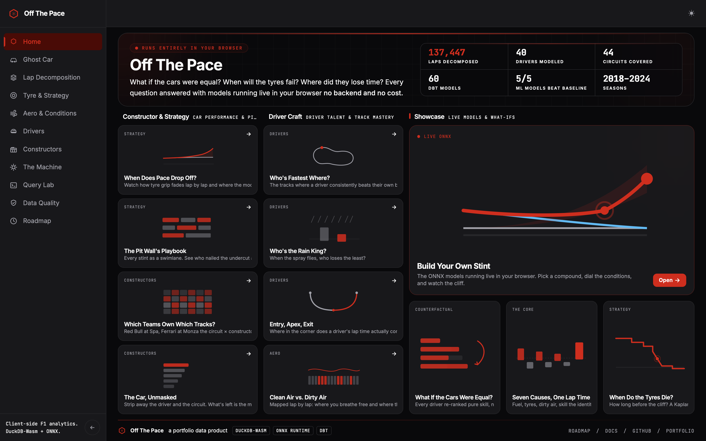
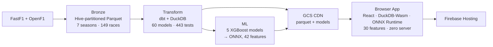

# Off The Pace

> **When a car is off the pace, why?**

**A browser-native, full-stack F1 analytics platform.** It ingests 7 seasons of telemetry, models it through a 60-table dbt warehouse, trains 5 ML models, and serves 30 interactive analytics features with **no server, no login, and no cost to serve**.

Under the hood, every lap is decomposed into seven additive, physically-grounded components, so lost time is attributed to an exact, named cause rather than a vibe.


**[▶ Launch the app](https://off-the-pace.web.app)** · **[Read the docs](https://offthepace.mintlify.app)**



**137,447** laps decomposed · **149** races · **40** drivers · **44** circuits · **60** dbt models · **443** tests · **5/5** ML models beat baseline · **30** browser features · **0** servers

---

## Three things to notice

### 1. The question, as the thesis

Most F1 analytics tells you *who* is slow. This project asks *why*. Each lap is decomposed into:

> `lap_time = base_track_pace + fuel + compound + rubber + ambient + constructor + dirty_air + driver_skill`

The driver skill residual is what remains after every measurable physical factor is removed: the part that actually belongs to the human.

### 2. A CI-enforced mathematical invariant

The seven terms sum to zero by construction. This isn't a stated property: it's tested on every lap in CI:

```sql
-- transform/macros/assert_additive_identity.sql
select count(*) from {{ model }}
where abs(pace_delta_s-(
  fuel_component_s + compound_component_s + rubber_component_s +
  ambient_component_s + constructor_component_s + dirty_air_tax_s +
  driver_skill_residual_s
)) > 0.0001
```

If it fails, the build fails. An enforced invariant is worth more than a claimed one.

### 3. Out-of-sample validation + limitations

Trained on 2018–2024. The 2025 season is held out as a reproducible out-of-sample validation against now-public OpenF1 data; you can run it yourself to get the same numbers. Paired with an explicit limitations section: no 2025 ingestion yet (so the ML holdout is time-series CV for now).

---

## Architecture



Bronze Parquet → a dbt/DuckDB warehouse → XGBoost models exported to ONNX → published to a GCS CDN → a React app that runs DuckDB-Wasm and ONNX Runtime Web **in the browser**. No backend computes anything at request time: the client downloads the data and models and does the work locally, which is why serving is free.

---

## Choose your path

**I want to understand the idea →** [offthepace.mintlify.app](https://offthepace.mintlify.app)

**I want to explore the app →** [off-the-pace.web.app](https://off-the-pace.web.app)

**I want to run it →** `make setup && make dbt-dev` (see Quickstart below)

---

## Quickstart

Requires Python 3.11+.

```bash
git clone https://github.com/justinclarke/off-the-pace
cd off-the-pace
make setup           # build venv + install Python/dbt deps
make dbt-dev         # build the transform layer (60 models)
make dbt-test        # run 443 tests including assert_additive_identity
```

No cloud credentials required. DuckDB runs locally at `data/dev.duckdb`.

### Running the Frontend React App & Docs

If you want to run the React app or the documentation site locally, you'll also need **Node.js (v18+)** and **pnpm** installed:

1. **Install dependencies**:
   ```bash
   make docs-install    # install docs dependencies
   make app-install     # install React app dependencies
   ```

2. **Generate data and models for the app**:
   The React app runs entirely in the browser using DuckDB-Wasm and ONNX. Before running the app, export the warehouse data and ML models:
   ```bash
   make app-data        # export DuckDB warehouse data to app/public/data/
   make app-models      # copy trained ONNX models to app/public/models/
   ```
   *(Note: `make app-models` requires models to be trained first via `make ml-setup && make ml-all`)*

3. **Start the development servers**:
   - For the **Docs site**: `make docs-site` (runs Mintlify at http://localhost:3000)
   - For the **React app** (offline/local data): `VITE_DATA_BASE="" make app-dev`
   - For the **React app** (live CDN data): `make app-dev`

   > **Running offline:** By default the app fetches parquet and models from the live CDN
   > (`gs://off-the-pace-cdn`). No credentials required to read, but you will see whatever
   > data is currently published there. Set `VITE_DATA_BASE=""` to point the app at your
   > local `app/public/data/` export instead, so you can develop and test entirely offline
   > with no dependency on the bucket.

4. **Publish data to the CDN** (when data changes, maintainers only):
   `make app-data` only writes to `app/public/data/` on disk; nothing reaches the
   live site until synced to the bucket (requires `gcloud` with write access):
   ```bash
   make app-publish-dry # preview the sync (uploads nothing)
   make app-publish     # sync app/public/data/ + models → CDN (no delete; manifest last)
   make app-deploy      # convenience: app-data then app-publish
   ```
   Parquet URLs are cache-busted by the manifest `version` so a data change is
   never masked by stale CDN/browser caching (see ADR-010).

---

## Project status

| Subsystem | State | Evidence |
|---|---|---|
| Ingestion (Bronze) | ✅ Built | `ingestion/src/`: FastF1 + OpenF1 → Hive-partitioned Parquet, 7 seasons / 149 races |
| Transform (60 models, 443 tests) | ✅ Built | `transform/models/`: schema.yml and singular tests; additive identity enforced in CI |
| Coefficients (KM tyre cliff) | ✅ Fitted | `transform/tasks/coefficients/`: seeds |
| ML (5 XGBoost models, 28 tests) | ✅ Built | [`ml/`](ml/): degradation quantile trio + cliff classifier + stint-life; ONNX parity; v4 model (42 features) |
| Frontend (React + DuckDB-Wasm) | ✅ Built | [`app/`](app/): 30 interactive features, zero server, sub-10ms queries; deployed to Firebase Hosting |
| Docs | ✅ Built | [`docs/`](docs/): Mintlify site with 6 tabs (Overview, Data, Transform, ML, App, Platform) |
| Platform | ✅ Built | CI/CD, security scanning, observability (Sentry), E2E tests (Playwright), IaC (Terraform) |
| Streaming (Microsoft Fabric) | ❌ Planned | Streaming Integration |

The engine is built and deployed. The current focus is the live watch-along experience: in-race strategy predictions served from the same offline-trained models.

---

## Machine Learning

Five XGBoost models score every lap from the feature mart [`fct_cliff_prediction_features`](transform/models/marts/fct_cliff_prediction_features.sql):

- **Degradation quantile trio** (`p10` / `p50` / `p90`) next-lap pace loss with a calibrated interval (empirical coverage 0.80 at nominal 0.80).
- **Cliff classifier** laps-until-cliff bucket (`0_to_2` / `3_to_5` / `6_plus` / `none_in_stint`).
- **Stint-life regressor** remaining laps of usable life.

Every model **beats a strong per-cohort baseline** on the headline metric (season-grouped `TimeSeriesSplit`; the 2024 fold stands in as a holdout until 2025 ingests). Each booster round-trips to **ONNX within `atol=1e-5`** for in-browser scoring. The leakage spine (no forward-looking features, `driver_id`/`race_year` excluded) is enforced by tests and CI.

Reproduce end-to-end (one venv, warehouse read-only, nothing written to `app/`):

```bash
make ml-setup        # install ml/requirements.txt
make ml-all          # features → tune → train → evaluate → predict → onnx → card → docs
make ml-test         # 28 tests: leakage spine, ONNX parity, output schema, beats-baseline
```

Full auto-generated **[model card](docs/reference/ml/degradation-model.mdx)** (metrics, baselines, calibration, dual feature importance, limitations) is built from `ml/model_card.yml`.

---

## App features

The app runs entirely in the browser: DuckDB-Wasm for sub-10ms SQL and ONNX Runtime Web for inference. No server, no login, no cost to serve. Thirty features across eight analytical families:

| Family | Features |
|---|---|
| **Ghost Car** | Ghost Race Standings, Counterfactual Championship, Hidden Performance |
| **Lap Decomposition** | Lap Waterfall, Race Lost, Sector Decomposition |
| **Tyre & Strategy** | Tyre Cliff Survival, Stint Degradation Timeline, Pit Strategy, Tyre Recovery Forecast, Party Mode |
| **Aero & Conditions** | Dirty Air Cost, Dirty Air Lap Map, Track Evolution, Field Pace Curve |
| **Drivers** | Era Ratings Timeline, Driver Consistency, Quali vs Race Skill, Driver Circuit Affinity, Era Translator, Wet Race Specialist, Driver Workload, Synthetic Teammate, Corner Phase Skill |
| **Constructors** | Constructor Structural Pace, Constructor Circuit Interaction |
| **The Machine** | Degradation Simulator, Model Metrics, Blind Test Scoreboard |
| **Data & Validation** | Query Lab, Data Quality Audit |

---

## Stack

| Layer | Tech |
|---|---|
| Ingestion | FastF1 + OpenF1 → Hive-partitioned Parquet |
| Transform | dbt-core (DuckDB local, 60 models, 443 tests) |
| ML | XGBoost (degradation quantile trio, cliff classifier, remaining life) → ONNX v4 (42 features) |
| Frontend | React + DuckDB-Wasm (sub-10ms queries, zero compute cost) |
| Hosting | Firebase Hosting (frontend) + GCS CDN `gs://off-the-pace-cdn` (data + models) |
| Docs | Mintlify (offthepace.mintlify.app) |
| Platform | GitHub Actions CI/CD · Sentry observability · Playwright E2E · Terraform IaC |

## Repo layout

| Folder | Contents |
|---|---|
| [`ingestion/`](ingestion/) | FastF1 + OpenF1 pulls → Bronze Parquet |
| [`transform/`](transform/) | dbt project, from staging through feature marts |
| [`ml/`](ml/) | Machine learning layer: XGBoost models, ONNX export, model card |
| [`app/`](app/) | React + DuckDB-Wasm frontend; 30 interactive features |
| [`docs/`](docs/) | Mintlify docs site |
| [`infra/`](infra/) | Terraform modules (GCS, WIF, billing budget) |
| [`scripts/`](scripts/) | Reference doc generators, CI tooling |

---

## Documentation map

| Document | Purpose |
|---|---|
| **[README.md](README.md)** | *Start here*: thesis, status, quickstart, stack |
| **[offthepace.mintlify.app](https://offthepace.mintlify.app)** | Full docs: Data · Transform · ML · App · Platform tabs |
| **[.github/CONTRIBUTING.md](.github/CONTRIBUTING.md)** | How to contribute; pipeline overview for new contributors |

---

Built by [Justin Clarke](https://justinclarke.github.io) · Licensed under AGPL-3.0
