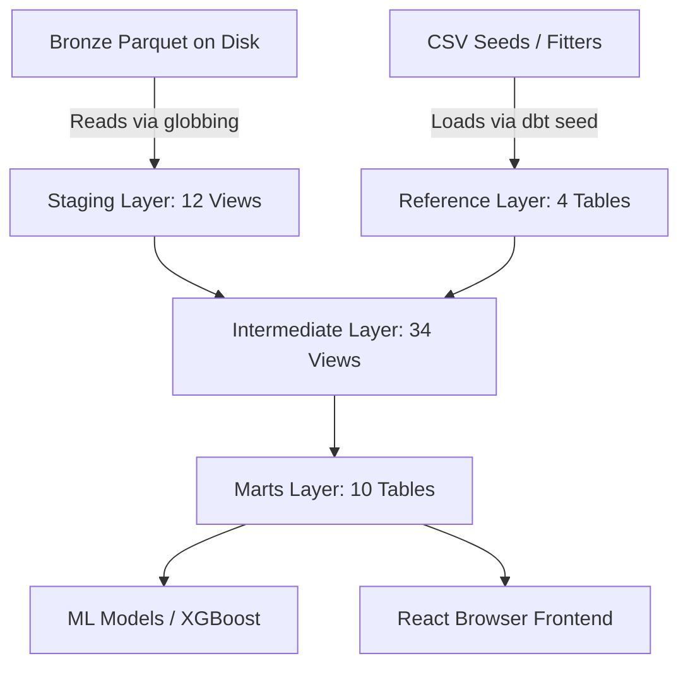

# Transformation Layer Breakdown

The **transform layer** is the mathematical and data-processing engine of the **Off The Pace** repository. Built as a **60-model dbt (data build tool)** project running locally on **DuckDB**, its primary goal is to isolate and quantify the physical factors affecting Formula 1 lap times, attributing lost time to exact physical causes and isolating the driver's pure skill as a residual. It has successfully decomposed **137,447 laps** across **147 Grand Prix events** (2018–2024).

---

## 1. The Core Equation (The Seven-Term Identity)
Every lap is decomposed into seven physically grounded, additive components. 

$$\text{pace\_delta\_s} = \text{fuel} + \text{compound} + \text{rubber} + \text{ambient} + \text{constructor} + \text{dirty\_air} + \text{driver\_skill\_residual}$$

* **Positive values** denote time lost (slower lap).
* **Negative values** denote time gained (faster lap).

### CI-Enforced Physical Invariant
The seven terms reconstruct `pace_delta_s` to within **0.0001 s** (empirically closing to $1.4 \times 10^{-14}\text{s}$ machine precision). This mathematical invariant is tested on every single lap in CI using the assert_additive_identity.sql macro. If the sum of these terms deviates from the total pace delta by more than $0.0001\text{s}$, the build fails and the merge is blocked.

### Sequential Residualisation
Estimating all six physics terms simultaneously is circular. The project breaks this circularity by estimating terms in order of **decreasing identifiability**, subtracting each before estimating the next:
1. **Fuel**: Mass computed from lap number and circuit length. Weight penalty is empirically calibrated per circuit.
2. **Compound + Rubber + Ambient**: Separated by structural signatures (tyre wear via within-stint variation, rubber via monotone increase, ambient via non-monotonicity).
3. **Constructor**: High-Dimensional Fixed Effects (HDFE) panel regression.
4. **Dirty air**: Regression of partial residuals against dirty-air share.
5. **Driver skill**: The closure. Defined as a residual, never estimated independently, guaranteeing the identity closes exactly.

---

## 2. The Four-Layer Medallion Architecture
The dbt project is organized into four sequential layers, tested by **424 CI-enforced tests** (including 28 bespoke singular tests).

---

## 3. Comprehensive Component Dictionary

### Staging Layer (12 Views)
The staging layer casts raw Bronze Hive-partitioned Parquet files into `snake_case`, enforces numeric types, normalizes string labels, and establishes primary keys. No joins or aggregations happen here.

* **`stg_laps`**: Cleaned lap-level data from FastF1. Includes sector times, speed traps, pit flags, and lap validity classification.
* **`stg_sector_times`**: Per-sector timing unpivoted from `stg_laps` (one row per lap × sector).
* **`stg_pits`**: One row per pit stop event, derived from in/out times.
* **`stg_weather`**: Weather snapshot per lap, mapped from 1Hz nearest-predecessor samples.
* **`stg_events`**: Race-level manual event entries (damage, penalties).
* **`stg_results`**: Official classified race results. The source of truth for finishing positions and DNF causes.
* **`stg_track_status`**: SC/VSC/yellow/red timeline from session status changes.
* **`stg_session_status`**: High-level session lifecycle events (Inactive / Started / Aborted / Finished).
* **`stg_circuit_info`**: Corner geometry mapped dynamically per race.
* **`stg_tyre_allocations`**: Pipeline stub for Pirelli allocation sheets to map C1-C5 compound codes to soft/medium/hard.

### Reference Layer (4 Tables)
Slowly-changing dimensions populated by version-controlled CSV seeds (static or rarely updated).

* **`dim_circuits`**: Physical properties per circuit × era. Includes `fuel_consumption_rate`, `weight_penalty_factor` and `lap_length_km`.
* **`dim_compounds_season`**: Tyre cliff parameters derived from Kaplan-Meier survival analysis. 
* **`dim_drivers`**: Driver metadata (debut year, career races).
* **`dim_constructors`**: Constructor metadata, heavily used for mapping power unit families (`pu_family`).

### Intermediate Layer (34 Views)
The physics and fixed-effects engine room. This layer handles everything from fuel burnoff to the Seven-Term decomposition.

**Core Physics & State Tracking**
* **`int_stint_geometry`**: Foundation for downstream window functions. Builds `stint_id`, `lap_in_stint`, and tracks tyre age.
* **`int_lap_fuel_state`**: Calculates `fuel_mass_kg` and lap time penalties due to weight.
* **`int_lap_air_state`**: Classifies air state (free air, tow, dirty air) and tracks cumulative thermal load.
* **`int_lap_thermal_proxy`**: Models engine braking and thermal duty using exponential moving averages.
* **`int_compound_cliff_predicted`**: Predicts compound degradation utilizing parameters from `dim_compounds_season`.
* **`int_track_evolution`**: Models rubber lay-down and track surface temperature evolution.
* **`int_dirty_air_tax_component`**: Establishes causality for dirty air slowdown using prior-lap intensity (capped at 5.0 seconds).
* **`int_tyre_surface_vs_bulk_decoupling`**: After the tyre cliff, diagnoses if degradation is surface-recoverable or bulk-structural.

**Fixed-Effects Regressions & Statistics**
* **`int_synthetic_teammate`**: Synthesizes a counterfactual teammate for ego-driver comparisons.
* **`int_field_pace_curve`**: Computes rolling median of free-air pace to establish a field-level baseline.
* **`int_constructor_car_fe`**: De-biased constructor pace via two-way FE regression (`pace_delta ~ 1 | driver + constructor_race`).
* **`int_constructor_structural_pace`**: Car pace advantage/penalty derived via same-constructor teammate pairs.
* **`int_constructor_deg_sensitivity`**: Constructor-specific tyre deg sensitivity. EB-shrunk toward 0 using DerSimonian-Laird.
* **`int_circuit_x_constructor_interaction`**: Circuit-specific car advantage (e.g. Red Bull faster at high-downforce tracks).
* **`int_driver_circuit_affinity`**: Driver performance at specific circuits vs their career average (Bayesian shrunk).
* **`int_driver_circuit_era_affinity`**: Same as above, split on the 2022 ground-effect regulation boundary.

**Telemetry & Corners**
* **`int_lap_telemetry_aggregates`**: Powertrain telemetry aggregates (gear changes, rpm, throttle trace) against early-stint baselines.
* **`int_corner_metrics`**: Corner-level g-force and speed metrics.
* **`int_corner_skill_residuals`**: Decomposes corner skill into braking, mid-corner, and exit phases.

**The Seven-Term Decomposition**
* **`int_lap_residual_decomposed`**: The 7-term identity closure.
* **`int_sector_residual_decomposed`**: Breaks down lap-level components into sectors proportional to sector time.
* **`int_lap_anomaly_flags`**: Uses trailing-7-lap Median Absolute Deviation (MAD) to detect anomalies.

**Qualifying & Strategy Models**
* **`int_lap_fuel_state_qualifying`**: Fuel weight correction for qualifying (flat 12 kg assumption).
* **`int_constructor_structural_pace_qualifying`**: Qualifying-mode car pace derived from quali session panel regression.
* **`int_lap_residual_decomposed_qualifying`**: 7-term decomposition with quali-specific coefficients.
* **`int_qualifying_decomposed`**: Final quali residuals + qualifying-vs-race driver skill delta.
* **`int_pit_strategy_value`**: Evaluates pit strategy (optimal pit lap vs actual, opportunity cost, undercut).

### Marts Layer (10 Tables)
Feature-serving tables consumed downstream by machine learning pipelines and the client interface. These tables enforce dbt schema contracts strictly.

* **`fct_driver_skill_features`**: Race-grain driver skill feature table. Aggregates clean-lap residuals, synthetic teammate deltas, and constructor pace indices.
* **`fct_cliff_prediction_features`**: Lap-grain feature table for the ML tyre cliff XGBoost model. Its primary target is `next_lap_degradation_jump_detrended_s`.
* **`fct_stint_features`**: Pit strategy features, including thermal load buildup, cumulative dirty air tax, and cliff onset laps.
* **`fct_ghost_car_pace`**: Ghost-car lap times (recombines ego driver skill + host constructor car pace).
* **`fct_ghost_race_finish`**: Projects finishing positions in host-constructor scenario (Ghost Car Scenarios).
* **`fct_lap_residuals`**: Lap-grain analytics table exposing the full residual decomposition alongside anomaly flags.
* **`mart_corner_skill_driver`**: Estimates driver skill deviation from the car's average corner geometry (braking point, apex speed, throttle point).
* **`mart_degradation_history_envelope`**: Pre-aggregated historical stint envelope mapping the distribution (p10/p50/p90) of fuel-removed pace.
* **`dim_events`**: Race-level events dimension (damage, retirement, penalty) joined onto `fct_lap_residuals`.

---

## 4. Key Patterns & Statistical Practices

* **HDFE Two-Way Fixed Effects (Car vs Driver De-biasing):** To prevent driver skill from confounding constructor pace, the pipeline uses a two-way High-Dimensional Fixed Effects panel regression ($\text{pace\_delta\_s} \sim 1 \mid \text{driver\_id} + \text{constructor\_race}$). 
* **Right-Censored Kaplan-Meier Survival Analysis:** Tyre cliff modeling is treated as a survival problem. Voluntary pits are right-censored, preventing systematic underestimation of tyre life. The model computes median survival time across 401 groups in offline fitters.
* **Isotonic Regression & Wear Polynomials:** Degradation envelopes use weighted isotonic regression to enforce monotonicity across the 10th, 50th, and 90th percentiles, ensuring physically plausible wear curves.
* **Bayesian Shrinkage:** The pipeline uses a custom bayesian_shrinkage.sql macro for drivers' ratings, circuit affinities, and constructor indices. This shrinks small-sample estimates towards a zero-centered prior to prevent outliers from distorting performance metrics.
* **Clean Lap Identification:** To extract true driver skill without noise, the clean_lap_filter.sql macro dynamically filters out anomalies (Safety Cars, in/out laps, weather disruptions, track status warnings, etc.).

---

## 5. Downstream Handoffs
* **Machine Learning (`ml/`):** The layer generates an engineered spine of **42 features**. Five XGBoost models consume `fct_cliff_prediction_features` to predict degradation quantiles, cliff onset, and stint life. Column type safety is strictly enforced by dbt schema contracts to prevent compilation failures.
* **Browser Frontend (`app/`):** The final tables are exported to Parquet and queries are run locally in the browser using **DuckDB-Wasm** and **ONNX** with zero server-side compute cost.
