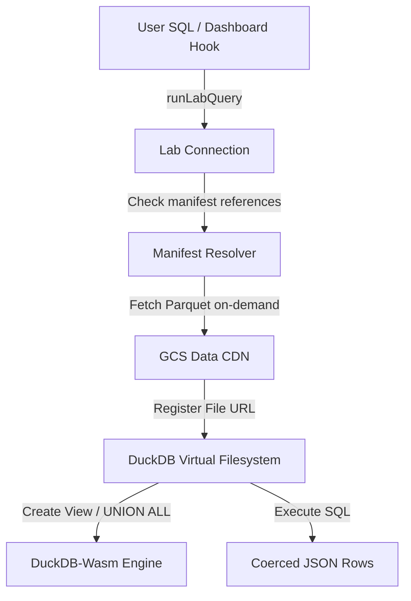

# Application Layer (Vite + DuckDB-Wasm)

The **Application Layer** of **Off The Pace** is a modern React web application built with **Vite**, **TypeScript**, and **Tailwind CSS**. Designed as a serverless, zero-compute architecture, it runs complex analytical queries entirely inside the user's browser using **DuckDB-Wasm** compiled to WebAssembly. The app downloads gold-tier Parquet datasets from a high-performance CDN, registers them as local views on demand, and presents interactive, animated dashboards (powered by **Framer Motion**) with sub-10ms query times.

---

## 1. Client-Side Database Architecture (DuckDB-Wasm)

Instead of relying on a traditional SQL backend, the app executes all queries client-side. The database engine resides in the browser.



### The Singleton client
The application communicates with a single initialized instance of DuckDB-Wasm.
*   **File Location**: [client.ts](file:///Users/justin/github/off-the-pace/app/src/data/duckdb/client.ts)
*   **WASM Worker Bundle**: It loads the **EH (Exception Handling) bundle** (`duckdb-eh.wasm` + `duckdb-browser-eh.worker.js`) to support range-request Parquet reads over HTTP. Other bundles (MVP, COI) are bypassed because COI uses shared memory that crashes DuckDB-Wasm during simultaneous Parquet queries due to memory model constraints.

### Dynamic Parquet Registration
Tables are loaded on-the-fly when a query references them.
*   **File Location**: [register.ts](file:///Users/justin/github/off-the-pace/app/src/data/duckdb/register.ts)
*   **Unpartitioned Tables**: Single `.parquet` files are registered with DuckDB's HTTP file system and loaded via `CREATE OR REPLACE VIEW <name> AS SELECT * FROM parquet_scan('<name>.parquet')`.
*   **Partitioned Tables**: Tables like `fct_lap_residuals` or `mart_corner_skill_driver` are partitioned by year. The registrar dynamically parses the table partitions from the manifest, registers each file URL individually, and binds them into a single `UNION ALL` view under the table name, making the partitioning transparent to the query writer:
    ```sql
    CREATE OR REPLACE VIEW fct_lap_residuals AS 
      SELECT * FROM parquet_scan('fct_lap_residuals__2018.parquet')
      UNION ALL
      SELECT * FROM parquet_scan('fct_lap_residuals__2019.parquet')
      -- ...
    ```

---

## 2. The Query Lab (SQL Workbench)

The **Query Lab** is an interactive, browser-based SQL IDE that gives users a direct interface to execute arbitrary read-only queries against the database views.

*   **Page Component**: [query.tsx](file:///Users/justin/github/off-the-pace/app/src/routes/query.tsx)
*   **Engine & Safety Guards**: [queryLab.ts](file:///Users/justin/github/off-the-pace/app/src/data/duckdb/queryLab.ts)

### Read-Only Security Model
Because the database runs client-side, mutating commands (e.g. dropping views) would corrupt the schema cache for all other page components until a full page reload. The engine enforces a strict read-only parser before executing any query:
1.  **Allowed Formats**: Only queries starting with `SELECT`, `WITH`, `EXPLAIN`, `DESCRIBE`, `DESC`, `SUMMARIZE`, `SHOW`, `PRAGMA table_info`, `PIVOT`, `TABLE`, `VALUES`, or `FROM` are permitted.
2.  **Forbidden Keywords**: Any statement containing `CREATE`, `DROP`, `ALTER`, `INSERT`, `UPDATE`, `DELETE`, `TRUNCATE`, `ATTACH`, `DETACH`, `COPY`, `INSTALL`, `LOAD`, `CALL`, `SET`, `RESET`, `EXPORT`, or `IMPORT` is immediately rejected.
3.  **Single Statement Constraint**: Multiple SQL commands separated by semicolons are blocked.

### Auto-Resolution of Table References
To optimize bandwidth, the engine parses the SQL syntax using `resolveTablesInSql()` to extract referenced table identifiers, matching them against the data manifest. Only those referenced tables are loaded and registered from the CDN before executing the query.

### UI Features
*   **Schema Rail Explorer**: ([SchemaExplorer.tsx](file:///Users/justin/github/off-the-pace/app/src/features/query-lab/SchemaExplorer.tsx)) Displays tables categorized by layer (dimensions, facts, intermediate, marts, ml). Clicking a table name performs a lazy `DESCRIBE` query to fetch and display its columns, allowing columns to be clicked to insert directly into the text editor.
*   **Dynamic Result Grid**: ([ResultGrid.tsx](file:///Users/justin/github/off-the-pace/app/src/features/query-lab/ResultGrid.tsx)) Renders data in a paginated grid. Coerces DuckDB's native `BigInt` outputs into JavaScript standard `Number` to prevent JSON serialization errors.
*   **Shareable Links**: SQL queries can be encoded into Base64 hashes and embedded directly into the URL query parameters (`?q=...`), making workbench configurations shareable.
*   **Query History**: Persists the user's historical queries in local storage.

---

## 3. Data CDN & Manifest

*   **File Location**: [manifest.ts](file:///Users/justin/github/off-the-pace/app/src/data/manifest.ts)
*   **Manifest Path**: `app/public/data/_manifest.json`

The data files are hosted on Google Cloud Storage (GCS) or Firebase Storage acting as the CDN. At startup, the app loads `_manifest.json` which maps each table name to its CDN path, partitioning style, and metadata.

### Cache-Busting Strategy
Because CDN Parquet paths are static, browser caches could serve stale files after a data revision. The app resolves this by appending the manifest's current build version as a cache-busting parameter to all parquet scan URLs:
```typescript
function withVersion(url: string, version: string): string {
  if (!url.endsWith('.parquet')) return url
  return `${url}?v=${encodeURIComponent(version)}`
}
```

---

## 4. Deployment & Security Configuration

*   **File Location**: [firebase.json](file:///Users/justin/github/off-the-pace/firebase.json)
*   **Docs**: [deployment-data-cdn.md](file:///Users/justin/github/off-the-pace/app/_docs/deployment-data-cdn.md)

### WASM Execution Headers (COEP & COOP)
To allow WebAssembly multi-threading, the browser environment must run in a secure, isolated context. The app's deployment configuration explicitly sets these headers on all responses via `firebase.json`:
*   `Cross-Origin-Embedder-Policy: require-corp`
*   `Cross-Origin-Opener-Policy: same-origin`

Any third-party assets or external APIs loaded without CORS headers are blocked. DuckDB worker WASM files are therefore packaged locally in `public/duckdb/` so they remain same-origin. The Parquet datasets on the CDN are loaded over CORS, which is enabled by configuring the GCS bucket with standard `Access-Control-Allow-Origin: *` headers.

---

## 5. SQL Reference: Diagnostic Queries to Test
These queries can be copy-pasted directly into the Query Lab to inspect the physical attributes of the gold-tier models:

### 1. Driver Skill Consistency Analysis
Inspects driver performance consistency across clean, anomaly-free racing laps.
```sql
SELECT 
    driver_id,
    count(*) AS clean_laps_analyzed,
    round(avg(driver_skill_residual_s), 3) AS avg_skill_residual_s,
    round(stddev(driver_skill_residual_s), 3) AS pace_consistency_stddev,
    round(min(driver_skill_residual_s), 3) AS driver_personal_best_residual_s
FROM fct_lap_residuals
WHERE ml_eligible = TRUE
GROUP BY driver_id
HAVING count(*) >= 500
ORDER BY avg_skill_residual_s ASC
LIMIT 50
```

### 2. Constructor Track Affinity Synergy
Evaluates which cars perform best at specific circuits due to mechanical/aerodynamic layout match.
```sql
SELECT 
    i.constructor_id,
    c.circuit_name,
    count(*) AS race_appearances,
    round(avg(i.circuit_constructor_interaction_s), 3) AS avg_track_affinity_s,
    sum(i.interaction_obs_n) AS total_laps_recorded
FROM int_circuit_x_constructor_interaction i
JOIN dim_circuits c ON i.circuit_key = c.circuit_key
GROUP BY i.constructor_id, c.circuit_name
HAVING total_laps_recorded >= 10
ORDER BY avg_track_affinity_s ASC
LIMIT 50
```

### 3. Tyre Thermal Decoupling & Grip Recovery
Finds where drivers successfully cooled down their tyre surfaces relative to the tyre bulk carcass to regain grip.
```sql
SELECT 
    driver_id,
    compound,
    degradation_source,
    round(avg(surface_bulk_ratio), 3) AS avg_surface_bulk_ratio,
    round(avg(recovery_probability), 3) AS avg_recovery_prob,
    count(CASE WHEN recovery_flag = TRUE THEN 1 END) AS successful_recoveries
FROM int_tyre_surface_vs_bulk_decoupling
GROUP BY driver_id, compound, degradation_source
HAVING count(*) >= 10
ORDER BY avg_recovery_prob DESC
LIMIT 50
```

### 4. Qualifying Specialism & Skill Delta
Computes driver raw qualifying pace capability vs their average race pace.
```sql
SELECT 
    driver_id,
    count(*) AS total_quali_laps,
    round(avg(quali_skill_residual_s), 3) AS avg_quali_skill_s,
    round(avg(quali_vs_race_skill_delta_s), 3) AS avg_quali_vs_race_delta_s
FROM int_qualifying_decomposed
GROUP BY driver_id
HAVING count(*) >= 25
ORDER BY avg_quali_vs_race_delta_s ASC
LIMIT 50
```
