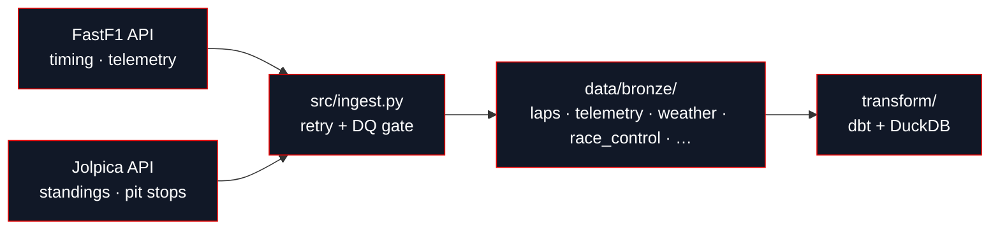

Every decomposition, model, and chart in Off The Pace traces back to two upstream APIs and one rule: Bronze stores data exactly as the source returns it, and computes nothing. This page orients you to where the data comes from and how it's shaped; the rest of the Data tab covers populating it yourself.

## Two sources, two purposes

<CardGroup cols={2}>
  <Card title="FastF1" icon="flag" href="/data/source-fastf1">
    The primary timing source lap times, telemetry, weather, and race-control messages for every session.
  </Card>
  <Card title="Jolpica" icon="plug" href="/data/source-jolpica">
    The Ergast-compatible reference client official driver/constructor standings and classified pit stops.
  </Card>
</CardGroup>

## What Bronze stores

Ingestion writes four fully-documented datasets per session, each Hive-partitioned by `season` and `race`:

<CardGroup cols={2}>
  <Card title="Laps" icon="gauge" href="/reference/schemas/laps">
    One row per driver per completed lap sector times, compound, stint, pit timing, track status.
  </Card>
  <Card title="Telemetry" icon="radio" href="/reference/schemas/telemetry">
    Continuous per-car samples within each lap speed, throttle, brake, gear, DRS state, position.
  </Card>
  <Card title="Weather" icon="thermometer" href="/reference/schemas/weather">
    Periodic session-level atmospheric readings air and track temperature, humidity, wind, pressure.
  </Card>
  <Card title="Race Control" icon="megaphone" href="/reference/schemas/race_control">
    Every race-control broadcast flags, safety car and VSC deployments, incidents, penalties.
  </Card>
</CardGroup>

Ingestion also writes a handful of supplementary datasets alongside these four official results, track/session status timelines, circuit geometry, and the event schedule plus Jolpica's reference standings and pit stops under `data/bronze/reference/jolpica/`. Each writer is independent and isolated by its own `try`/`except`, so one failing dataset never blocks the others. The full per-writer walkthrough lives on [Architecture](/ingestion/architecture).

<Note>
  **Bronze is dumb.** Ingestion renames columns to `snake_case` but never computes a derived value, joins a table, or applies a business rule. Every physics term, every feature, every model lives downstream in `transform/` and `ml/`, where it's version-controlled, tested, and re-runnable without touching the API again.
</Note>

## Schema drift detection

FastF1's own schema shifts between seasons a column renamed, a type changed, a field added. Every write computes a **schema fingerprint**: a SHA-1 hash of the sorted column names, recorded on the run manifest. Comparing fingerprints across runs turns silent drift into a detectable, queryable event instead of a downstream surprise see [Manifest Report](/ingestion/manifest-report).

<Info>
  Neither source requires credentials. FastF1 caches to `data/cache/` on disk; Jolpica is a public REST API with a politeness contract, not an auth contract.
</Info>

<Warning>
  Raw data has rough edges: time columns are nanosecond integers, several fields are undocumented numeric enums, and telemetry has expected gaps around safety cars and pit stops. See [Data Quality](/data/data-quality) and [Known Issues](/data/known-issues) before writing queries against Bronze directly.
</Warning>

## Next

<CardGroup cols={4}>
  <Card title="Sources" icon="plug" href="/data/source-fastf1">
    FastF1 and Jolpica in depth.
  </Card>
  <Card title="Bronze Schemas" icon="database" href="/reference/data-schemas">
    Every column, every dataset.
  </Card>
  <Card title="Quality & Coverage" icon="shield-check" href="/data/data-quality">
    What's checked, what blocks a write.
  </Card>
  <Card title="Get Started" icon="rocket" href="/ingestion/quickstart">
    Ingest your first race.
  </Card>
</CardGroup>
