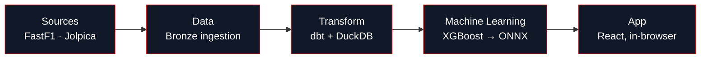

<Frame caption="The Off The Pace home dashboard showing lap decomposition analytics, driver ratings, and strategy projections running entirely client-side.">
  
</Frame>

Off The Pace answers the question lap time alone can't: **when a car is off the pace, exactly why?** Every lap is split into seven named, additive components fuel, tyre degradation, track rubber, ambient conditions, constructor pace, dirty air, and driver skill so you can see precisely how much of the gap is the car, the tyres, the conditions, or the driver. Underneath that product is a full data and ML platform: a CI-enforced decomposition, a 60-model dbt warehouse, ONNX models with train/serve parity, and a zero-server browser app.

## Are you here to…

<CardGroup cols={3}>
  <Card title="Evaluate the work" icon="user-check" href="/engineering-highlights">
    The sixty-second tour for a reviewer: the eight things to notice, then the skills demonstrated and who built it.
  </Card>
  <Card title="Assess the system" icon="sitemap" href="/system-design">
    The architecture, the build-time vs request-time split, and how it clears a production data-engineering bar.
  </Card>
  <Card title="Use or run it" icon="rocket" href="/ingestion/quickstart">
    Clone the repo and ingest your first race, or launch the live app.
  </Card>
</CardGroup>

## How the pipeline fits together

Raw timing data becomes an interactive chart through four layers, each documented in its own tab:

<CardGroup cols={4}>
  <Card title="Data" icon="table" href="/data/overview">
    Where the timing data comes from and how to ingest it yourself.
  </Card>
  <Card title="Transform" icon="layers" href="/decomposition/seven-term-identity">
    The seven-term decomposition: dbt models enforced by a CI contract.
  </Card>
  <Card title="Machine Learning" icon="brain" href="/ml/overview">
    XGBoost models predicting tyre cliff onset and degradation, exported to ONNX.
  </Card>
  <Card title="App" icon="monitor" href="/app/overview">
    The browser app every chart and simulator above ships from.
  </Card>
</CardGroup>

## By the numbers

import OverviewNumbers from '/snippets/overview-numbers.mdx';

<OverviewNumbers />

## The stack

### Data Pipeline & ML

<CardGroup cols={3}>
  <Card title="FastF1" icon="flag" color="#E10600">
    Telemetry & lap timing API
  </Card>
  <Card title="Jolpica" icon="trophy" color="#E2B714">
    Championship standings & pit API
  </Card>
  <Card title="Python" icon="python" color="#3776AB">
    Ingestion & orchestration
  </Card>
  <Card title="DuckDB" icon="database" color="#EAB308">
    In-process data warehouse
  </Card>
  <Card title="dbt" icon="layers" color="#FF694B">
    Transform layer & data tests
  </Card>
  <Card title="XGBoost" icon="brain" color="#1A936F">
    Gradient-boosted models
  </Card>
</CardGroup>

### App & Inference

<CardGroup cols={3}>
  <Card title="React + Vite" icon="react" color="#0ea5e9">
    App framework & build tool
  </Card>
  <Card title="DuckDB-Wasm" icon="server" color="#EAB308">
    In-browser SQL analytics
  </Card>
  <Card title="ONNX Runtime Web" icon="microchip" color="#005CED">
    In-browser ML inference
  </Card>
</CardGroup>

### Infrastructure

<CardGroup cols={3}>
  <Card title="Google Cloud Storage" icon="cloud" color="#4285F4">
    Gold-mart CDN
  </Card>
  <Card title="Firebase" icon="flame" color="#F59E0B">
    Static hosting
  </Card>
  <Card title="GitHub Actions" icon="github">
    CI: tests, drift gates, deploy
  </Card>
</CardGroup>

## What you can do

<CardGroup cols={2}>
  <Card title="Degradation Simulator" icon="activity" href="https://off-the-pace.web.app/ml/simulator">
    Dial in a stint compound, fuel load, and dirty air and watch the trained models project pace loss and cliff risk live.
  </Card>
  <Card title="Ghost Race Standings" icon="flag" href="https://off-the-pace.web.app/ghost-car/standings">
    Every driver re-ranked in equal machinery a counterfactual championship built from the structural pace model.
  </Card>
  <Card title="Lap Decomposition Waterfall" icon="bar-chart-3" href="https://off-the-pace.web.app/lap-decomposition/waterfall">
    Any lap, any driver: seven causes stacked into one bar that always closes to zero.
  </Card>
  <Card title="Tyre Cliff Survival" icon="trending-down" href="https://off-the-pace.web.app/tyre-strategy/survival">
    How long each compound lasts before the cliff, by circuit and season.
  </Card>
</CardGroup>

<Steps>
  <Step title="A question">
    "Did Mercedes' pit call or Hamilton's driving win São Paulo 2021?"
  </Step>
  <Step title="A decomposition">
    `fct_lap_residuals` splits every lap of the race into fuel, tyre, rubber, ambient, constructor, dirty-air, and driver-skill components see [the case study](/findings/sao-paulo-2021).
  </Step>
  <Step title="A model">
    The same physics terms feed the ONNX degradation models that power the live simulator.
  </Step>
  <Step title="A chart">
    The React app queries the gold Parquet mart with DuckDB-Wasm and renders the answer client-side, in milliseconds.
  </Step>
</Steps>

<CardGroup cols={3}>
  <Card title="Key Concepts" icon="book-open" href="/key-concepts">
    The vocabulary used throughout the docs pace delta, clean laps, the tyre cliff.
  </Card>
  <Card title="Quick Start" icon="rocket" href="/ingestion/quickstart">
    Clone the repo and ingest your first race in five minutes.
  </Card>
  <Card title="Case Studies" icon="presentation" href="/findings/overview">
    Real race decompositions, starting with Hamilton vs Verstappen at São Paulo 2021.
  </Card>
</CardGroup>
