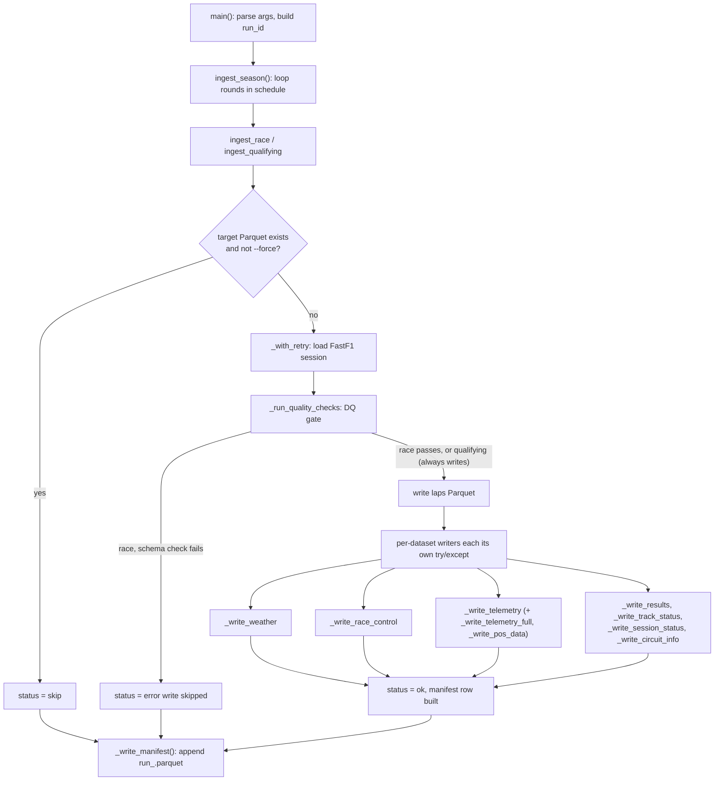
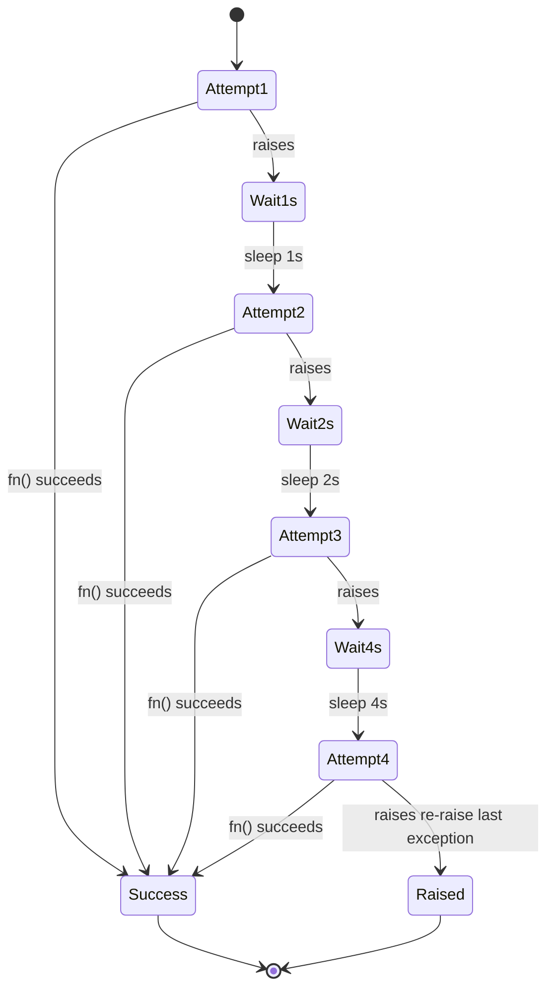

`ingestion/src/ingest.py` is a single Python process: for every season and round in scope, load a FastF1 session, gate it through data quality, write Hive-partitioned Parquet, and record one manifest row per attempt. Nothing here computes a feature or joins a table that's deliberate (see [Bronze is dumb](/data/overview)) but a lot of resilience machinery exists to keep a multi-hour backfill from dying on the first bad file.

## Control flow

A race and a qualifying session take the same shape with one difference: `ingest_race` treats a schema failure as fatal for that session (skip the write, record `error`); `ingest_qualifying` runs the same checks but discards the schema result entirely qualifying always writes (see [Data Quality](/data/data-quality) for why).

<Steps>
  <Step title="Skip if already on disk">
    `target.exists() and not force` both `ingest_race` and `ingest_qualifying` check this first. A completed session is skipped in milliseconds; only gaps from a previous run get pulled.
  </Step>
  <Step title="Load with retry">
    `_with_retry(lambda: _load_race_session(year, round_num))` wraps the FastF1 call see [Retry envelope](#retry-envelope) below.
  </Step>
  <Step title="Run the DQ gate">
    `_run_quality_checks` runs all four `DataQualityEngine` checks. For race laps, a schema failure stops here the function returns `False` and `ingest_race` records `status=error` without writing anything.
  </Step>
  <Step title="Write laps, then every companion dataset">
    The laps Parquet is written first. Weather, race control, telemetry, results, track status, session status, and circuit info are written next, each behind its own `try/except` see [Per-dataset writers](#per-dataset-writers).
  </Step>
  <Step title="Record the manifest row">
    `_make_manifest_row` builds one row with status, row count, DQ flag, duplicate-key count, and schema fingerprint. `ingest_season` collects every row across the season; `main` writes them all to `data/bronze/manifests/run_<run_id>.parquet` once, at the very end of the run.
  </Step>
</Steps>

## Retry envelope

`_with_retry` wraps any call that talks to FastF1 session loads and the event schedule fetch in up to 4 attempts with exponential backoff. There is no `8s` delay: with `max_attempts=4`, only 3 retries happen between the 4 attempts, so the sequence is **1s → 2s → 4s**, and a 4th failure re-raises the original exception immediately rather than waiting again.

If all 4 attempts fail, the exception propagates out of `ingest_race`/`ingest_qualifying`'s own `try/except`, which records `status=error` and moves on to the next round rather than aborting the season.

## Per-dataset writers

Every dataset beyond the laps file itself is written by its own function, called after the laps write succeeds, each independently wrapped in `try/except`. One writer raising never aborts the others, and never aborts the race.

<AccordionGroup>
  <Accordion title="_write_weather">
    Renames FastF1's weather columns (`AirTemp` → `ambient_temp_c`, `Rainfall` → `rainfall_flag`, …) and writes to `weather/season=<year>/race=<slug>/[session=Q/]weather.parquet`. Returns silently no warning if the session has no `weather_data` at all.
  </Accordion>
  <Accordion title="_write_race_control">
    Renames `Category`/`Message` to `category`/`message`. The `Time` column arrives in different shapes across sessions a plain `timedelta64`, a timezone-aware datetime, or something `pd.to_timedelta` needs to coerce and the writer handles all three explicitly, converting each to elapsed `session_time_s` rather than assuming one representation and raising on the others.
  </Accordion>
  <Accordion title="_write_telemetry">
    Iterates every lap in `session.laps`, pulling that lap's `get_telemetry()` individually. A single lap's `get_telemetry()` call is wrapped in its own inner `try/except` that swallows the exception silently safety-car laps, pit-in/pit-out laps, and red-flagged stints routinely have no telemetry, and that's expected, not an error. Only logs a warning if *no* lap in the whole race produced telemetry.
  </Accordion>
  <Accordion title="_write_telemetry_full">
    Only runs when `--telemetry-full` is passed. Writes full-channel `car_data` (Speed, Throttle, Brake, `nGear`, RPM, DRS) per driver, partitioned by `driver=<id>`, compressed with `zstd` instead of `snappy` since this dataset is substantially larger.
  </Accordion>
  <Accordion title="_write_pos_data">
    Only runs alongside `_write_telemetry_full`. Writes X/Y/Z car-position samples per driver, same per-driver partitioning and `zstd` compression as `_write_telemetry_full`.
  </Accordion>
  <Accordion title="_write_results">
    Writes official classification `ClassifiedPosition`, `Status`, `GridPosition`, qualifying `Q1`/`Q2`/`Q3` times to `results/season=<year>/race=<slug>/results.parquet`. Returns silently if `session.results` is empty.
  </Accordion>
  <Accordion title="_write_track_status">
    Writes the safety-car/VSC event timeline. Same multi-format `Time` handling as `_write_race_control` (timedelta, tz-aware datetime, or coerced fallback) before deriving `session_time_s`.
  </Accordion>
  <Accordion title="_write_session_status">
    Writes red-flag and session-status transitions, with the same `Time`-format handling as `_write_track_status`.
  </Accordion>
  <Accordion title="_write_circuit_info">
    Writes corner geometry from `session.get_circuit_info()` one row per corner, with coordinates and marshal-sector numbers. Returns silently if the session has no circuit-info accessor at all (older seasons).
  </Accordion>
  <Accordion title="_write_event_schedule">
    Called once per season, not per race writes the full FastF1 event schedule (every round, including non-numbered events) to `schedule/season=<year>/schedule.parquet` after the season's races/qualifying sessions are done.
  </Accordion>
</AccordionGroup>

<Note>
  Idempotency and the on-disk FastF1 cache compose: re-running a `--force` ingest re-pulls every writer above, but the slow part talking to FastF1's upstream feed is usually skipped because the session was already cached locally on the first pull. See [FastF1](/data/source-fastf1#loading-a-session).
</Note>

<Note>
  Output is laid out as `<dataset>/season=<year>/race=<slug>/`, so a query scoped to one race never scans datasets it doesn't need telemetry alone spans hundreds of millions of rows across the full history, and Hive partitioning lets DuckDB and dbt prune to a single race directory instead of reading the whole table.
</Note>

<Tip>
  Every writer's `except` clause logs and returns rather than re-raising, so a malformed weather file or a missing circuit-info accessor never takes down the rest of the race. The one exception is the laps write itself, which is what `ingest_race`/`ingest_qualifying`'s outer `try/except` guards that's the one write the DQ gate protects.
</Tip>

## Next

<Card title="Bronze schemas" icon="database" href="/reference/data-schemas">
  Column-level detail for every dataset this page's writers produce.
</Card>
