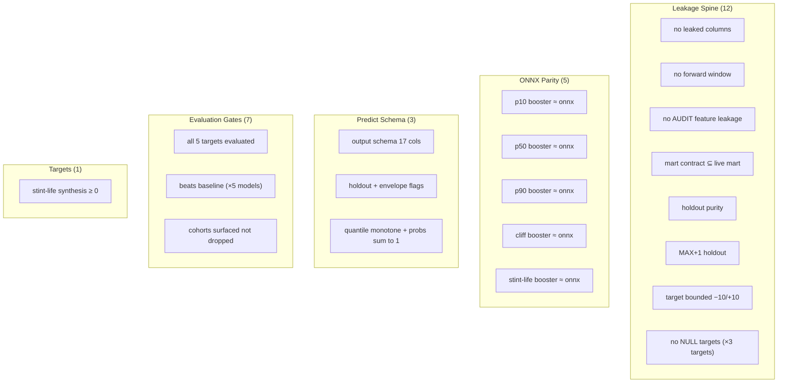

import MLTests from '/snippets/ml-inventory-tests.mdx';

The ML layer's 28 tests are load-bearing, not box-ticking. The leakage spine is the only thing standing between a model that looks good on paper and one that silently inflates every offline number by memorising the season. The ONNX parity gate is the only thing that ensures the browser scores what the Python booster trained. Every test has a unique idea; none is decorative.

<CodeGroup>

```bash Run all ML tests
make ml-test
```

```bash Run a specific group
./.venv/bin/python -m pytest ml/tests/test_features.py -v   # leakage spine
./.venv/bin/python -m pytest ml/tests/test_onnx_parity.py -v  # ONNX parity
./.venv/bin/python -m pytest ml/tests/test_predict.py -v    # predict schema
./.venv/bin/python -m pytest ml/tests/test_evaluate.py -v   # evaluation gates
./.venv/bin/python -m pytest ml/tests/test_targets.py -v    # targets
```

</CodeGroup>

## The 28 tests, grouped

<MLTests />



## Go deeper

<CardGroup cols={2}>
  <Card title="Leakage Spine" href="/ml/ci/leakage-spine" icon="shield">
    The 12 guards in detail one idea each, with the assertion and why it matters.
  </Card>
  <Card title="Parity & Schema" href="/ml/ci/parity-and-schema" icon="check-check">
    The 5 ONNX parity + 3 predict-schema + 1 target tests the mechanical contracts.
  </Card>
  <Card title="Evaluation Gates" href="/ml/ci/evaluation-gates" icon="trophy">
    The 7 evaluation gates beats-baseline, calibration computed, cohorts surfaced.
  </Card>
  <Card title="Validation" href="/ml/validation" icon="chart-bar">
    The methodology behind the metrics these gates enforce.
  </Card>
</CardGroup>
