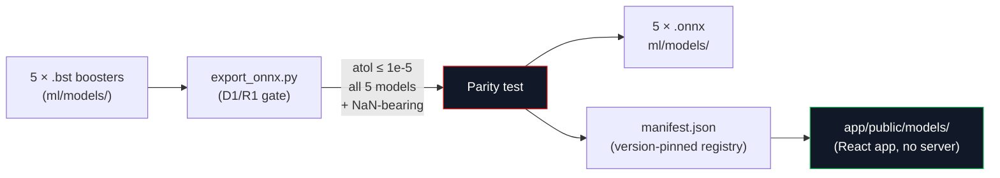

import MLInventory from '/snippets/ml-inventory.mdx';

The `ml-onnx` stage converts every trained `.bst` booster to ONNX format. This is the step that makes the React app able to score predictions entirely client-side no server, no round-trip, no network dependency for in-race prediction.



## The parity gate

<Check>
  All five models round-trip XGBoost → ONNX within `atol=1e-5`, including a NaN-bearing sample (the ~47% of laps with a null cliff-onset prior). The quantile trio moves together if any one fails, none ship.
</Check>

The parity gate runs automatically during `ml-onnx` and is re-enforced by `test_onnx_parity.py` in CI. The tolerance is `atol=1e-5` and is never loosened any divergence between the Python booster and the ONNX runtime would silently produce wrong numbers on screen.

The NaN-bearing sample is the critical case. XGBoost learns the optimal missing-value split direction for each feature during training. When exported to ONNX, those learned directions must round-trip exactly a model that produces correct numbers on clean rows but wrong numbers on NaN rows would be wrong for nearly half of all real-world predictions.

<AccordionGroup>
  <Accordion title="Why parity must be exact" icon="scale">
    Python trains; the browser scores. The booster and the ONNX runtime compute the same trees by different code paths. Any divergence is:

    - **Silent** there is no error; the browser just shows a wrong number
    - **Systematic** it would affect the same input patterns every time
    - **Invisible** users comparing the app's degradation prediction to the training number would see them disagree, with no indication of which is correct

    The `atol=1e-5` gate catches the divergence before anything is exported. It is run on every `ml-onnx` invocation, not just during CI.
  </Accordion>
  <Accordion title="The manifest version pinning" icon="bookmark">
    After a successful parity test, `ml-onnx` writes `ml/models/manifest.json` a registry that maps each model name to its current version and ONNX path:

    ```json
    {
      "degradation_regressor_p50": {
        "version": "v4",
        "onnx": "ml/models/degradation_regressor_p50_v4.onnx"
      },
      ...
    }
    ```

    The app reads this manifest to resolve which ONNX file to load. When a new version is trained, only the manifest needs updating the app does not need to be changed. The `make app-models` target copies the ONNX files and manifest to `app/public/models/`, where the React build picks them up.
  </Accordion>
  <Accordion title="Encoders the categorical bridge" icon="key">
    The ONNX model receives a float32 matrix; it cannot handle raw string categoricals. The ordinal encoding map (`ml/models/encoders.json`) built during `ml-features` is the bridge: the app applies the same map at scoring time so the browser and the Python training code see the same integer representation for "SOFT" or "Mercedes".

    The map is built from training data only values not seen during training map to `MISSING_ORDINAL = −1.0`, which the ONNX model handles via the same learned split direction as any other missing value.
  </Accordion>
</AccordionGroup>

## In-browser scoring

The React app loads the ONNX files at startup via `onnxruntime-web`. Prediction is fully client-side:

1. The app fetches the mart parquet and the encoders JSON from the CDN.
2. The user selects a lap; the app encodes the row into a float32 tensor.
3. The ONNX runtime scores all five models in sequence.
4. The results are displayed p10/p50/p90 degradation, cliff class probabilities, remaining stint life.

No server round-trip is required. The CDN serves data; all computation is local.

## Relationships

<CardGroup cols={2}>
  <Card title="ONNX parity tests" href="/ml/ci/parity-and-schema" icon="shield-check">
    The 5 CI tests that enforce `atol=1e-5` parity on every build, including the NaN-bearing case.
  </Card>
  <Card title="Pipeline" href="/ml/pipeline" icon="workflow">
    Where `ml-onnx` fits in the full `make ml-all` DAG.
  </Card>
  <Card title="Models" href="/ml/models" icon="microchip">
    The boosters that are exported their objectives, training, and the weights that affect how missing values are handled.
  </Card>
  <Card title="Features & Targets" href="/ml/features-and-targets" icon="layers">
    The ordinal encoding that the browser must replicate for the ONNX input to be correct.
  </Card>
</CardGroup>
