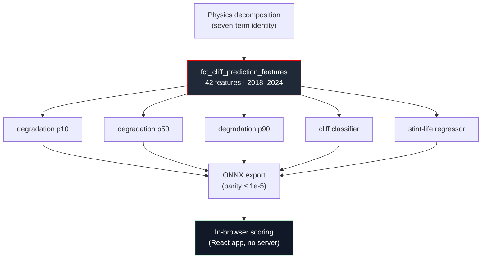

import MLInventory from '/snippets/ml-inventory.mdx';

The seven-term decomposition tells you where each lap's time went. The machine layer asks what happens next. Five XGBoost models sit on top of the decomposed lap data and translate per-lap physics signals into forward-looking predictions about tyre behaviour how much pace the next lap will cost, how close the cliff is, and how many usable laps remain in the stint.

<Note>
  **For a reviewer:**
  - **Decision:** gradient-boosted trees over a hand-built physics feature mart, exported to ONNX for in-browser scoring; interpretability and parity over raw model flexibility.
  - **Trade-off:** tree models on tabular features, not deep learning, so gains come from the decomposition's signal rather than model capacity.
  - **Proof:** train/serve parity to `atol=1e-5`, calibrated prediction intervals, and a no-leakage feature spine, all enforced in CI.
</Note>

<MLInventory />

## Why ML is needed on top of the physics decomposition

The statistical layer already estimates a tyre cliff for every `(circuit, compound, season)` cohort using Kaplan-Meier survival analysis. That is the right answer to a population question: *when does the average Soft at Bahrain fall off?* It cannot answer whether *this* stint, in *these* conditions, is about to drop.

The cliff is not a fixed lap number. It moves with:

- **Thermal history** how hard the tyre has been pushed (`push_residual`, cumulative surface and bulk load)
- **Dirty air** laps spent in another car's wake overheat the surface (`dirty_air_thermal_load_surface/bulk`)
- **Ambient and air density** a hot, thin-air afternoon cliffs earlier than a cool evening session
- **Fuel load** a heavy car early in the stint loads the tyre differently from a light car at the end
- **Compound generation** 2018 legacy compounds behave unlike the 2019+ range

These factors interact. A linear correction per dimension cannot capture "Soft, lap 14, after six laps in dirty air, on a hot low-grip surface." Gradient-boosted trees can which is the entire reason for the machine layer. The Kaplan-Meier prior becomes a feature the models consume as a starting point, not the final word.

## The feature source

All five models read from a single contracted mart: `fct_cliff_prediction_features`. The models consume 42 features across ten physics-grouped families nothing is hand-engineered inside the ML layer. The physics lives in the dbt transform layer; the machine layer reads it.

<Info>
  **One mart, two target spans.** The quantile trio and the cliff classifier train on **114,270 laps** that carry the degradation and cliff targets; the stint-life regressor trains on **120,934 laps** the spans differ because a lap can have a usable stint-life count even where its next-lap jump is undefined. All seven seasons (2018–2024) feed in, and the **19,144-lap 2024 fold** stands in as the evaluation holdout until 2025 ingests.
</Info>

## Three question families, five models

<CardGroup cols={2}>
  <Card title="How much pace will the tyre lose?" icon="chart-line">
    Three quantile regressors p10, p50, and p90 predict `next_lap_degradation_jump_s`. Together they form a calibrated 80% prediction interval: p50 is the best single guess; p10 and p90 bound it. The target is legitimately negative roughly 44% of the time a tyre coming into its working window genuinely gains pace.
  </Card>
  <Card title="How close is the cliff?" icon="triangle-exclamation">
    A 4-class classifier predicts `laps_until_cliff_class`: `0_to_2`, `3_to_5`, `6_plus`, or `none_in_stint`. Most laps have no cliff ahead at all-the balance is roughly 9 / 7 / 9 / 76 percent-so the model trains with balanced class weights to keep the cliff-window classes from being drowned out by `none_in_stint`.
  </Card>
</CardGroup>

<CardGroup cols={2}>
  <Card title="How many usable laps remain?" icon="flag">
    A single regressor predicts `remaining_stint_life_laps` the synthesised, non-negative count of usable laps left in the stint. This is what drives the strategy view's "this set is done in ~N laps" readout.
  </Card>
  <Card title="All five run in-browser" icon="chrome">
    Every model is exported to ONNX and scored client-side via the React app no server round-trip required. ONNX parity tests confirm numbers in the browser match numbers from training to within `atol=1e-5`.
  </Card>
</CardGroup>

## How the models fit into the broader system



The machine layer reads the warehouse **read-only** and never writes to the application layer. Reproducing the full pipeline takes a single command:

<CodeGroup>

```bash Build
make ml-all   # features → tune → train → evaluate → predict → onnx → card
```

```bash Test
make ml-test  # 40 tests: leakage spine, ONNX parity, version contract, output schema, beats-baseline
```

</CodeGroup>

## Go deeper

<CardGroup cols={2}>
  <Card title="Feature contract" href="/ml/feature-contract" icon="layers">
    The 42 features across 10 physics groups, where each comes from in the mart, and the read-only contract that keeps physics and ML cleanly separated.
  </Card>
  <Card title="The pipeline" href="/ml/pipeline" icon="workflow">
    The eight-stage `make ml-all` DAG features → tune → train → evaluate → predict → onnx → card → reference and what each stage reads, writes, and guarantees.
  </Card>
  <Card title="Validation & Trust" href="/ml/validation" icon="shield-check">
    Season-grouped time-series cross-validation, the leakage spine, calibration coverage, and the `MAX+1`-derived holdout policy.
  </Card>
  <Card title="The CI Contract" href="/ml/ci/overview" icon="vial">
    All 40 tests 14 leakage-spine guards, 5 ONNX parity, 3 predict-schema, 7 evaluation gates, 1 target bound, 10 version-contract grouped and explained.
  </Card>
  <Card title="Model Reference" href="/reference/ml/degradation-model" icon="database">
    The generated model card: per-model hyperparameters, headline metrics, calibration, cohorts, and reproducibility.
  </Card>
</CardGroup>
