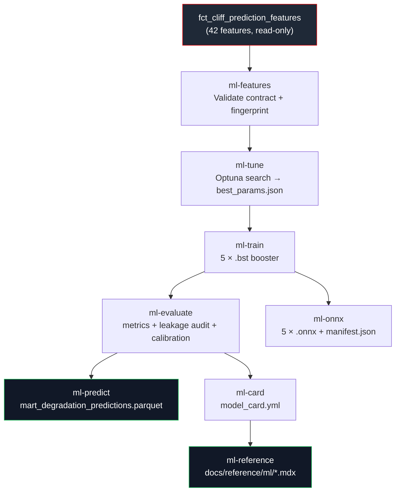

One command reproduces the entire machine learning layer from scratch:

<CodeGroup>

```bash Build
make ml-all   # features → tune → train → evaluate → predict → onnx → card → reference
```

```bash Test
make ml-test  # 28 tests: leakage spine, ONNX parity, output schema, beats-baseline
```

</CodeGroup>

The eight stages run in dependency order. Walking them top to bottom is the same direction the data flows.



## The eight stages

<Steps>
  <Step title="ml-features validate the feature contract" icon="shield-check">
    **What it reads:** `data/dev.duckdb` → `fct_cliff_prediction_features`.

    **What it writes:** `ml/models/encoders.json` (the ordinal encoding map) and a dataset fingerprint logged to stdout.

    **What it guarantees:** the 42-column feature contract is a subset of the mart's actual columns; the forward-window SQL audit finds no `LEAD`/`FOLLOWING` clauses; and the leakage exclusion list is non-overlapping with the feature list. The fingerprint makes the run reproducible: given the same mart rows, every downstream artefact is byte-for-byte identical.

    ```bash
    make ml-features
    ```
  </Step>
  <Step title="ml-tune Optuna hyperparameter search" icon="sliders">
    **What it reads:** the feature matrix (loaded from the warehouse) and the previous stage's encoders.

    **What it writes:** `ml/models/*_best_params.json` one file per model, containing the optimal hyperparameters found across the search.

    **What it guarantees:** each model's parameters were selected by the season-grouped `TimeSeriesSplit` headline metric, not by held-out test performance. Studies are seeded and resumable.

    ```bash
    make ml-tune   # 50 trials / 5 folds / full data (canonical)
    ```

    <Note>
      The shipped v1 parameters used a reduced tuning budget (15 trials / 3 folds / 30k-row subsample) for speed. The full `make ml-tune` run only improves them the beats-baseline gate holds regardless. See [Tuning](/ml/tuning) for the full search space.
    </Note>
  </Step>
  <Step title="ml-train fit the five boosters" icon="microchip">
    **What it reads:** the best-params JSON from the tune stage and the full training set.

    **What it writes:** `ml/models/degradation_regressor_p{10,50,90}_vN.bst`, `ml/models/cliff_classifier_vN.bst`, `ml/models/stint_life_regressor_vN.bst` one XGBoost booster per model, serialised in binary format.

    **What it guarantees:** each booster was fit on the full training data (not a CV fold), using the hyperparameters that won the search. The quantile trio carries IPW survival weights; the cliff classifier carries balanced class weights. See [Models](/ml/models).

    ```bash
    make ml-train
    ```
  </Step>
  <Step title="ml-evaluate metrics, leakage audit, calibration, cohorts" icon="chart-bar">
    **What it reads:** the five trained boosters and the held-out evaluation fold (the final `TimeSeriesSplit` fold 2024).

    **What it writes:** `ml/models/evaluation_metrics.json` all headline metrics, calibration coverage, cohort losses, and the adversarial leakage probe result.

    **What it guarantees:** every model's eval metric is compared against the per-cohort baseline; all five beat it. The `[p10, p90]` interval coverage is measured. The adversarial probe confirms `race_year` is recoverable from features but is intentionally excluded. See [Validation](/ml/validation).

    ```bash
    make ml-evaluate
    ```
  </Step>
  <Step title="ml-predict score the full mart" icon="database">
    **What it reads:** all five boosters and the full mart (including training rows).

    **What it writes:** `data/marts/mart_degradation_predictions.parquet` 17 columns per lap: p10/p50/p90 degradation quantiles, cliff class probabilities, remaining stint life, holdout flag, envelope flag, model version, and timestamp.

    **What it guarantees:** the output schema is Arrow-validated against the declared 17-column schema on every run. The `is_holdout` flag marks the designated holdout season (no data yet). See the [predict schema tests](/ml/ci/parity-and-schema).

    ```bash
    make ml-predict
    ```
  </Step>
  <Step title="ml-onnx export and parity-test" icon="circle-check">
    **What it reads:** the five trained boosters and the encoders JSON.

    **What it writes:** `ml/models/*_vN.onnx` (one per model) and `ml/models/manifest.json` (version-pinned registry).

    **What it guarantees:** every booster round-trips to ONNX within `atol=1e-5`, including a NaN-bearing sample that confirms parity on the ~47% of laps with a null cliff-onset prior. Any parity failure blocks the export nothing ships. See [ONNX export](/ml/onnx).

    ```bash
    make ml-onnx
    ```
  </Step>
  <Step title="ml-card write the model card" icon="file-text">
    **What it reads:** the trained boosters, the evaluation metrics JSON, and the encoders.

    **What it writes:** `ml/model_card.yml` the machine-written YAML record of every model's hyperparameters, metrics, calibration, cohorts, dataset fingerprint, and library versions.

    **What it guarantees:** the card is the single source of truth for all numbers displayed in the generated reference. It is machine-written by `ml/src/card.py`; never hand-edited.

    ```bash
    make ml-card
    ```
  </Step>
  <Step title="ml-reference generate the reference MDX" icon="book">
    **What it reads:** `ml/model_card.yml`.

    **What it writes:** `docs/reference/ml/degradation-model.mdx` the rendered model card as Mintlify MDX, with a drift-gate that fails CI if the committed page disagrees with a fresh generation.

    **What it guarantees:** the published reference always matches the last run of `ml-card`. See `python scripts/gen_ml_reference.py --check`.

    ```bash
    make ml-reference
    ```
  </Step>
</Steps>

<Accordion title="Smoke vs production artefacts" icon="flask">
  Each booster is named `{target}_{version}.bst`. The `smoke` version is a fast fixture trained on a 1,000-row subsample it exists only for CI speed; its metrics are meaningless. The production artefacts are named `v5` (the current version). When the pipeline produces a new version, the old `.bst` and `.onnx` files are kept for diffing.

  The distinction matters for the parity tests: `test_onnx_parity.py` runs against the current `MODEL_VERSION_DEFAULT` (`v5`), not against the smoke fixture.
</Accordion>

## Relationships

<CardGroup cols={2}>
  <Card title="Features and targets" href="/ml/features-and-targets" icon="layers">
    How a mart row becomes a row of the feature matrix encoding, fingerprinting, the three targets, and the forward-window audit.
  </Card>
  <Card title="Models" href="/ml/models" icon="microchip">
    The five objectives, the training engine (IPW + balanced weights), and per-model behaviour.
  </Card>
  <Card title="Tuning" href="/ml/tuning" icon="sliders">
    The 9-dimensional Optuna search space, CV selection, and the refit-on-everything step.
  </Card>
  <Card title="ONNX export" href="/ml/onnx" icon="cpu">
    The parity gate, NaN-bearing sample, and how the models reach the browser.
  </Card>
</CardGroup>
