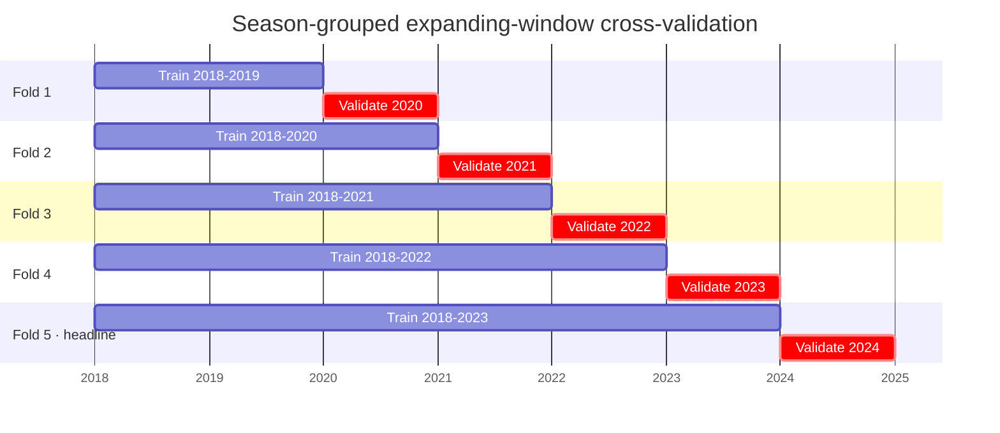

Forward-looking targets make leakage the defining risk of the machine layer. A model that accidentally sees the future or the answer will look good on paper and fail the moment it runs on live data. Off The Pace defends against this with a **leakage spine**: a set of guards baked into tests and CI that prove the model never sees what it should not.

## Season-grouped time-series validation

Tyre data is a time series. A random train/test split would let the model train on 2024 laps and then "predict" 2022 which is not prediction at all. Instead, validation uses a **season-grouped `TimeSeriesSplit`** with an expanding window across five splits: whole seasons move together, and each fold validates on the season(s) immediately after those it trained on.

The final fold trains on 2018–2023 and validates on **2024** the most recent, holdout-shaped unseen season. That final-fold score is the evaluation headline reported in the [model metrics table](/ml/models#headline-results).

<Note>
  **2025 is the planned true out-of-sample holdout.** The holdout season is data-derived, not hard-coded: `HOLDOUT_SEASON = MAX(race_year) + 1`. Today that resolves to 2025, which has no rows yet. The moment 2025 data ingests, the evaluation logic detects the populated holdout and switches to a true out-of-sample reveal **with zero code change**. The split year is never a hard-coded literal the test suite enforces this.
</Note>

---

## The leakage spine five guards

| Guard | What it proves |
|---|---|
| **No leaked columns** | Targets, driver-skill signals, and season identifiers never enter the feature matrix |
| **No forward-looking features** | A `sqlglot` audit walks the compiled mart and all ancestors, rejecting any `LEAD` or `FOLLOWING` window function |
| **Holdout purity** | No holdout-season row appears in any training fold |
| **No hard-coded holdout** | The split is `MAX+1`-derived, never a literal year |
| **Bounded / non-null targets** | Degradation ∈ [−10, 10]; no NULL-target rows enter training |

<Check>
  These five guards are part of the **28-test suite** and run automatically in CI on every change. Reproduce locally with `make ml-test`. Each guard is explained in depth on the [Leakage Spine page](/ml/ci/leakage-spine).
</Check>

---

## The adversarial leakage probe

The two most consequential exclusions `driver_id` and `race_year` are justified by **demonstration, not assertion**. A throwaway XGBoost model is trained to recover `race_year` from the remaining features. It succeeds at **0.987 accuracy** against a majority-class baseline of 0.168 a lift of 0.82.

That is the point. Constructor identities and compound generations carry such a strong residual temporal signal that `race_year` is almost perfectly recoverable from them. Including `race_year` as a feature would create a backdoor to the season, and through it to outcomes the model should not know. The same logic applies to `driver_id`, which would let the trees relearn per-driver skill the very signal the decomposition works to isolate into `driver_skill_residual_s`. Both are correctly excluded.

<Warning>
  A feature that *predicts the season* is a feature that predicts the answer. Temporal leakage is silent it never throws an error, it just inflates every offline number and collapses the moment the model meets a season it has not memorised. The probe is the tripwire that makes the exclusion non-negotiable.
</Warning>

---

## Metric definitions

Each model family is judged on a single headline metric, computed directly from the implementations in `ml/src/train.py` and `ml/src/evaluate.py`.

<Tabs>
  <Tab title="Pinball ↓ (quantiles)">
    The quantile trio is scored by the same **pinball loss** it is trained on, at $\alpha \in \{0.1, 0.5, 0.9\}$. For a residual $u = y - \hat{y}$:

    $$\ell_\alpha(y,\hat{y}) = \max\!\big(\alpha\,u,\;(\alpha-1)\,u\big)$$

    Lower is better. Because the loss is the training objective, beating the empirical-percentile baseline on it is direct evidence the model has learned conditional structure the cohort average has not. Full derivation in [Models → Objective functions](/ml/models#objective-functions).
  </Tab>
  <Tab title="RMSE ↓ (stint life)">
    The stint-life regressor is scored by **root-mean-square error** in laps:

    $$\mathrm{RMSE} = \sqrt{\tfrac{1}{n}\sum_i (y_i - \hat{y}_i)^2}$$

    Lower is better. RMSE punishes large misses quadratically, which is the right risk profile for a planning horizon: being ten laps wrong is far worse than being one lap wrong ten times.
  </Tab>
  <Tab title="Macro-F1 ↑ (cliff class)">
    The cliff classifier is scored by **macro-averaged F1** the *unweighted* mean of the four per-class F1 scores:

    $$\text{F1}_c = \frac{2\,P_c\,R_c}{P_c + R_c}, \qquad \text{macro-F1} = \frac{1}{C}\sum_{c=1}^{C}\text{F1}_c$$

    where $P_c$ and $R_c$ are precision and recall for class $c$ and $C = 4$. Averaging *unweighted* (rather than by class support) is deliberate: it gives the rare `0_to_2` window the same say as the dominant `6_plus` class, so a model that quietly ignored imminent cliffs would be punished hard. This is also why macro-F1 sets a far lower ceiling than raw accuracy would.
  </Tab>
</Tabs>

---

## Calibration

The degradation quantile trio claims an 80% prediction interval from `[p10, p90]`. The raw quantiles are **already calibrated** empirical coverage lands within ~0.014 of nominal on the 2024 evaluation fold. A split-conformal (CQR) correction is computed post-hoc and confirms calibration with a finite-sample guarantee. In plain terms: the model is right approximately four times in five, and the interval averages ~1.24 seconds wide.

The full LaTeX derivation of the conformity score, the CQR quantile formula, and the coverage table live on the [Calibration page](/ml/calibration).

---

## Cohorts surfaced, never dropped

Beyond the global headline, every model is scored across cohorts: compound, circuit, constructor, rain-lap, and season. Underperforming cells are recorded to the model card rather than hidden. Most are the near-oracle stint-life baseline winning on specific circuits (the Dutch, Japanese, and Las Vegas Grands Prix among them). The contract is explicit: surface the losses, do not hide them.

The full cohort table and the context for each loss live on the [Cohorts page](/ml/cohorts).

---

---

## Known limitations

<Warning>
  **No live 2025 holdout yet.** Evaluation headlines are the final time-series CV fold (2024). They become a true out-of-sample reveal automatically when 2025 data ingests but until that moment, they are cross-validation, not a held-out season.
</Warning>

- **The cliff classifier is the weakest model.** Macro-F1 ≈ 0.33 decisively beats the majority prior but is modest in absolute terms; skill on the rare imminent-cliff windows is limited. The 100 most-confident misses are exported for study and inform the v2 roadmap.
- **v1 hyperparameters come from a reduced tuning budget.** Running `make ml-tune` (50 trials / 5 folds / full data) only improves them no code change required and should precede any production blessing.
- **~47% of laps have a null cliff-onset prior** (2018 legacy compounds, un-fit circuits). XGBoost handles the missingness natively via default-direction splits rather than imputation this is documented and its ONNX parity is proven but those laps lean less on the strongest prior feature.
