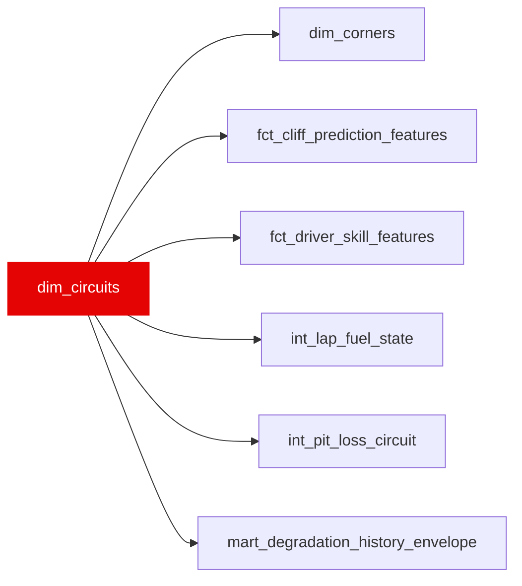

{/* _AUTOGENERATED   do not hand-edit. Run `python scripts/gen_dbt_reference.py` to regenerate. */}

<Note>Part of the [Reference](/transform/families/reference) family.</Note>

One row per event slug (circuit_key). Lifts the circuit_reference seed into a typed dimension carrying the physical properties used for fuel-load estimation (weight_penalty_factor), track evolution (abrasiveness_index), and constructor pace decomposition (track_energy_index). circuit_key is a grand-prix/event slug, so several keys can share one physical venue (renamed events, double-headers); circuit_id is the stable physical-circuit identifier used to pool races run at the same track. Refresh the seed when layouts change.

## Lineage

## Overview

| Property | Value |
|---|---|
| Layer | `reference` |
| Family | [Reference](/transform/families/reference) |
| Contract enforced | No |

**7 tests** [guard](/transform/ci/overview) this model  -  6 generic, 1 singular.

## Columns

| Column | Type | Nullable | Tests | Description |
|---|---|---|---|---|
| `circuit_key` | `varchar` | Yes | [`not_null`](/transform/ci/structural), [`unique`](/transform/ci/structural) | Event slug (grand-prix key) matching race_id in stg_laps. |
| `circuit_id` | `varchar` | Yes | [`not_null`](/transform/ci/structural) | Physical-circuit identifier (slug of circuit_name). Several event slugs can share one circuit_id (renamed events, double-headers), so it is non-unique here. |
| `circuit_name` | `varchar` | Yes |   | Human-readable circuit name from the seed. |
| `lap_length_km` | `double` | Yes | [`expect_column_values_to_be_between`](/transform/ci/range-and-domain) | Circuit lap length in kilometres. |
| `corner_count` | `integer` | Yes |   | Number of corners on the lap (used in the weight-penalty formula). |
| `avg_lateral_g` | `double` | Yes |   | Average lateral g-force proxy for the circuit (used in the weight-penalty formula). |
| `fuel_consumption_rate_kg_per_lap` | `double` | Yes | [`not_null`](/transform/ci/structural) | Estimated kg of fuel burned per lap, used for fuel_mass_kg in Layer 03. |
| `track_energy_index` | `double` | Yes |   | Energy-demand index for the circuit; conditions constructor structural-pace decomposition. |
| `abrasiveness_index` | `integer` | Yes |   | Ordinal surface-abrasiveness rating driving track-evolution / rubber-in modelling. |
| `weight_penalty_factor` | `double` | Yes | [`not_null`](/transform/ci/structural) | Seconds per kg of fuel mass carried. Formula: 0.02 + 0.0002 × corner_count × avg_lateral_g. Used in int_lap_fuel_state to compute weight_corrected_lap_time. |
| `era_start_year` | `integer` | Yes |   | First season of the regulation era this circuit row applies to (e.g. 2022 ground-effect). |
