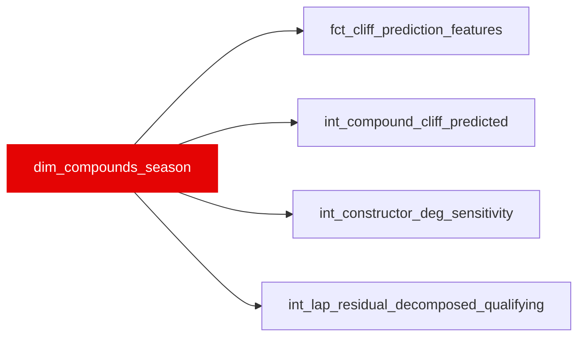

{/* _AUTOGENERATED   do not hand-edit. Run `python scripts/gen_dbt_reference.py` to regenerate. */}

<Note>Part of the [Reference](/transform/families/reference) family.</Note>

One row per circuit × compound × season. Lifts the compound_cliff_params seed into a typed dimension: cliff parameters estimated from stint survival analysis (Kaplan-Meier, fitted on 2018–2024 data   see tasks/coefficients/README.md). Every row carries fit_date and data_window for governance. Re-fit when a new season is ingested via make coefficients-fit.

## Lineage

## Overview

| Property | Value |
|---|---|
| Layer | `reference` |
| Family | [Reference](/transform/families/reference) |
| Contract enforced | No |

**4 tests** [guard](/transform/ci/overview) this model  -  4 generic, 0 singular.

## Columns

| Column | Type | Nullable | Tests | Description |
|---|---|---|---|---|
| `circuit_key` | `varchar` | Yes | [`not_null`](/transform/ci/structural) | Event slug (grand-prix key) matching race_id in stg_laps. |
| `compound_code` | `varchar` | Yes | [`not_null`](/transform/ci/structural) | Compound identifier the cliff parameters were fitted for (e.g. SOFT/MEDIUM/HARD or C1–C5). |
| `season` | `integer` | Yes | [`not_null`](/transform/ci/structural) | Season year the parameters apply to. |
| `compound_grip_peak` | `double` | Yes |   | Fitted peak grip level (relative pace offset at the compound's best window). |
| `compound_wear_gradient` | `double` | Yes |   | Fitted linear wear rate (pace loss per lap before the cliff). |
| `compound_optimal_temp_low` | `double` | Yes |   | Lower bound of the compound's optimal operating-temperature window (°C). |
| `compound_optimal_temp_high` | `double` | Yes |   | Upper bound of the compound's optimal operating-temperature window (°C). |
| `compound_cliff_onset_laps` | `double` | Yes |   | Fitted Kaplan-Meier cliff-onset age (laps) at which performance falls off sharply. |
| `compound_cliff_severity` | `double` | Yes |   | Fitted magnitude of the pace drop once the cliff is reached. |
| `fit_date` | `date` | Yes | [`not_null`](/transform/ci/structural) | Date on which the cliff parameters were last estimated. |
| `data_window` | `varchar` | Yes |   | Season range the fit was estimated over (governance provenance). |
| `notes` | `varchar` | Yes |   | Free-text provenance / caveat notes carried from the seed. |
