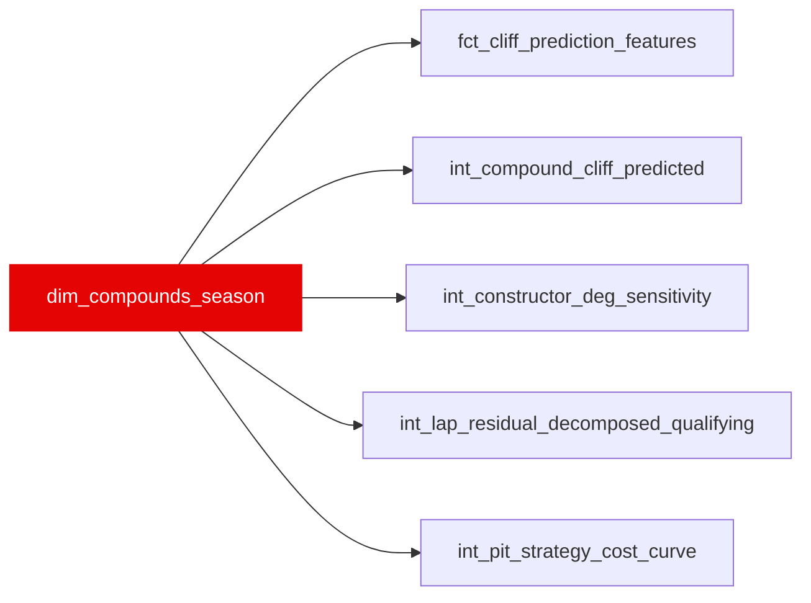

{/* _AUTOGENERATED   do not hand-edit. Run `python scripts/gen_dbt_reference.py` to regenerate. */}

<Note>Part of the [Reference](/transform/families/reference) family.</Note>

One row per circuit × compound × season. Lifts the compound_cliff_params seed into a typed dimension: cliff parameters estimated from stint survival analysis (Kaplan-Meier, fitted on 2018–2024 data   see tasks/coefficients/README.md). Every row carries fit_date and data_window for governance. Re-fit when a new season is ingested via make coefficients-fit.

## Lineage

```mermaid
flowchart LR
  dim_compounds_season --> fct_cliff_prediction_features
  dim_compounds_season --> int_compound_cliff_predicted
  dim_compounds_season --> int_constructor_deg_sensitivity
  dim_compounds_season --> int_lap_residual_decomposed_qualifying
  dim_compounds_season --> int_pit_strategy_cost_curve
  style dim_compounds_season fill:#e40404,stroke:#e40404,color:#fff
```

## Overview

| Property | Value |
|---|---|
| Layer | `reference` |
| Family | [Reference](/transform/families/reference) |
| Contract enforced | No |

**12 tests** [guard](/transform/ci/overview) this model  -  11 generic, 1 singular.

## Columns

| Column | Type | Nullable | Tests | Description |
|---|---|---|---|---|
| `circuit_key` | `varchar` | Yes | [`not_null`](/transform/ci/structural) | Event slug (grand-prix key) matching race_id in stg_laps. |
| `compound_code` | `varchar` | Yes | [`not_null`](/transform/ci/structural) | Compound identifier the cliff parameters were fitted for (e.g. SOFT/MEDIUM/HARD or C1–C5). |
| `season` | `integer` | Yes | [`not_null`](/transform/ci/structural) | Season year the parameters apply to. |
| `compound_grip_peak` | `double` | Yes |   | Fitted peak grip level (relative pace offset at the compound's best window). |
| `compound_wear_gradient` | `double` | Yes |   | Fitted linear wear rate (pace loss per lap before the cliff). |
| `compound_optimal_temp_low` | `double` | Yes |   | Lower bound of the compound's optimal operating-temperature window (°C). |
| `compound_optimal_temp_high` | `double` | Yes |   | Upper bound of the compound's optimal operating-temperature window (°C). |
| `compound_cliff_onset_laps` | `double` | Yes |   | Fitted Kaplan-Meier cliff-onset age (laps) at which performance falls off sharply. |
| `compound_cliff_severity` | `double` | Yes |   | Fitted magnitude of the pace drop once the cliff is reached. |
| `fit_date` | `date` | Yes | [`not_null`](/transform/ci/structural) | Date on which the cliff parameters were last estimated. |
| `data_window` | `varchar` | Yes |   | Season range the fit was estimated over (governance provenance). |
| `fit_source` | `varchar` | Yes | [`not_null`](/transform/ci/structural) | Cell-level fit tier (cox_km_survival, cross_season_fallback, compound_class_default, carried_forward_&lt;season&gt;). Says which tier was attempted, not where each number came from -- use the three *_source columns for that. |
| `onset_source` | `varchar` | Yes | [`not_null`](/transform/ci/structural), [`accepted_values`](/transform/ci/range-and-domain) | Where compound_cliff_onset_laps came from: fitted, cross_season_fallback, class_default or carried_forward. A class default stays class_default wherever the cell is carried. See the compound_cliff_params seed for how rows fitted before this column existed were labelled. |
| `gradient_source` | `varchar` | Yes | [`not_null`](/transform/ci/structural), [`accepted_values`](/transform/ci/range-and-domain) | Where compound_wear_gradient came from; same vocabulary as onset_source. |
| `severity_source` | `varchar` | Yes | [`not_null`](/transform/ci/structural), [`accepted_values`](/transform/ci/range-and-domain) | Where compound_cliff_severity came from; same vocabulary as onset_source. |
| `notes` | `varchar` | Yes |   | Free-text provenance / caveat notes carried from the seed. Never reads "fitted from" on a cell where any parameter is a class default. |
