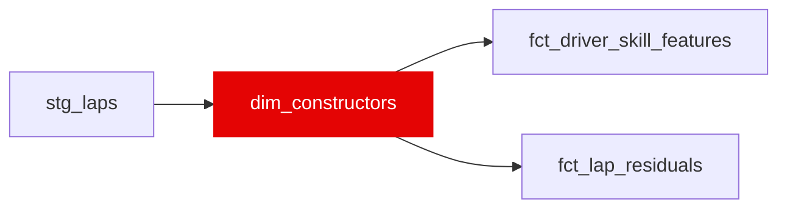

{/* _AUTOGENERATED   do not hand-edit. Run `python scripts/gen_dbt_reference.py` to regenerate. */}

<Note>Part of the [Reference](/transform/families/reference) family.</Note>

One row per constructor (team). Derived from stg_laps with a manually maintained power-unit family mapping. pu_family conditions constructor_pace_index on similar-engine teams in Layer 04 (e.g. Mercedes PU customers share base drag); update the mapping when customer relationships change.

## Lineage

## Overview

| Property | Value |
|---|---|
| Layer | `reference` |
| Family | [Reference](/transform/families/reference) |
| Contract enforced | No |
| Upstream | [`stg_laps`](../stg/stg_laps) |

**3 tests** [guard](/transform/ci/overview) this model  -  3 generic, 0 singular.

## Columns

| Column | Type | Nullable | Tests | Description |
|---|---|---|---|---|
| `constructor_id` | `varchar` | Yes | [`not_null`](/transform/ci/structural), [`unique`](/transform/ci/structural) | Team name as reported by FastF1 (e.g. 'Mercedes', 'Red Bull Racing'). |
| `pu_family` | `varchar` | Yes | [`not_null`](/transform/ci/structural) | Power-unit family grouping (e.g. mercedes_pu, honda_pu, ferrari_pu, renault_pu); 'unknown_pu' when unmapped. |
