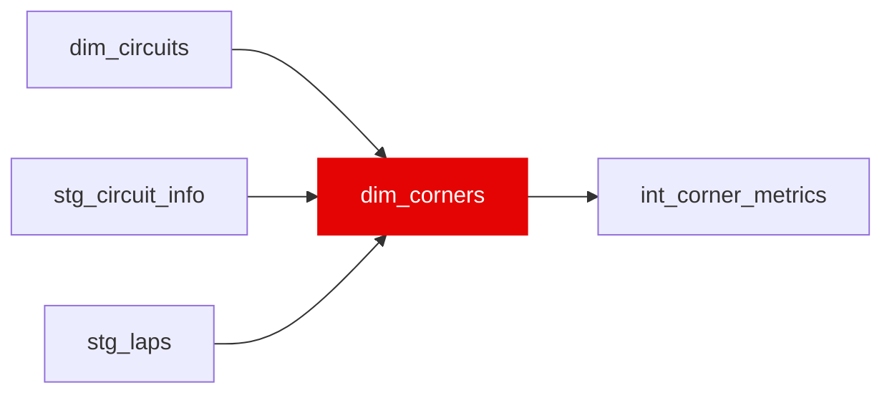

{/* _AUTOGENERATED   do not hand-edit. Run `python scripts/gen_dbt_reference.py` to regenerate. */}

<Note>Part of the [Reference](/transform/families/reference) family.</Note>

One row per race × circuit turn: the telemetry distance window each corner owns, derived from FastF1's own corner table (stg_circuit_info) rather than maintained by hand. Windows run from the apex minus corner_entry_margin_m to the apex plus corner_exit_margin_m, each end clipped at the neighbouring apex, so consecutive corners overlap only in the stretch between them   which is both the exit of one and the approach to the next. Keyed per race because FastF1 publishes geometry per event and venues re-profile mid-history; a race whose corner table is missing borrows the nearest season of the same event slug and says so in geometry_source.

## Lineage

## Overview

| Property | Value |
|---|---|
| Layer | `reference` |
| Family | [Reference](/transform/families/reference) |
| Contract enforced | No |
| Upstream | [`stg_laps`](../stg/stg_laps), [`stg_circuit_info`](../stg/stg_circuit_info), [`dim_circuits`](./dim_circuits) |

**14 tests** [guard](/transform/ci/overview) this model  -  13 generic, 1 singular.

## Columns

| Column | Type | Nullable | Tests | Description |
|---|---|---|---|---|
| `corner_key` | `varchar` | Yes | [`not_null`](/transform/ci/structural), [`unique`](/transform/ci/structural) | PK, race_id \|\| '_' \|\| corner_name. |
| `race_year` | `integer` | Yes | [`not_null`](/transform/ci/structural) | Season year of the race the window applies to. |
| `race_id` | `varchar` | Yes | [`not_null`](/transform/ci/structural) | Numeric FastF1 event id, the join key into stg_telemetry. |
| `track_id` | `varchar` | Yes | [`not_null`](/transform/ci/structural) | Event slug for the race (bahrain_grand_prix). Carried through int_corner_metrics as a label; nothing in this model pools across slugs. |
| `circuit_id` | `varchar` | Yes |   | Physical-circuit identifier from dim_circuits. Several event slugs can share one circuit_id (renamed events, double-headers), so it is non-unique here. |
| `corner_name` | `varchar` | Yes | [`not_null`](/transform/ci/structural) | Turn label, 'Turn_' \|\| corner_number \|\| corner_letter (e.g. Turn_7, Turn_7A). |
| `corner_number` | `integer` | Yes | [`not_null`](/transform/ci/structural) | FastF1 corner number, ordered by distance along the lap. |
| `corner_letter` | `varchar` | Yes |   | Suffix FastF1 uses where one numbered turn has several apexes; NULL otherwise. |
| `apex_distance_m` | `double` | Yes | [`not_null`](/transform/ci/structural) | Distance of the corner apex from the start line, on the same reference as stg_telemetry.distance_m. Validated against the measured speed minimum on slow corners (median offset 2 m). |
| `start_distance_m` | `double` | Yes | [`not_null`](/transform/ci/structural) | Window start: apex − corner_entry_margin_m, floored at the previous apex and at 0. Wide enough to contain the braking zone on corners with a clear approach. |
| `end_distance_m` | `double` | Yes | [`not_null`](/transform/ci/structural) | Window end: apex + corner_exit_margin_m, capped at the next apex so a corner never reaches past its neighbour. |
| `geometry_race_id` | `varchar` | Yes | [`not_null`](/transform/ci/structural) | Race whose FastF1 corner table produced this window (self, or the borrowed session). |
| `geometry_source` | `varchar` | Yes | [`not_null`](/transform/ci/structural), [`accepted_values`](/transform/ci/range-and-domain) | 'session' where the race has its own corner table, 'nearest_season' where it borrows the closest season at the same event slug. 143 of 149 races carry their own geometry and four borrow; the two that cannot (2020 Sakhir and Tuscan, one-offs with no sibling event at the same slug) have no geometry anywhere and carry no rows. |
