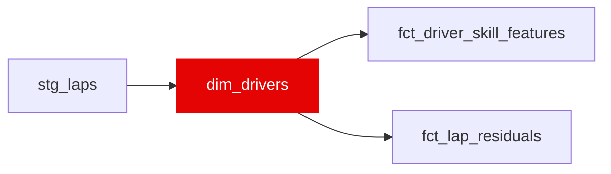

{/* _AUTOGENERATED   do not hand-edit. Run `python scripts/gen_dbt_reference.py` to regenerate. */}

<Note>Part of the [Reference](/transform/families/reference) family.</Note>

One row per driver_id. Derived from stg_laps   driver_id is the FastF1 three-letter code (e.g. VER, HAM); debut_year and career_races_in_dataset reflect only the seasons present in the Bronze layer.

## Lineage

## Overview

| Property | Value |
|---|---|
| Layer | `reference` |
| Family | [Reference](/transform/families/reference) |
| Contract enforced | No |
| Upstream | [`stg_laps`](../stg/stg_laps) |

**2 tests** [guard](/transform/ci/overview) this model  -  2 generic, 0 singular.

## Columns

| Column | Type | Nullable | Tests | Description |
|---|---|---|---|---|
| `driver_id` | `varchar` | Yes | [`not_null`](/transform/ci/structural), [`unique`](/transform/ci/structural) | FastF1 three-letter driver code (e.g. VER, HAM). |
| `driver_number` | `varchar` | Yes |   | Most recent car number observed for the driver (drivers occasionally change numbers). |
| `debut_year` | `integer` | Yes |   | Earliest season the driver appears in the dataset. |
| `career_races_in_dataset` | `hugeint` | Yes |   | Count of distinct races the driver contested across the ingested seasons. |
