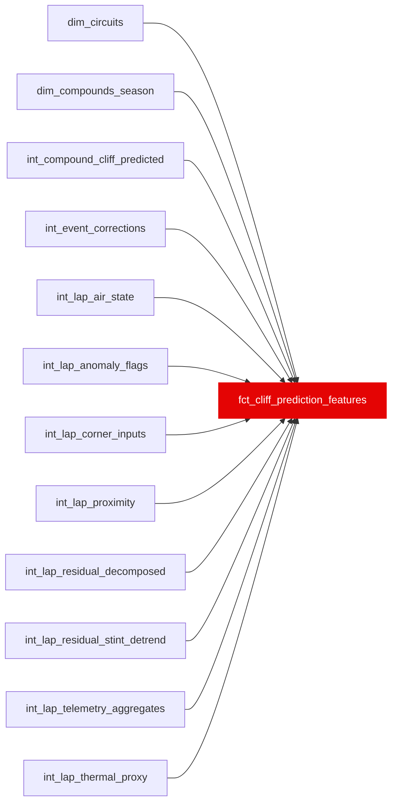

{/* _AUTOGENERATED   do not hand-edit. Run `python scripts/gen_dbt_reference.py` to regenerate. */}

<Note>Part of the [Marts](/transform/families/marts) family.</Note>

> For the conceptual foundation, read [Fct Cliff Prediction Features](/decomposition/methodology).

Lap-grain feature table for the tyre cliff XGBoost model. One row per valid race lap. Target is next_lap_degradation_jump_s (NULL on the last lap of each stint). Excludes synthetic-teammate features to prevent causal label leakage into a predictive model.

<Warning>Breaking a column type on this model fails the dbt build  -  this is the enforced handoff contract with `ml/`.</Warning>

## Lineage

## Overview

| Property | Value |
|---|---|
| Layer | `marts` |
| Family | [Marts](/transform/families/marts) |
| Contract enforced | ✅ Yes |
| Upstream | [`int_lap_residual_decomposed`](../int/int_lap_residual_decomposed), [`int_lap_anomaly_flags`](../int/int_lap_anomaly_flags), [`int_compound_cliff_predicted`](../int/int_compound_cliff_predicted), [`int_lap_thermal_proxy`](../int/int_lap_thermal_proxy), [`int_lap_air_state`](../int/int_lap_air_state), [`int_lap_proximity`](../int/int_lap_proximity), [`int_lap_corner_inputs`](../int/int_lap_corner_inputs), [`int_event_corrections`](../int/int_event_corrections), [`int_lap_residual_stint_detrend`](../int/int_lap_residual_stint_detrend), [`int_lap_telemetry_aggregates`](../int/int_lap_telemetry_aggregates), [`dim_compounds_season`](../dim/dim_compounds_season), [`dim_circuits`](../dim/dim_circuits) |
| Model-level tests | `expect_column_values_to_be_between`, `expect_column_values_to_be_between` |

**3 tests** [guard](/transform/ci/overview) this model  -  2 generic, 1 singular.

## Columns

| Column | Type | Nullable | Tests | Description |
|---|---|---|---|---|
| `lap_id` | `varchar` | No |   | Surrogate PK from stg_laps |
| `stint_id` | `varchar` | No |   | Stint surrogate key |
| `race_year` | `integer` | No |   | Season year |
| `race_id` | `varchar` | No |   | Race identifier |
| `circuit_key` | `varchar` | No |   | Circuit identifier (track_id via race_to_track); L0-1 cohort key and predictions output column |
| `driver_id` | `varchar` | No |   | FastF1 three-letter driver code |
| `constructor_id` | `varchar` | Yes |   | Team name |
| `lap_number` | `integer` | No |   | Lap number within race |
| `lap_in_stint` | `bigint` | Yes |   | Lap position within current tyre stint |
| `age_in_stint` | `integer` | Yes |   | Tyre age in laps (may differ from lap_in_stint for used tyres) |
| `compound` | `varchar` | Yes |   | Tyre compound (SOFT, MEDIUM, HARD, etc.) |
| `compound_grip_peak` | `double` | Yes |   | Fitted peak grip coefficient for this compound × circuit × season |
| `compound_wear_gradient` | `double` | Yes |   | Fitted wear gradient (s/lap) for this compound × circuit × season |
| `compound_optimal_temp_low` | `double` | Yes |   | Lower bound of optimal operating temperature window (°C) |
| `compound_optimal_temp_high` | `double` | Yes |   | Upper bound of optimal operating temperature window (°C) |
| `compound_cliff_onset_laps` | `double` | Yes |   | Expected lap age at cliff onset for this compound × circuit × season |
| `compound_cliff_severity` | `double` | Yes |   | Fitted cliff severity (s/lap post-cliff) for this compound × circuit × season |
| `push_residual` | `double` | Yes |   | Lap pace against the stint's point-in-time baseline, from int_lap_thermal_proxy. NULL until the stint has one valid prior lap (08e); the NULL is deterministic on baseline_observations_n below. |
| `cumulative_push_load_surface` | `double` | Yes |   | EW cumulative push load (τ≈3 laps) for tyre surface |
| `cumulative_push_load_bulk` | `double` | Yes |   | EW cumulative push load (τ≈5 laps) for tyre bulk |
| `baseline_observations_n` | `bigint` | Yes |   | Valid prior laps behind this stint's baseline. NOT a feature -- it is not in ml/src/schema.py's FEATURE_COLUMNS, and putting it in X is an add-ablation someone has to gate. It ships in the contract because the four thermal columns are NULL exactly where it is 0, and unlike 02a's rebuild that missingness is not declarable from any other contract column: it rises with SC and pit disruption, so it is plausibly correlated with the outcome. |
| `dirty_air_share_lap` | `decimal(2,1)` | No |   | Fraction of this lap spent in dirty air (sector 2) |
| `dirty_air_thermal_load_surface` | `double` | No |   | EW dirty air thermal load on tyre surface |
| `dirty_air_thermal_load_bulk` | `double` | No |   | EW dirty air thermal load on tyre bulk |
| `air_state_dominant` | `varchar` | No |   | Dominant air state this lap (free_air, tow_zone, drs_train, dirty_air) |
| `share_lap_within_1s` | `double` | No |   | Share of the lap's 100 track bins with a car within 1 s ahead on track (position channel; mean 0.2011) |
| `share_lap_within_2s` | `double` | No |   | Share of the lap's track bins with a car within 2 s ahead on track (mean 0.4063) |
| `share_lap_in_train` | `double` | No |   | Share of the lap in a train rather than a single tow - within 1 s of the car ahead AND that car within 1 s of its own car ahead (mean 0.0800) |
| `share_lap_behind_within_1s` | `double` | No |   | Share of the lap's track bins with a car within 1 s BEHIND. The half of traffic DistanceToDriverAhead structurally cannot see (mean 0.2012) |
| `time_within_1s` | `double` | No |   | Seconds of the lap spent within 1 s of the car ahead, time-weighted by real bin duration rather than counted in bins (mean 18.36 s) |
| `gap_ahead_min_s` | `double` | Yes |   | Closest the car ahead on track came this lap (s). NULL = a full lap of clear air; median 0.92 s |
| `gap_ahead_median_s` | `double` | Yes |   | Median gap to the car ahead on track across the lap's bins (s). NULL = clear air; median 2.26 s |
| `ahead_identity_stability` | `double` | Yes |   | Share of the lap's within-3 s bins held by the single most frequent car ahead. 1.0 = a settled follow, low = the car ahead rotated. NULL on the 27.3% of laps with no car within 3 s |
| `n_distinct_cars_ahead_3s` | `integer` | Yes |   | How many distinct cars were within 3 s ahead at some point in the lap (mean 1.348) |
| `corner_input_coverage` | `double` | No |   | 02c. Share of the lap's measured corners that cleared int_corner_skill_residuals' field_corner_sample_n &gt;= 5 gate, so carry a residual at all (mean 0.794 over mart rows, 0.799 over the training-eligible ones; 0.813 over int_lap_corner_inputs, which is the same column before the COALESCE below adds the uncovered laps. Laps average 16.35 corners measured, 13.27 of them mapped). COALESCE-d to 0.0 on the 2.5% of mart laps with no corner row, because a lap with no mapped corner genuinely has zero coverage. NOT a nuisance column: coverage is correlated with the label (the 4.15% of training-eligible rows with no braking mean average +1.393 s of 5-lap jump against -2.330 s for covered rows, sd 10.196 vs 5.938), so it is admitted explicitly and ablated separately rather than left to XGBoost as an implicit NaN pattern. |
| `corner_braking_loss_mean_s` | `double` | Yes |   | 02c. Mean braking_loss_s across the lap's corners that have a braking point (mean -0.0065 s). Distance-of-first-brake-application vs the backward-only trailing-5 field median (02g), converted to seconds at s2 trap speed. NULL, never 0.0, where the lap has no measured braking corner - 0.0 would assert the driver braked exactly at the field median. |
| `corner_braking_loss_sd_s` | `double` | Yes |   | 02c. Sample sd of braking_loss_s across the lap's corners (mean 0.3289 s; NULL on 2.57% of corner-covered laps, which have fewer than two measured braking corners). The tyre-management statistic of the three: a driver even across the lap loads the tyre differently from one spiking in two corners and coasting the rest, at equal mean. |
| `corner_braking_loss_max_s` | `double` | Yes |   | 02c. Largest (most positive) braking_loss_s on the lap - the single hardest corner (mean 0.5459 s). |
| `corner_mid_residual_mean_s` | `double` | Yes |   | 02c. Mean mid_corner_residual_s across the lap's corners (mean -0.0102 s). Apex-speed deficit vs the trailing-5 field median, in seconds. Highest-coverage of the three phases (81.12% of corner rows, and 100% of the mapped ones) because every corner has an apex, while not every corner has a discrete braking zone or a clean full-throttle point. |
| `corner_mid_residual_sd_s` | `double` | Yes |   | 02c. Sample sd of mid_corner_residual_s across the lap's corners (mean 0.1439 s; NULL on 2.39% of corner-covered laps). |
| `corner_mid_residual_max_s` | `double` | Yes |   | 02c. Largest mid_corner_residual_s on the lap - the corner with the biggest apex-speed deficit (mean 0.2543 s). |
| `corner_exit_residual_mean_s` | `double` | Yes |   | 02c. Mean exit_residual_s across the lap's corners that reach full throttle (mean 0.0589 s). Distance-to-full-throttle vs the trailing-5 field median, in seconds. Sparsest of the three phases (47.00% of corner rows, 57.94% of the mapped ones): throttle_point_m is NULL where the driver never reaches 100% throttle before the next apex, which is a real answer about a corner sequence rather than missing data. |
| `corner_exit_residual_sd_s` | `double` | Yes |   | 02c. Sample sd of exit_residual_s across the lap's corners (mean 0.2115 s; NULL on 9.78% of corner-covered laps, the sparsest phase). |
| `corner_exit_residual_max_s` | `double` | Yes |   | 02c. Largest exit_residual_s on the lap - the corner the driver was slowest back to power in (mean 0.4367 s). |
| `expected_compound_pace_s` | `double` | Yes |   | Model-expected compound pace contribution from int_compound_cliff_predicted |
| `expected_degradation_rate_s_per_lap` | `double` | Yes |   | Model-expected degradation rate (s/lap) at current tyre age |
| `cliff_onset_passed` | `boolean` | Yes |   | TRUE if tyre has passed its fitted cliff onset lap |
| `laps_past_cliff` | `double` | Yes |   | Laps elapsed since cliff onset (0 if not passed) |
| `ambient_temp_delta` | `double` | Yes |   | Difference between current ambient temp and optimal temp midpoint (°C) |
| `track_energy_index` | `double` | Yes |   | Track energy index from dim_circuits |
| `circuit_abrasiveness_index` | `integer` | Yes |   | Track abrasiveness index from dim_circuits |
| `n_gear_changes` | `integer` | Yes |   | Gear changes this lap (telemetry powertrain group; NULL if no telemetry) |
| `mean_rpm` | `double` | Yes |   | Mean engine RPM this lap |
| `max_rpm` | `double` | Yes |   | Max engine RPM this lap |
| `pct_full_throttle` | `double` | Yes |   | Fraction of the lap at full throttle (0–1) |
| `pct_drs_active` | `double` | Yes |   | Fraction of the lap with DRS active (0–1) |
| `short_shift_index` | `double` | Yes |   | Fraction of upshifts taken below 92% of lap-max RPM (short-shifting) |
| `mid_corner_speed_loss_kph` | `double` | Yes |   | Within-stint drift: early-stint baseline minus this lap's mean local-minimum (corner-apex) speed. Positive = slow points getting slower vs own baseline. NULL if no telemetry. |
| `traction_wheelspin_proxy` | `double` | Yes |   | Share of corner-exit full-throttle samples with non-positive accel (wheelspin proxy, 0–1) |
| `throttle_trace_decay` | `double` | Yes |   | Within-stint drift of full-throttle fraction (early-stint baseline minus this lap) |
| `braking_point_drift_m` | `double` | Yes |   | Within-stint drift: early-stint baseline minus this lap's mean brake-onset distance. Positive = braking earlier than own baseline. NULL if no telemetry. |
| `lift_coast_share` | `double` | Yes |   | Off-throttle, non-braking, decelerating share of the lap (0–1). CONFOUND with fuel-saving   consumed alongside int_lap_fuel_state, not equated with degradation. |
| `fuel_mass_kg` | `double` | Yes |   | Estimated fuel mass on board at this lap |
| `event_flag_any` | `boolean` | No |   | TRUE if any race event contaminated this lap (SC, VSC, restart, etc.) |
| `cliff_candidate_flag` | `boolean` | Yes |   | TRUE if this lap shows a MAD-score cliff spike consistent with tyre cliff. Removed from ML feature contract by 08j (2026-09-09): ruled dead on both substrates by 08g (carried no information in any family). Retained in mart for audit and historical reference; not consumed by current ML features. |
| `anomaly_class` | `varchar` | Yes |   | Anomaly classification (clean_cliff, mistake, event_driven, conditions, normal) |
| `is_rain_lap` | `boolean` | Yes |   | TRUE if rainfall was detected on this lap |
| `surface_bulk_ratio` | `double` | Yes |   | C3 feature (42nd): ratio of surface thermal load to total thermal load (cumulative_push_load_surface / (surface + bulk)). NULL when both loads are zero. Helps the model distinguish early-stint surface-dominated warming from bulk-driven structural degradation. |
| `survival_weight` | `double` | Yes |   | C2 metadata (not a feature): IPW weight = 1 / P(stint reaches lap_in_stint \| compound), clipped to [0.25, 4]. Used by train.py for quantile regressor sample weighting to correct for survivorship bias (degraded stints pitted early are under-represented at high lap_in_stint values). |
| `next_lap_degradation_jump_detrended_s` | `double` | Yes |   | C1 PRIMARY target: per-lap change in driver skill residual with per-stint linear drift removed. drift_s_per_lap (OLS slope on pre-cliff laps, Step 0 median -0.072 s/lap) is subtracted so fuel-lightening and track-evolution leaks are cancelled. Bounded [-10, 10]. NULL on last lap of each stint. |
| `next_lap_degradation_jump_s` | `double` | Yes |   | Legacy target (undetrended): change in driver skill residual on the next lap, bounded [-10, 10]. Kept alongside the detrended primary for gate comparison. NULL on last lap. |
| `next_3_lap_cumulative_jump_s` | `double` | Yes |   | Cumulative detrended degradation jump over the next 3 laps: SUM over i=1..3 of (residual(t+i) - residual(t) - i * drift_s_per_lap), i.e. the current residual is subtracted once per horizon step and per-stint drift is removed on the same schedule as next_lap_degradation_jump_detrended_s. Signed and bounded [-30, 30] (the per-lap +/-10 s bound scaled by the horizon). NULL unless laps t+1..t+3 are all present in the stint -- the guard is on true lap offsets, not row offsets. |
| `next_5_lap_cumulative_jump_s` | `double` | Yes |   | As next_3_lap_cumulative_jump_s over a 5-lap horizon: SUM over i=1..5 of (residual(t+i) - residual(t) - i * drift_s_per_lap). Signed and bounded [-50, 50]. NULL unless laps t+1..t+5 are all present in the stint. |
| `laps_until_cliff_class` | `varchar` | Yes |   | Bucket: 0_to_2, 3_to_5, 6_plus, none_in_stint. Laps until the FIRST crossing of the &gt;1.0s detrended jump threshold, scanned over every remaining lap of the stint at true lap offsets. The buckets partition the horizon exactly as their names read -- 6_plus is 6-or-more, not exactly 6, and none_in_stint means no crossing anywhere in the remaining stint. NULL on the last lap of a stint, where there is no horizon to scan. |
| `is_training_eligible` | `boolean` | No |   | TRUE if this lap is suitable for model training (age_in_stint &gt; 3, no anomaly) |
