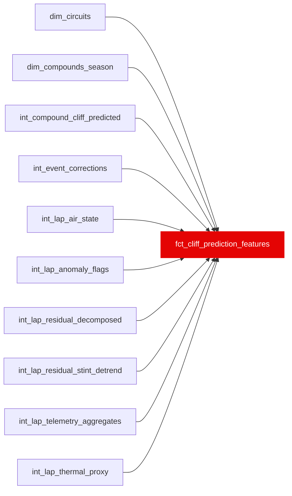

{/* _AUTOGENERATED   do not hand-edit. Run `python scripts/gen_dbt_reference.py` to regenerate. */}

<Note>Part of the [Marts](/transform/families/marts) family.</Note>

> For the conceptual foundation, read [Fct Cliff Prediction Features](/decomposition/methodology).

Lap-grain feature table for the tyre cliff XGBoost model. One row per valid race lap. Target is next_lap_degradation_jump_s (NULL on the last lap of each stint). Excludes synthetic-teammate features to prevent causal label leakage into a predictive model.

<Warning>Breaking a column type on this model fails the dbt build  -  this is the enforced handoff contract with `ml/`.</Warning>

## Lineage

## Overview

| Property | Value |
|---|---|
| Layer | `marts` |
| Family | [Marts](/transform/families/marts) |
| Contract enforced | ✅ Yes |
| Upstream | [`int_lap_residual_decomposed`](../int/int_lap_residual_decomposed), [`int_lap_anomaly_flags`](../int/int_lap_anomaly_flags), [`int_compound_cliff_predicted`](../int/int_compound_cliff_predicted), [`int_lap_thermal_proxy`](../int/int_lap_thermal_proxy), [`int_lap_air_state`](../int/int_lap_air_state), [`int_event_corrections`](../int/int_event_corrections), [`int_lap_residual_stint_detrend`](../int/int_lap_residual_stint_detrend), [`int_lap_telemetry_aggregates`](../int/int_lap_telemetry_aggregates), [`dim_compounds_season`](../dim/dim_compounds_season), [`dim_circuits`](../dim/dim_circuits) |
| Model-level tests | `expect_column_values_to_be_between`, `expect_column_values_to_be_between` |

**2 tests** [guard](/transform/ci/overview) this model  -  2 generic, 0 singular.

## Columns

| Column | Type | Nullable | Tests | Description |
|---|---|---|---|---|
| `lap_id` | `varchar` | No |   | Surrogate PK from stg_laps |
| `stint_id` | `varchar` | No |   | Stint surrogate key |
| `race_year` | `integer` | No |   | Season year |
| `race_id` | `varchar` | No |   | Race identifier |
| `circuit_key` | `varchar` | No |   | Circuit identifier (track_id via race_to_track); L0-1 cohort key and predictions output column |
| `driver_id` | `varchar` | No |   | FastF1 three-letter driver code |
| `constructor_id` | `varchar` | Yes |   | Team name |
| `lap_number` | `integer` | No |   | Lap number within race |
| `lap_in_stint` | `bigint` | Yes |   | Lap position within current tyre stint |
| `age_in_stint` | `integer` | Yes |   | Tyre age in laps (may differ from lap_in_stint for used tyres) |
| `compound` | `varchar` | Yes |   | Tyre compound (SOFT, MEDIUM, HARD, etc.) |
| `compound_grip_peak` | `double` | Yes |   | Fitted peak grip coefficient for this compound × circuit × season |
| `compound_wear_gradient` | `double` | Yes |   | Fitted wear gradient (s/lap) for this compound × circuit × season |
| `compound_optimal_temp_low` | `double` | Yes |   | Lower bound of optimal operating temperature window (°C) |
| `compound_optimal_temp_high` | `double` | Yes |   | Upper bound of optimal operating temperature window (°C) |
| `compound_cliff_onset_laps` | `double` | Yes |   | Expected lap age at cliff onset for this compound × circuit × season |
| `compound_cliff_severity` | `double` | Yes |   | Fitted cliff severity (s/lap post-cliff) for this compound × circuit × season |
| `push_residual` | `double` | Yes |   | Lap-level push load residual from int_lap_thermal_proxy |
| `cumulative_push_load_surface` | `double` | Yes |   | EW cumulative push load (τ≈3 laps) for tyre surface |
| `cumulative_push_load_bulk` | `double` | Yes |   | EW cumulative push load (τ≈5 laps) for tyre bulk |
| `dirty_air_share_lap` | `decimal(2,1)` | No |   | Fraction of this lap spent in dirty air (sector 2) |
| `dirty_air_thermal_load_surface` | `double` | No |   | EW dirty air thermal load on tyre surface |
| `dirty_air_thermal_load_bulk` | `double` | No |   | EW dirty air thermal load on tyre bulk |
| `air_state_dominant` | `varchar` | No |   | Dominant air state this lap (free_air, tow_zone, drs_train, dirty_air) |
| `expected_compound_pace_s` | `double` | Yes |   | Model-expected compound pace contribution from int_compound_cliff_predicted |
| `expected_degradation_rate_s_per_lap` | `double` | Yes |   | Model-expected degradation rate (s/lap) at current tyre age |
| `cliff_onset_passed` | `boolean` | Yes |   | TRUE if tyre has passed its fitted cliff onset lap |
| `laps_past_cliff` | `double` | Yes |   | Laps elapsed since cliff onset (0 if not passed) |
| `ambient_temp_delta` | `double` | Yes |   | Difference between current ambient temp and optimal temp midpoint (°C) |
| `track_energy_index` | `double` | Yes |   | Track energy index from dim_circuits |
| `circuit_abrasiveness_index` | `integer` | Yes |   | Track abrasiveness index from dim_circuits |
| `n_gear_changes` | `integer` | Yes |   | Gear changes this lap (telemetry powertrain group; NULL if no telemetry) |
| `mean_rpm` | `double` | Yes |   | Mean engine RPM this lap |
| `max_rpm` | `double` | Yes |   | Max engine RPM this lap |
| `pct_full_throttle` | `double` | Yes |   | Fraction of the lap at full throttle (0–1) |
| `pct_drs_active` | `double` | Yes |   | Fraction of the lap with DRS active (0–1) |
| `short_shift_index` | `double` | Yes |   | Fraction of upshifts taken below 92% of lap-max RPM (short-shifting) |
| `mid_corner_speed_loss_kph` | `double` | Yes |   | Within-stint drift: early-stint baseline minus this lap's mean local-minimum (corner-apex) speed. Positive = slow points getting slower vs own baseline. NULL if no telemetry. |
| `traction_wheelspin_proxy` | `double` | Yes |   | Share of corner-exit full-throttle samples with non-positive accel (wheelspin proxy, 0–1) |
| `throttle_trace_decay` | `double` | Yes |   | Within-stint drift of full-throttle fraction (early-stint baseline minus this lap) |
| `braking_point_drift_m` | `double` | Yes |   | Within-stint drift: early-stint baseline minus this lap's mean brake-onset distance. Positive = braking earlier than own baseline. NULL if no telemetry. |
| `lift_coast_share` | `double` | Yes |   | Off-throttle, non-braking, decelerating share of the lap (0–1). CONFOUND with fuel-saving   consumed alongside int_lap_fuel_state, not equated with degradation. |
| `fuel_mass_kg` | `double` | Yes |   | Estimated fuel mass on board at this lap |
| `event_flag_any` | `boolean` | No |   | TRUE if any race event contaminated this lap (SC, VSC, restart, etc.) |
| `cliff_candidate_flag` | `boolean` | Yes |   | TRUE if this lap shows a MAD-score cliff spike consistent with tyre cliff |
| `anomaly_class` | `varchar` | Yes |   | Anomaly classification (clean_cliff, mistake, event_driven, conditions, normal) |
| `is_rain_lap` | `boolean` | Yes |   | TRUE if rainfall was detected on this lap |
| `surface_bulk_ratio` | `double` | Yes |   | C3 feature (42nd): ratio of surface thermal load to total thermal load (cumulative_push_load_surface / (surface + bulk)). NULL when both loads are zero. Helps the model distinguish early-stint surface-dominated warming from bulk-driven structural degradation. |
| `survival_weight` | `double` | Yes |   | C2 metadata (not a feature): IPW weight = 1 / P(stint reaches lap_in_stint \| compound), clipped to [0.25, 4]. Used by train.py for quantile regressor sample weighting to correct for survivorship bias (degraded stints pitted early are under-represented at high lap_in_stint values). |
| `next_lap_degradation_jump_detrended_s` | `double` | Yes |   | C1 PRIMARY target: per-lap change in driver skill residual with per-stint linear drift removed. drift_s_per_lap (OLS slope on pre-cliff laps, Step 0 median -0.072 s/lap) is subtracted so fuel-lightening and track-evolution leaks are cancelled. Bounded [-10, 10]. NULL on last lap of each stint. |
| `next_lap_degradation_jump_s` | `double` | Yes |   | Legacy target (undetrended): change in driver skill residual on the next lap, bounded [-10, 10]. Kept alongside the detrended primary for gate comparison. NULL on last lap. |
| `next_3_lap_cumulative_jump_s` | `double` | Yes |   | Cumulative degradation jump over the next 3 laps (sum of residuals k=1..3 minus current residual). NULL when fewer than 3 laps remain in stint. GREATEST floored at 0. |
| `next_5_lap_cumulative_jump_s` | `double` | Yes |   | Cumulative degradation jump over the next 5 laps. NULL when fewer than 5 remain. |
| `laps_until_cliff_class` | `varchar` | Yes |   | Bucket: 0_to_2, 3_to_5, 6_plus, none_in_stint. Based on &gt;1.0s cumulative jump threshold looking ahead up to 6 laps. NULL on last lap. |
| `is_training_eligible` | `boolean` | No |   | TRUE if this lap is suitable for model training (age_in_stint &gt; 3, no anomaly) |
