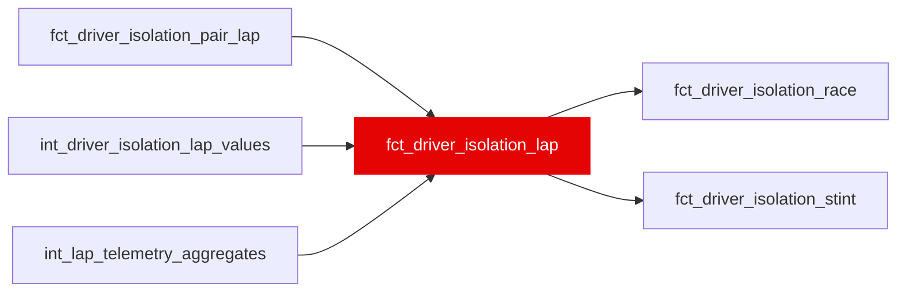

{/* _AUTOGENERATED   do not hand-edit. Run `python scripts/gen_dbt_reference.py` to regenerate. */}

<Note>Part of the [Marts](/transform/families/marts) family.</Note>

Driver isolation per Ω lap with the rolling rating: the lap's three ratings, its tier-3 peer aggregates and identity split, and a trailing window per rating (the Ω laps of the same stint with lap_number in [l - 4, l]; never forward, T44), each NULL below var('isolation_window_min_laps') contributing laps, with SE, lambda, a shrunk value, confidence_pct and trust_label. The 5-lap window is about half signal: the 'is he on it right now' number, not the 'who is better' number; verdicts belong at stint or race grain. Positive = faster. Leakage: a function of the residual trajectory; no ML-contract mart may depend on it (T48, ml/tests/test_manifest_contract.py). WI-16a, _roadmap/_fixes/wi/WI-16-cumulative-driver-isolation.md.

## Lineage

## Overview

| Property | Value |
|---|---|
| Layer | `marts` |
| Family | [Marts](/transform/families/marts) |
| Contract enforced | No |
| Tags | `driver_isolation` |
| Upstream | [`int_driver_isolation_lap_values`](../int/int_driver_isolation_lap_values), [`fct_driver_isolation_pair_lap`](./fct_driver_isolation_pair_lap), [`int_lap_telemetry_aggregates`](../int/int_lap_telemetry_aggregates) |

**28 tests** [guard](/transform/ci/overview) this model  -  23 generic, 5 singular.

## Columns

| Column | Type | Nullable | Tests | Description |
|---|---|---|---|---|
| `lap_id` |   | Yes | [`not_null`](/transform/ci/structural), [`unique`](/transform/ci/structural) | Lap identifier (int_lap_residual_decomposed.lap_id). |
| `stint_id` |   | Yes | [`not_null`](/transform/ci/structural) | Stint identifier (int_stint_geometry.stint_id). |
| `race_year` |   | Yes | [`not_null`](/transform/ci/structural) | Season. |
| `race_id` |   | Yes | [`not_null`](/transform/ci/structural) | FastF1 event id, e.g. 2021_8. |
| `driver_id` |   | Yes | [`not_null`](/transform/ci/structural) | Driver (three-letter code). In the pair mart, the focal driver whose gains the row reports. |
| `constructor_id` |   | Yes | [`not_null`](/transform/ci/structural) | Constructor (stg_laps.constructor_id). |
| `stint_number` |   | Yes |   | Stint ordinal within the driver's race (int_stint_geometry). |
| `lap_number` |   | Yes | [`not_null`](/transform/ci/structural) | Race lap number. Tiers 1 and 3 match cars on it, which is why 2020_1 is excluded (W18). |
| `compound` |   | Yes | [`not_null`](/transform/ci/structural) | Dry compound of the stint (INTERMEDIATE and WET laps are not in Ω). |
| `age_in_stint` |   | Yes | [`not_null`](/transform/ci/structural) | Tyre age in laps (int_stint_geometry). |
| `valid_lap_in_stint` |   | Yes |   | Ordinal among the stint's valid laps; early vs mid phase splits at 5/6. |
| `laps_past_cliff` |   | Yes |   | Laps beyond the compound seed's cliff onset (0 before it); drives tyre_phase = cliff. Never NULL in Ω. |
| `era` |   | Yes |   | Regulation era: pre&lt;era_boundary&gt; or post&lt;era_boundary&gt; (var era_boundary, 2022). |
| `tyre_phase` |   | Yes | [`accepted_values`](/transform/ci/range-and-domain) | early (laps_past_cliff = 0, valid_lap_in_stint &lt;= 5), mid (laps_past_cliff = 0, &gt;= 6) or cliff (laps_past_cliff &gt; 0), from the seed's onset, so never selected on the residual. |
| `is_recovery` |   | Yes |   | TRUE on the first var('isolation_recovery_laps') valid laps of a non-dirty-air run directly after &gt;= var('isolation_recovery_min_dirty_run') consecutive dirty-air valid laps in the stint. Backward-looking only. |
| `stint_phase` |   | Yes | [`not_null`](/transform/ci/structural), [`accepted_values`](/transform/ci/range-and-domain) | 'recovery' when is_recovery, else tyre_phase (T45). |
| `air_state_dominant` |   | Yes |   | int_lap_air_state.air_state_dominant (context; dirty_air drives the recovery overlay). |
| `is_dirty_air_lap` |   | Yes |   | TRUE when air_state_dominant = 'dirty_air'. |
| `field_n` |   | Yes |   | Ω laps on this (race, lap); &gt;= var('isolation_min_field_n') by construction (T40). |
| `lap_time_s` |   | Yes |   | Raw lap time, s. |
| `compound_component_s` |   | Yes |   | C: the compound seed's expected cost of this tyre state, s, positive = slower (int_lap_residual_decomposed). Never COALESCEd: an unknown tyre is not in Ω. |
| `dirty_air_tax_s` |   | Yes |   | D: dirty-air tax, s, positive = slower (int_lap_residual_decomposed). |
| `y_s` |   | Yes |   | x_s minus the lap's Ω field median of x_s, s. POSITIVE = SLOWER than the field- typical car and driver on the lap. Invariant to the field base, fuel, rubber and ambient terms, which depend on (race, lap) only (T41). |
| `car_iso_s` |   | Yes |   | Isolation car term, s, NEGATIVE = FASTER than the race's lap-weighted car (int_constructor_car_fe_isolation). NULL when not identified. |
| `car_term_source` |   | Yes | [`accepted_values`](/transform/ci/range-and-domain) | Where car_iso_s came from: driver_id (fitted per-era), unidentified (multiple components in race), not_estimated (pyfixest singleton), or no_fit_row (no row in the fit). |
| `tyre_offset_vs_field_s` |   | Yes |   | compound_component_s minus the lap's Ω field median of it, s; positive = this tyre state costs more than the field's. The strategy position on the lap: team-dominated context, not a rating. |
| `lift_coast_share` |   | Yes |   | int_lap_telemetry_aggregates.lift_coast_share (context; fuel- and tyre-saving are indistinguishable in it). |
| `lift_coast_excess_share` |   | Yes |   | lift_coast_share minus the lap's Ω field median of it (context for WI-16b's V2d; aggregates are means). |
| `pace_isolated_gain_s` |   | Yes |   | p = -(y_s - car_iso_s), s/lap. POSITIVE = FASTER than the field on an equal car, tyre state, traffic and fuel: the driver plus noise, everything modelled removed. NULL without a car term (never a car term of 0). |
| `pure_skill_gain_s` |   | Yes |   | Tier 1, s/lap, POSITIVE = FASTER: pace_isolated_gain_s plus the declared season offset (int_driver_isolation_lap_values.pure_season_offset_gain_s; 2018 +0.37 s, W33). Within a season it ranks and differences exactly like p. NULL without a car term. On cliff laps it is not a driver measurement (pure_is_extrapolated) and pure aggregates skip it. |
| `pure_is_extrapolated` |   | Yes |   | TRUE on cliff-tyre laps (tyre_phase = 'cliff'): the lap time there is dominated by the tyre, so pure_skill_gain_s is not a driver measurement; aggregates exclude these laps. |
| `season_sigma_w_s` |   | Yes |   | Pooled within-stint SD of p around its stint line for the season, s. |
| `season_neff_factor` |   | Yes |   | f = (1 - rho+)/(1 + rho+), rho+ = GREATEST(season_rho1, 0): the effective-sample factor every SE uses. NULL if rho cannot be measured. |
| `n_peers` |   | Yes | [`not_null`](/transform/ci/structural) | Same-strategy peers on this lap (pair-mart rows with this lap_id); 0 when none. |
| `n_teammate_peers` |   | Yes | [`not_null`](/transform/ci/structural) | Of n_peers, how many are teammates. |
| `relative_pace_gain_s` |   | Yes |   | Tier 3 on this lap: mean relative_pace_gain_s over its peers, s/lap, positive = faster than same-strategy peers. NULL with no peer. |
| `relative_pace_raw_gain_s` |   | Yes |   | Mean raw gap over this lap's peers, s/lap. Equal to relative_pace_gain_s since W63 design 2 (2026-10-03). |
| `identity_n_pair_laps` |   | Yes |   | Pair-laps with both car terms, over which the identity_* contributions are computed. |
| `identity_relative_pace_gain_s` |   | Yes |   | Mean relative_pace_gain_s over the identity_n_pair_laps rows, s/lap. = the three identity_* contributions plus the group's mean tyre-age bias (the seed's pricing of the peers' age gap, at most the match tolerance; not published, 0 when every pair is on the same tyre age). W63 design 2, 2026-10-03. |
| `identity_pace_gap_gain_s` |   | Yes |   | Contribution: SUM(pace_gap) over rows with both car terms / identity_n_pair_laps, s/lap. |
| `identity_car_advantage_gain_s` |   | Yes |   | Contribution: mean car_advantage_gain_s over identity rows, s/lap; &gt; 0 = the driver's car faster. |
| `identity_traffic_advantage_gain_s` |   | Yes |   | Contribution: mean traffic_advantage_gain_s over identity rows, s/lap; &gt; 0 = he lost less to dirty air. |
| `window_first_lap_number` |   | Yes |   | First lap number the window could span (the earliest Ω lap in it). |
| `window_n_laps` |   | Yes | [`not_null`](/transform/ci/structural) | Ω laps in the trailing window (same stint, lap_number in [l - (var('isolation_window_laps') - 1), l]). |
| `window_mixed_phase` |   | Yes | [`not_null`](/transform/ci/structural) | TRUE when the window's laps span more than one stint_phase; the window is labelled with this lap's. |
| `window_n_pure_laps` |   | Yes | [`not_null`](/transform/ci/structural) | Non-extrapolated laps with pure in the window; pure_skill_5lap_gain_s is NULL below var('isolation_window_min_laps'). |
| `window_n_pair_laps` |   | Yes | [`not_null`](/transform/ci/structural) | Pair-laps in the window (SUM of n_peers); relative_pace_5lap_gain_s is NULL below the floor. |
| `window_n_relative_laps` |   | Yes | [`not_null`](/transform/ci/structural) | Laps in the window with at least one peer. |
| `pure_skill_5lap_gain_s` |   | Yes |   | Pure pace skill, mean over the window's non-extrapolated laps at trailing 5-lap window grain, s/lap, POSITIVE = faster / better (raw, before shrinkage). |
| `pure_skill_5lap_se_s` |   | Yes |   | SE of pure_skill_5lap_gain_s, s/lap (see the model header for the formula). |
| `pure_skill_5lap_lambda` |   | Yes |   | Reliability tau^2 / (tau^2 + SE^2) in [0, 1]; tau^2 per (season, rating) at this grain. 1 when SE = 0. |
| `pure_skill_5lap_shrunk_gain_s` |   | Yes |   | lambda * pure_skill_5lap_gain_s: shrunk toward 0 (the ratings are field- or peer- centred), s/lap. |
| `pure_skill_5lap_confidence_pct` |   | Yes |   | ROUND(100 * lambda * method_score); NULL until WI-16b validates the method (seed driver_isolation_method_scores). |
| `pure_skill_5lap_trust_label` |   | Yes | [`accepted_values`](/transform/ci/range-and-domain) | solid (&gt;= 75), indicative (50-75), thin (25-50), suppress (&lt; 25, grade F or no lambda), unvalidated (no method score yet). NULL without a raw value. |
| `relative_pace_5lap_gain_s` |   | Yes |   | Relative pace vs same-strategy peers, SUM(relative * n_peers) / SUM(n_peers) at trailing 5-lap window grain, s/lap, POSITIVE = faster / better (raw, before shrinkage). |
| `relative_pace_5lap_se_s` |   | Yes |   | SE of relative_pace_5lap_gain_s, s/lap (see the model header for the formula). |
| `relative_pace_5lap_lambda` |   | Yes |   | Reliability tau^2 / (tau^2 + SE^2) in [0, 1]; tau^2 per (season, rating) at this grain. 1 when SE = 0. |
| `relative_pace_5lap_shrunk_gain_s` |   | Yes |   | lambda * relative_pace_5lap_gain_s: shrunk toward 0 (the ratings are field- or peer- centred), s/lap. |
| `relative_pace_5lap_confidence_pct` |   | Yes |   | ROUND(100 * lambda * method_score); NULL until WI-16b validates the method (seed driver_isolation_method_scores). |
| `relative_pace_5lap_trust_label` |   | Yes | [`accepted_values`](/transform/ci/range-and-domain) | solid (&gt;= 75), indicative (50-75), thin (25-50), suppress (&lt; 25, grade F or no lambda), unvalidated (no method score yet). NULL without a raw value. |
