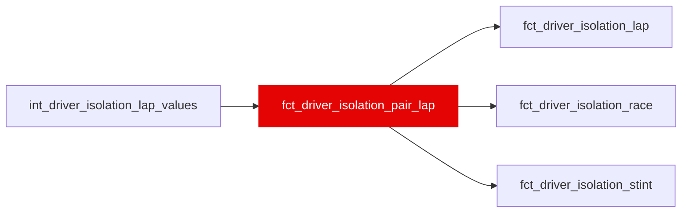

{/* _AUTOGENERATED   do not hand-edit. Run `python scripts/gen_dbt_reference.py` to regenerate. */}

<Note>Part of the [Marts](/transform/families/marts) family.</Note>

Driver isolation tier 3 per pair of cars: for every Ω lap, each peer on the same race, lap number and compound with tyre age within var('isolation_peer_age_tolerance'), teammates included. relative_pace_gain_s is the raw time gap, positive = the focal driver faster, with no tyre-age adjustment: the peer match on tyre age controls for it instead (W63 design 2, 2026-10-03). It splits into pace_gap + car_advantage + traffic_advantage plus the tyre-age bias the match leaves (the seed's pricing of an age gap of at most the tolerance; not published), which is 0 for cars on the same tyre age, where T42 checks the three terms exactly. Both directions of every pair are rows. The table 'X vs Y' questions are answered from. Peers share a lap and a compound, not a situation. Leakage: a function of the residual trajectory; no ML-contract mart may depend on it (T48, ml/tests/test_manifest_contract.py). WI-16a, _roadmap/_fixes/wi/WI-16-cumulative-driver-isolation.md.

## Lineage

## Overview

| Property | Value |
|---|---|
| Layer | `marts` |
| Family | [Marts](/transform/families/marts) |
| Contract enforced | No |
| Tags | `driver_isolation` |
| Upstream | [`int_driver_isolation_lap_values`](../int/int_driver_isolation_lap_values) |
| Model-level tests | `unique_combination_of_columns` |

**23 tests** [guard](/transform/ci/overview) this model  -  21 generic, 2 singular.

## Columns

| Column | Type | Nullable | Tests | Description |
|---|---|---|---|---|
| `lap_id` |   | Yes | [`not_null`](/transform/ci/structural) | Lap identifier (int_lap_residual_decomposed.lap_id). |
| `peer_lap_id` |   | Yes | [`not_null`](/transform/ci/structural) | The peer's lap on the same race, lap number and compound (its lap_id). |
| `race_year` |   | Yes | [`not_null`](/transform/ci/structural) | Season. |
| `race_id` |   | Yes | [`not_null`](/transform/ci/structural) | FastF1 event id, e.g. 2021_8. |
| `lap_number` |   | Yes | [`not_null`](/transform/ci/structural) | Race lap number. Tiers 1 and 3 match cars on it, which is why 2020_1 is excluded (W18). |
| `compound` |   | Yes | [`not_null`](/transform/ci/structural) | Dry compound of the stint (INTERMEDIATE and WET laps are not in Ω). |
| `driver_id` |   | Yes | [`not_null`](/transform/ci/structural) | Driver (three-letter code). In the pair mart, the focal driver whose gains the row reports. |
| `peer_driver_id` |   | Yes | [`not_null`](/transform/ci/structural) | The peer driver. |
| `constructor_id` |   | Yes | [`not_null`](/transform/ci/structural) | Constructor (stg_laps.constructor_id). |
| `peer_constructor_id` |   | Yes | [`not_null`](/transform/ci/structural) | The peer's constructor. |
| `is_teammate` |   | Yes | [`not_null`](/transform/ci/structural) | TRUE when the peer drove the same constructor in the race; car_advantage_gain_s is then exactly 0 (T42). |
| `stint_id` |   | Yes |   | Stint identifier (int_stint_geometry.stint_id). |
| `peer_stint_id` |   | Yes |   | The peer's stint. |
| `age_in_stint` |   | Yes | [`not_null`](/transform/ci/structural) | Tyre age in laps (int_stint_geometry). |
| `peer_age_in_stint` |   | Yes | [`not_null`](/transform/ci/structural) | The peer's tyre age in laps; within var('isolation_peer_age_tolerance') of age_in_stint. |
| `stint_phase` |   | Yes | [`accepted_values`](/transform/ci/range-and-domain) | 'recovery' when is_recovery, else tyre_phase (T45). |
| `peer_stint_phase` |   | Yes | [`accepted_values`](/transform/ci/range-and-domain) | The peer's stint_phase. |
| `tyre_phase` |   | Yes | [`accepted_values`](/transform/ci/range-and-domain) | early (laps_past_cliff = 0, valid_lap_in_stint &lt;= 5), mid (laps_past_cliff = 0, &gt;= 6) or cliff (laps_past_cliff &gt; 0), from the seed's onset, so never selected on the residual. |
| `peer_tyre_phase` |   | Yes | [`accepted_values`](/transform/ci/range-and-domain) | The peer's tyre_phase. |
| `is_dirty_air_lap` |   | Yes |   | TRUE when air_state_dominant = 'dirty_air'. |
| `peer_is_dirty_air_lap` |   | Yes |   | The peer's is_dirty_air_lap (V3b's exactly-one-in-dirty-air strata). |
| `relative_pace_raw_gain_s` |   | Yes | [`not_null`](/transform/ci/structural) | t(peer) - t(driver), s/lap: model-free, POSITIVE = the driver faster. Equal to relative_pace_gain_s since W63 design 2 (2026-10-03); kept under this name for the readers that compare the two. In aggregates, the mean over pair-laps. |
| `relative_pace_gain_s` |   | Yes | [`not_null`](/transform/ci/structural) | Tier 3: t(peer) - t(driver), s/lap, the raw gap against a peer on the same lap and compound within var('isolation_peer_age_tolerance') laps of tyre age, with no tyre-age adjustment (W63 design 2, 2026-10-03; the seed's ΔC and the fitted curve both added within-pair variance). POSITIVE = the driver faster than same-strategy peers. |
| `pace_gap_gain_s` |   | Yes |   | p(driver) - p(peer), s/lap. relative = pace_gap + car_advantage + traffic_advantage + (C(peer) - C(driver)), the last being the unpublished tyre-age bias; exact on the three terms for cars on the same tyre age (T42). NULL if either car term is missing. |
| `pure_gap_gain_s` |   | Yes |   | pure(driver) - pure(peer), s/lap. NULL unless both tactical values exist; then pace_gap = pure_gap + tactical_gap. |
| `car_advantage_gain_s` |   | Yes |   | car_iso(peer) - car_iso(driver), s/lap; &gt; 0 = the driver's car faster. 0 for teammates. |
| `traffic_advantage_gain_s` |   | Yes | [`not_null`](/transform/ci/structural) | D(peer) - D(driver), s/lap; &gt; 0 = the driver lost less to dirty air. |
