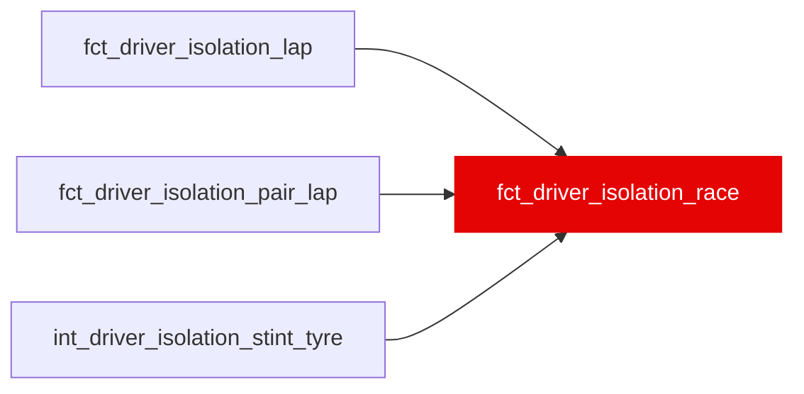

{/* _AUTOGENERATED   do not hand-edit. Run `python scripts/gen_dbt_reference.py` to regenerate. */}

<Note>Part of the [Marts](/transform/families/marts) family.</Note>

Driver isolation per driver-race: the three ratings rolled up with lap weighting (pair-lap weighting for relative), SEs that add each stint's slope error in quadrature, lambda, shrunk value, confidence_pct and trust_label, the tier-3 identity split, and context. Keyed with the same surrogate-key recipe as fct_driver_skill_features, which is deliberately not changed (an unvalidated rating must not enter a trained model's contract). No minimum-race floor: lambda does that job. Positive = faster. Leakage: a function of the residual trajectory; no ML-contract mart may depend on it (T48, ml/tests/test_manifest_contract.py). WI-16a, _roadmap/_fixes/wi/WI-16-cumulative-driver-isolation.md.

## Lineage

## Overview

| Property | Value |
|---|---|
| Layer | `marts` |
| Family | [Marts](/transform/families/marts) |
| Contract enforced | No |
| Tags | `driver_isolation` |
| Upstream | [`fct_driver_isolation_lap`](./fct_driver_isolation_lap), [`int_driver_isolation_stint_tyre`](../int/int_driver_isolation_stint_tyre), [`fct_driver_isolation_pair_lap`](./fct_driver_isolation_pair_lap) |

**19 tests** [guard](/transform/ci/overview) this model  -  16 generic, 3 singular.

## Columns

| Column | Type | Nullable | Tests | Description |
|---|---|---|---|---|
| `driver_race_id` |   | Yes | [`not_null`](/transform/ci/structural), [`unique`](/transform/ci/structural) | PK: dbt_utils.generate_surrogate_key(race_year, race_id, driver_id), the same recipe as fct_driver_skill_features.driver_race_id, so the two join directly. |
| `race_year` |   | Yes | [`not_null`](/transform/ci/structural) | Season. |
| `race_id` |   | Yes | [`not_null`](/transform/ci/structural) | FastF1 event id, e.g. 2021_8. |
| `driver_id` |   | Yes | [`not_null`](/transform/ci/structural) | Driver (three-letter code). In the pair mart, the focal driver whose gains the row reports. |
| `constructor_id` |   | Yes | [`not_null`](/transform/ci/structural) | Constructor (stg_laps.constructor_id). |
| `era` |   | Yes |   | Regulation era: pre&lt;era_boundary&gt; or post&lt;era_boundary&gt; (var era_boundary, 2022). |
| `car_iso_s` |   | Yes |   | Isolation car term, s, NEGATIVE = FASTER than the race's lap-weighted car (int_constructor_car_fe_isolation). NULL when not identified. |
| `car_term_source` |   | Yes | [`accepted_values`](/transform/ci/range-and-domain) | Where car_iso_s came from: driver_id (fitted per-era), unidentified (multiple components in race), not_estimated (pyfixest singleton), or no_fit_row (no row in the fit). |
| `n_stints` |   | Yes | [`not_null`](/transform/ci/structural) | Stints with Ω laps in the race. |
| `n_laps` |   | Yes | [`not_null`](/transform/ci/structural) | Ω laps in the group. |
| `pace_isolated_gain_s` |   | Yes |   | Mean p over the race's Ω laps, s/lap, positive = faster. |
| `n_pure_laps` |   | Yes | [`not_null`](/transform/ci/structural) | Non-extrapolated laps with pure in the group (the pure rating's n). |
| `n_pair_laps` |   | Yes | [`not_null`](/transform/ci/structural) | Pair-laps in the group (the relative rating's n). |
| `n_relative_laps` |   | Yes | [`not_null`](/transform/ci/structural) | Distinct laps with at least one peer in the group. |
| `n_teammate_pair_laps` |   | Yes | [`not_null`](/transform/ci/structural) | Of n_pair_laps, those against a teammate. |
| `relative_pace_raw_gain_s` |   | Yes |   | t(peer) - t(driver), s/lap: model-free, POSITIVE = the driver faster. In aggregates, the mean over pair-laps. |
| `identity_n_pair_laps` |   | Yes |   | Pair-laps with both car terms, over which the identity_* contributions are computed. |
| `identity_relative_pace_gain_s` |   | Yes |   | Mean relative_pace_gain_s over the identity_n_pair_laps rows, s/lap. = the three identity_* contributions plus the group's mean tyre-age bias (the seed's pricing of the peers' age gap, at most the match tolerance; not published, 0 when every pair is on the same tyre age). W63 design 2, 2026-10-03. |
| `identity_pace_gap_gain_s` |   | Yes |   | Contribution: SUM(pace_gap) over rows with both car terms / identity_n_pair_laps, s/lap. |
| `identity_car_advantage_gain_s` |   | Yes |   | Contribution: mean car_advantage_gain_s over identity rows, s/lap; &gt; 0 = the driver's car faster. |
| `identity_traffic_advantage_gain_s` |   | Yes |   | Contribution: mean traffic_advantage_gain_s over identity rows, s/lap; &gt; 0 = he lost less to dirty air. |
| `tyre_offset_vs_field_s` |   | Yes |   | Mean tyre_offset_vs_field_s over the race (context). |
| `lift_coast_excess_share` |   | Yes |   | Mean lift_coast_excess_share over the race (context). |
| `dirty_air_lap_share` |   | Yes |   | Share of the group's laps with is_dirty_air_lap. |
| `pure_skill_gain_s` |   | Yes |   | Pure pace skill, mean over the race's non-extrapolated laps at driver-race grain, s/lap, POSITIVE = faster / better (raw, before shrinkage). Includes pure_season_offset_gain_s. |
| `pure_season_offset_gain_s` |   | Yes | [`not_null`](/transform/ci/structural) | The declared season-level offset inside pure_skill_gain_s, s/lap (positive = the season's pure is raised; 0 for seasons without one). W33 Option A, 2026-09-30: 2018 +0.37 s, so a 2018 pure value sits at the 2019-2024 seasons' level. It does not change any within-season ranking or gap. Cross-season comparisons remain caveated (docs/decomposition/driver-isolation.mdx, Limitations). |
| `pure_skill_se_s` |   | Yes |   | SE of pure_skill_gain_s, s/lap (see the model header for the formula). |
| `pure_skill_lambda` |   | Yes |   | Reliability tau^2 / (tau^2 + SE^2) in [0, 1]; tau^2 per (season, rating) at this grain. 1 when SE = 0. |
| `pure_skill_shrunk_gain_s` |   | Yes |   | lambda * pure_skill_gain_s: shrunk toward 0 (the ratings are field- or peer- centred), s/lap. |
| `pure_skill_confidence_pct` |   | Yes |   | ROUND(100 * lambda * method_score); NULL until WI-16b validates the method (seed driver_isolation_method_scores). |
| `pure_skill_trust_label` |   | Yes | [`accepted_values`](/transform/ci/range-and-domain) | solid (&gt;= 75), indicative (50-75), thin (25-50), suppress (&lt; 25, grade F or no lambda), unvalidated (no method score yet). NULL without a raw value. |
| `relative_pace_gain_s` |   | Yes |   | Relative pace vs same-strategy peers, mean over the race's pair-laps at driver-race grain, s/lap, POSITIVE = faster / better (raw, before shrinkage). |
| `relative_pace_se_s` |   | Yes |   | SE of relative_pace_gain_s, s/lap (see the model header for the formula). |
| `relative_pace_lambda` |   | Yes |   | Reliability tau^2 / (tau^2 + SE^2) in [0, 1]; tau^2 per (season, rating) at this grain. 1 when SE = 0. |
| `relative_pace_shrunk_gain_s` |   | Yes |   | lambda * relative_pace_gain_s: shrunk toward 0 (the ratings are field- or peer- centred), s/lap. |
| `relative_pace_confidence_pct` |   | Yes |   | ROUND(100 * lambda * method_score); NULL until WI-16b validates the method (seed driver_isolation_method_scores). |
| `relative_pace_trust_label` |   | Yes | [`accepted_values`](/transform/ci/range-and-domain) | solid (&gt;= 75), indicative (50-75), thin (25-50), suppress (&lt; 25, grade F or no lambda), unvalidated (no method score yet). NULL without a raw value. |
