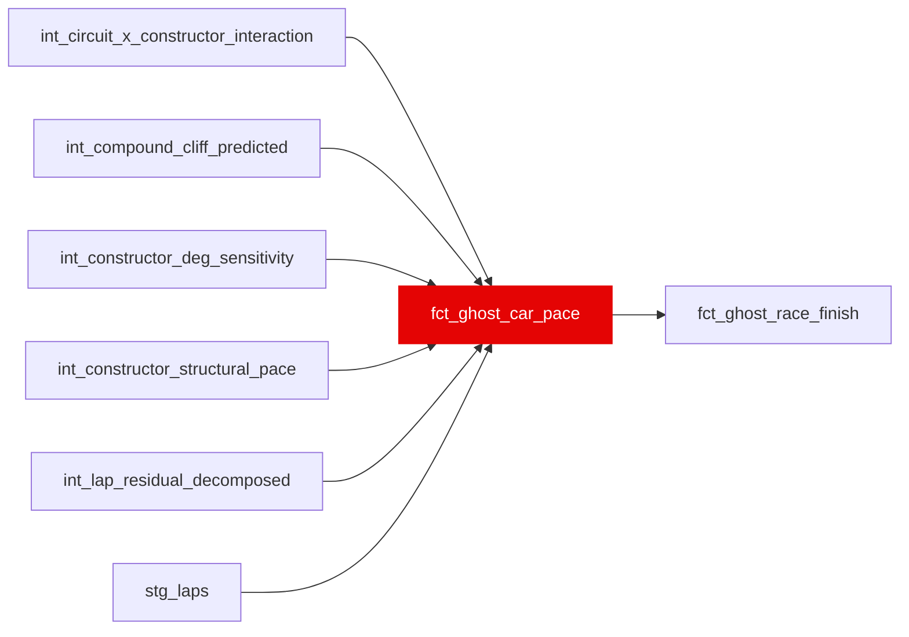

{/* _AUTOGENERATED   do not hand-edit. Run `python scripts/gen_dbt_reference.py` to regenerate. */}

<Note>Part of the [Marts](/transform/families/marts) family.</Note>

One row per (ego_driver, host_constructor, race, lap). "What if" lap times: recombines ego driver's skill (residual) with host constructor's car pace. predicted_lap_time_s = ego skill + host car. Degenerate check: ego == host → predicted == actual. Powers "ghost car" simulator: replay with different cars.

## Lineage

## Overview

| Property | Value |
|---|---|
| Layer | `marts` |
| Family | [Marts](/transform/families/marts) |
| Contract enforced | No |
| Tags | `simulation`, `ghost_car` |
| Upstream | [`int_lap_residual_decomposed`](../int/int_lap_residual_decomposed), [`int_compound_cliff_predicted`](../int/int_compound_cliff_predicted), [`stg_laps`](../stg/stg_laps), [`int_constructor_structural_pace`](../int/int_constructor_structural_pace), [`int_circuit_x_constructor_interaction`](../int/int_circuit_x_constructor_interaction), [`int_constructor_deg_sensitivity`](../int/int_constructor_deg_sensitivity) |

**25 tests** [guard](/transform/ci/overview) this model  -  23 generic, 2 singular.

## Columns

| Column | Type | Nullable | Tests | Description |
|---|---|---|---|---|
| `ghost_id` |   | Yes | [`not_null`](/transform/ci/structural), [`unique`](/transform/ci/structural) | Surrogate PK = MD5(ego_driver_id \|\| host_constructor_id \|\| race_id \|\| lap_number) |
| `predicted_lap_time_s` |   | Yes | [`not_null`](/transform/ci/structural) | Recombined lap time using ego skill + host constructor pace. |
| `actual_lap_time_s` |   | Yes | [`not_null`](/transform/ci/structural) | Observed actual lap time for the ego driver. |
| `predicted_residual_pace_s` |   | Yes | [`not_null`](/transform/ci/structural) | predicted_lap_time_s with the fuel-burn component backed out (the fuel term is simply omitted from the recombination sum). Fuel-adjusted so ranking by pace isn't biased by which lap window (heavy vs. light fuel) a driver ran. |
| `actual_residual_pace_s` |   | Yes | [`not_null`](/transform/ci/structural) | actual_lap_time_s minus fuel_component_s. Fuel-adjusted counterpart to actual_lap_time_s. |
| `delta_vs_actual_lap_s` |   | Yes | [`not_null`](/transform/ci/structural) | predicted_lap_time_s minus actual_lap_time_s. 0 when ego == host. |
| `deg_interaction_s` |   | Yes | [`not_null`](/transform/ci/structural) | (host deg slope - ego deg slope) x age_in_stint, slopes from int_constructor_deg_sensitivity at the ego lap's (compound, season). The only host-dependent term that varies within a race, so it is what lets different hosts produce different driver orders. Exactly 0 when ego == host; 0 when no cell exists (wet compounds / low-sample = field-average degradation). |
| `host_deg_slope_s_per_lap` |   | Yes | [`not_null`](/transform/ci/structural) | Host constructor's deg slope for the ego lap's compound; 0 when no cell. |
| `ego_deg_slope_s_per_lap` |   | Yes | [`not_null`](/transform/ci/structural) | Ego constructor's deg slope for the ego lap's compound; 0 when no cell. |
| `cliff_interaction_s` |   | Yes | [`not_null`](/transform/ci/structural), [`expect_column_values_to_be_between`](/transform/ci/range-and-domain) | severity x [hinge(host) - hinge(ego)] where hinge(c) = GREATEST(0, age - field_onset - cliff_onset_shift(c)). The nonlinear host-dependent term: it only fires once tyres approach/pass the cliff, reordering drivers on long stints. Exactly 0 when ego == host. Guardrail-clipped to +/-2 s. |
| `host_cliff_shift_laps` |   | Yes | [`not_null`](/transform/ci/structural) | Host constructor's cliff-onset shift (laps) for the ego lap's compound; 0 when no cell. |
| `ego_cliff_shift_laps` |   | Yes | [`not_null`](/transform/ci/structural) | Ego constructor's cliff-onset shift (laps) for the ego lap's compound; 0 when no cell. |
| `recombination_confidence` |   | Yes | [`not_null`](/transform/ci/structural), [`expect_column_values_to_be_between`](/transform/ci/range-and-domain) | Continuous confidence in recombination [0, 1] = host_obs_factor (panel_obs / (panel_obs + 50)) × the lap's correction_weight. Degrades smoothly when the host has sparse panel data or the lap was soft-down-weighted. |
| `host_constructor_pace_se_s` |   | Yes | [`not_null`](/transform/ci/structural) | SE-propagation ingredient: SE of the host constructor's structural pace (0 when no panel cell). Aggregated into predicted_mean_lap_se_s downstream; cancels in within-scenario ordering since every driver shares the host car. |
| `host_deg_slope_sd_s_per_lap` |   | Yes | [`not_null`](/transform/ci/structural) | Posterior sd of the host deg slope for the ego lap's compound; 0 when no cell. |
| `ego_deg_slope_sd_s_per_lap` |   | Yes | [`not_null`](/transform/ci/structural) | Posterior sd of the ego deg slope for the ego lap's compound; 0 when no cell. |
| `host_cliff_shift_se_laps` |   | Yes | [`not_null`](/transform/ci/structural) | SE (laps) of the host cliff-onset shift; 0 when no cell. |
| `ego_cliff_shift_se_laps` |   | Yes | [`not_null`](/transform/ci/structural) | SE (laps) of the ego cliff-onset shift; 0 when no cell. |
| `host_cliff_active` |   | Yes | [`not_null`](/transform/ci/structural) | 1.0 when the host car is past its shifted cliff onset on this lap, else 0.0. |
| `ego_cliff_active` |   | Yes | [`not_null`](/transform/ci/structural) | 1.0 when the ego car is past its shifted cliff onset on this lap, else 0.0. |
