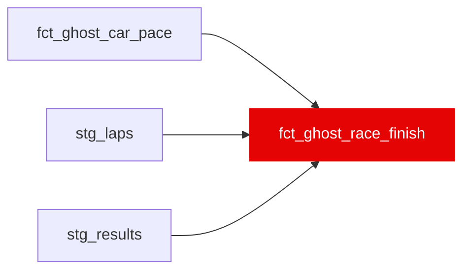

{/* _AUTOGENERATED   do not hand-edit. Run `python scripts/gen_dbt_reference.py` to regenerate. */}

<Note>Part of the [Marts](/transform/families/marts) family.</Note>

One row per (host_constructor, ego_driver, race). Projects finishing position if ego driver raced in host constructor's car, ranked by predicted MEAN lap pace (invariant to lap count, so DNF / partial runs are ranked fairly and flagged via is_short_run). Filtered to recombination_confidence ≥ 0.3. Powers "what if" race outcome scenarios.

## Lineage

## Overview

| Property | Value |
|---|---|
| Layer | `marts` |
| Family | [Marts](/transform/families/marts) |
| Contract enforced | No |
| Tags | `simulation`, `ghost_car` |
| Upstream | [`fct_ghost_car_pace`](./fct_ghost_car_pace), [`stg_laps`](../stg/stg_laps), [`stg_results`](../stg/stg_results) |

**16 tests** [guard](/transform/ci/overview) this model  -  14 generic, 2 singular.

## Columns

| Column | Type | Nullable | Tests | Description |
|---|---|---|---|---|
| `ghost_race_id` |   | Yes | [`not_null`](/transform/ci/structural), [`unique`](/transform/ci/structural) | Surrogate PK = MD5(race_year \|\| race_id \|\| ego_driver_id \|\| host_constructor_id) |
| `is_self_scenario` |   | Yes | [`not_null`](/transform/ci/structural) | True when ego driver is placed in their own constructor's car (degenerate identity). |
| `predicted_finish_position` |   | Yes | [`not_null`](/transform/ci/structural), [`expect_column_values_to_be_between`](/transform/ci/range-and-domain) | Projected finish position within this host-constructor scenario (ranked by mean pace). |
| `actual_finish_position` |   | Yes |   | Actual finishing position, sourced from official classified results (stg_results) classified finishers get their official position, retirements get NULL. Falls back to the legacy last-valid-lap position only for races not yet in stg_results (see finish_from_results). |
| `actual_is_dnf` |   | Yes |   | True when official results classify the driver as a retirement (NULL position). FALSE when results absent. |
| `actual_dnf_cause` |   | Yes |   | Coarse DNF cause from stg_results ('racing'/'mechanical'/'non_classified'); NULL for finishers or races without results. |
| `finish_from_results` |   | Yes |   | True when actual_finish_position came from official classified results; False when it fell back to the lap-derived position. |
| `delta_vs_actual_position` |   | Yes |   | Projected minus actual finish position. Negative = would have finished higher. NULL when the driver has no real finishing position (DNF). |
| `predicted_mean_lap_s` |   | Yes | [`not_null`](/transform/ci/structural) | Mean predicted lap time across counted laps; the ranking key. |
| `predicted_mean_residual_pace_s` |   | Yes | [`not_null`](/transform/ci/structural) | Mean fuel-adjusted predicted pace (AVG of fct_ghost_car_pace's predicted_residual_pace_s over counted laps). The ranking key for assert_ghost_self_scenario_rank so drivers aren't ranked on raw pace that conflates fuel load with true speed. |
| `actual_mean_residual_pace_s` |   | Yes | [`not_null`](/transform/ci/structural) | Mean fuel-adjusted actual pace (AVG of actual_residual_pace_s over counted laps). |
| `lap_coverage` |   | Yes |   | laps_counted / race_distance_laps in [0,1]; fraction of the race the driver contributes. |
| `is_short_run` |   | Yes | [`not_null`](/transform/ci/structural) | True when lap_coverage &lt; ghost_short_run_threshold (default 0.5) DNF / partial run. |
| `avg_recombination_confidence` |   | Yes |   | Coverage-weighted lap confidence (n/(n+50) heuristic × sqrt coverage), used by the Counterfactual Championship and Hidden Performance app features. Coexists with the finer-grained SE columns below rather than being replaced by them. |
| `predicted_mean_lap_se_s` |   | Yes | [`not_null`](/transform/ci/structural), [`expect_column_values_to_be_between`](/transform/ci/range-and-domain) | Marginal standard error (seconds) of predicted_mean_lap_s, propagating host structural-pace SE, host/ego deg-slope posterior sds, host/ego cliff-shift SEs (scaled by tyre-age and past-cliff exposure), and the finite-sample SE of the lap mean. Includes the host-pace term that cancels in within-scenario ordering. |
| `p_beats_next` |   | Yes | [`expect_column_values_to_be_between`](/transform/ci/range-and-domain) | Probability this driver finishes ahead of the driver ranked immediately below it in this scenario, under a normal approximation on the pairwise pace gap (host structural pace cancels). NULL for the last-ranked driver (no one below). ≥ 0.5 by construction since the driver above always has the lower predicted pace. |
| `finish_pos_se` |   | Yes | [`not_null`](/transform/ci/structural), [`expect_column_values_to_be_between`](/transform/ci/range-and-domain) | Standard error of the projected finish position the Poisson-binomial sd of the number of drivers predicted ahead (sqrt of sum p_k(1-p_k) over pairwise order probabilities). 0 when the scenario has a single driver. |
