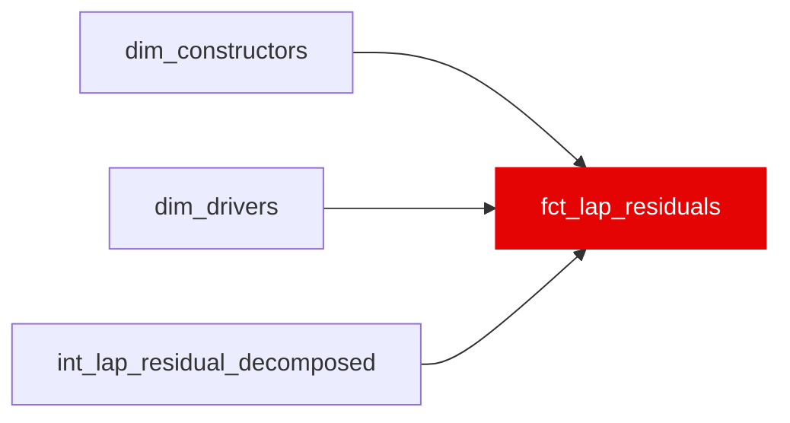

{/* _AUTOGENERATED   do not hand-edit. Run `python scripts/gen_dbt_reference.py` to regenerate. */}

<Note>Part of the [Marts](/transform/families/marts) family.</Note>

> For the conceptual foundation, read [Fct Lap Residuals](/decomposition/seven-term-identity).

Lap-grain analytics table. One row per valid race lap. Exposes the full residual decomposition from int_lap_residual_decomposed plus anomaly flags from int_lap_anomaly_flags. Use ml_eligible = TRUE to filter to training-quality laps. For ML model inputs, prefer the split marts:
  - fct_driver_skill_features   race-grain skill aggregates
  - fct_cliff_prediction_features   lap-grain with next_lap_degradation_jump_s target

## Lineage

## Overview

| Property | Value |
|---|---|
| Layer | `marts` |
| Family | [Marts](/transform/families/marts) |
| Contract enforced | No |
| Upstream | [`int_lap_residual_decomposed`](../int/int_lap_residual_decomposed), [`dim_drivers`](../dim/dim_drivers), [`dim_constructors`](../dim/dim_constructors) |

**19 tests** [guard](/transform/ci/overview) this model  -  18 generic, 1 singular.

## Columns

| Column | Type | Nullable | Tests | Description |
|---|---|---|---|---|
| `lap_id` |   | Yes | [`not_null`](/transform/ci/structural), [`unique`](/transform/ci/structural) | Surrogate PK, FK to stg_laps. |
| `race_year` |   | Yes | [`not_null`](/transform/ci/structural) | Season year. |
| `race_id` |   | Yes | [`not_null`](/transform/ci/structural) | Race identifier. |
| `driver_id` |   | Yes | [`not_null`](/transform/ci/structural) | Driver identifier. |
| `constructor_id` |   | Yes | [`not_null`](/transform/ci/structural) | Constructor identifier. |
| `lap_number` |   | Yes | [`not_null`](/transform/ci/structural) | Lap number within the race. |
| `lap_time_s` |   | Yes | [`not_null`](/transform/ci/structural) | Raw lap time in seconds. |
| `compound` |   | Yes | [`accepted_values`](/transform/ci/range-and-domain) | Tyre compound on this lap. |
| `fuel_component_s` |   | Yes | [`not_null`](/transform/ci/structural) | Fuel-burnoff weight penalty component. |
| `compound_component_s` |   | Yes | [`not_null`](/transform/ci/structural) | Tyre-compound degradation component. NULL when compound itself is NULL — a handful of laps (5, all 2018) have no tyre-compound tag in bronze; known source-data gap, not a pipeline bug. |
| `rubber_component_s` |   | Yes | [`not_null`](/transform/ci/structural) | Track-rubber evolution component. |
| `ambient_component_s` |   | Yes | [`not_null`](/transform/ci/structural) | Ambient/weather component. |
| `constructor_component_s` |   | Yes | [`not_null`](/transform/ci/structural) | Constructor structural pace component. |
| `dirty_air_tax_s` |   | Yes | [`not_null`](/transform/ci/structural) | Per-lap dirty-air slowdown component. |
| `driver_skill_residual_s` |   | Yes | [`not_null`](/transform/ci/structural) | Residual after all physics/car/strategy components (driver skill). |
| `ml_eligible` |   | Yes | [`not_null`](/transform/ci/structural) | TRUE when the lap is training-quality for ML inputs. |
| `correction_weight` |   | Yes | [`not_null`](/transform/ci/structural) | IPW/cleanliness weight for the lap. |
