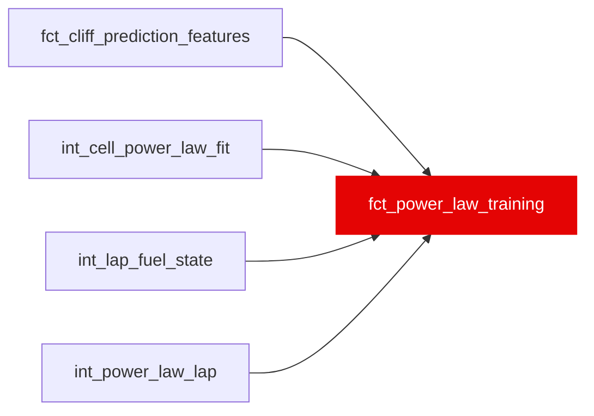

{/* _AUTOGENERATED   do not hand-edit. Run `python scripts/gen_dbt_reference.py` to regenerate. */}

<Note>Part of the [Marts](/transform/families/marts) family.</Note>

WI-17: the training frame for ml/src/powerlaw.py, one row per fit_eligible race x hardness rank cell. Targets from int_cell_power_law_fit (alpha_s, beta, curve_incr_*_s) and an allowlist of features the Degradation Simulator can supply (W26): compound_hardness_rank, era_code, track_energy_index, circuit_abrasiveness_index, track_temp_c (circuit-season median), stint_start_fuel_kg, dirty_air_share, constructor_pace_s. No compound_cliff_params column and nothing priced from it, including the warehouse's ambient_temp_delta (T51, assert_power_law_no_seed_columns.sql and ml/tests/test_powerlaw_export.py).

## Lineage

## Overview

| Property | Value |
|---|---|
| Layer | `marts` |
| Family | [Marts](/transform/families/marts) |
| Contract enforced | No |
| Upstream | [`int_cell_power_law_fit`](../int/int_cell_power_law_fit), [`int_power_law_lap`](../int/int_power_law_lap), [`fct_cliff_prediction_features`](./fct_cliff_prediction_features), [`int_lap_fuel_state`](../int/int_lap_fuel_state) |

**14 tests** [guard](/transform/ci/overview) this model  -  13 generic, 1 singular.

## Columns

| Column | Type | Nullable | Tests | Description |
|---|---|---|---|---|
| `cell_id` |   | Yes | [`not_null`](/transform/ci/structural), [`unique`](/transform/ci/structural) |  |
| `n_laps` |   | Yes | [`not_null`](/transform/ci/structural) | Laps in the cell's fit; the training sample weight. |
| `compound_hardness_rank` |   | Yes | [`not_null`](/transform/ci/structural) |  |
| `era_code` |   | Yes | [`not_null`](/transform/ci/structural), [`accepted_values`](/transform/ci/range-and-domain) | 0 = 2018, 1 = 2019-21, 2 = 2022+. |
| `track_energy_index` |   | Yes | [`not_null`](/transform/ci/structural) |  |
| `circuit_abrasiveness_index` |   | Yes | [`not_null`](/transform/ci/structural) |  |
| `stint_start_fuel_kg` |   | Yes | [`not_null`](/transform/ci/structural) |  |
| `dirty_air_share` |   | Yes | [`not_null`](/transform/ci/structural) |  |
| `constructor_pace_s` |   | Yes | [`not_null`](/transform/ci/structural) |  |
| `curve_incr_20_s` |   | Yes | [`not_null`](/transform/ci/structural) | Degradation at age 20 over the age-2 fresh pace (s); the level model's target. |
| `beta` |   | Yes | [`not_null`](/transform/ci/structural) | The shape model's target. |
