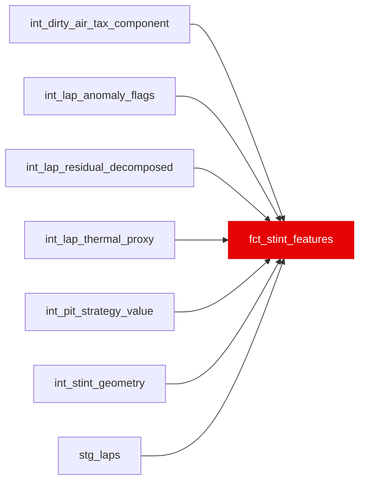

{/* _AUTOGENERATED   do not hand-edit. Run `python scripts/gen_dbt_reference.py` to regenerate. */}

<Note>Part of the [Marts](/transform/families/marts) family.</Note>

One row per stint. Pit strategy feature table: compound, stint length, tyre age progression, thermal load buildup, cumulative dirty air tax, cliff onset lap, and pace degradation slope. Used to model pit strategy decision: is it time to box? Includes tyre_management_score and pit_decision_class derived from int_pit_strategy_value.

## Lineage

## Overview

| Property | Value |
|---|---|
| Layer | `marts` |
| Family | [Marts](/transform/families/marts) |
| Contract enforced | No |
| Tags | `feature_engineering`, `simulation` |
| Upstream | [`int_stint_geometry`](../int/int_stint_geometry), [`stg_laps`](../stg/stg_laps), [`int_lap_thermal_proxy`](../int/int_lap_thermal_proxy), [`int_dirty_air_tax_component`](../int/int_dirty_air_tax_component), [`int_lap_anomaly_flags`](../int/int_lap_anomaly_flags), [`int_lap_residual_decomposed`](../int/int_lap_residual_decomposed), [`int_pit_strategy_value`](../int/int_pit_strategy_value) |

**8 tests** [guard](/transform/ci/overview) this model  -  8 generic, 0 singular.

## Columns

| Column | Type | Nullable | Tests | Description |
|---|---|---|---|---|
| `stint_id` |   | Yes | [`not_null`](/transform/ci/structural), [`unique`](/transform/ci/structural) | PK from int_stint_geometry |
| `driver_id` |   | Yes | [`not_null`](/transform/ci/structural) | FastF1 three-letter driver code (e.g. VER, HAM). |
| `race_id` |   | Yes | [`not_null`](/transform/ci/structural) | Race identifier (numeric FastF1 event id cast to string). |
| `race_year` |   | Yes | [`not_null`](/transform/ci/structural) | Season year. |
| `stint_length_laps` |   | Yes | [`not_null`](/transform/ci/structural), [`expect_column_values_to_be_between`](/transform/ci/range-and-domain) | Total laps in this stint |
| `compound` |   | Yes |   | Tyre compound for this stint |
| `starting_tyre_age_laps` |   | Yes |   | Tyre age at the start of this stint (before first lap) |
| `cumulative_thermal_load_end` |   | Yes |   | EW cumulative thermal load at the end of the stint |
| `cumulative_dirty_air_tax_s` |   | Yes |   | Sum of dirty air tax across all laps in the stint |
| `cliff_lap_in_stint` |   | Yes |   | Lap position within stint where cliff is first detected (NULL if no cliff) |
| `tyre_management_score` |   | Yes |   | Tyre management score: actual end-of-stint driver residual normalised against the optimal pit opportunity cost. Low score = good management. |
| `end_of_stint_pace_falloff_s_per_lap` |   | Yes |   | OLS slope of driver_skill_residual_s over last 3 laps. NULL when short_stint_flag = TRUE. |
| `short_stint_flag` |   | Yes | [`not_null`](/transform/ci/structural) | TRUE when stint_length_laps &lt; 3 (slope is NULL/unreliable) |
| `pit_decision_class` |   | Yes |   | Pit strategy decision verdict from int_pit_strategy_value (optimal / overran / undercut_forced / early). |
