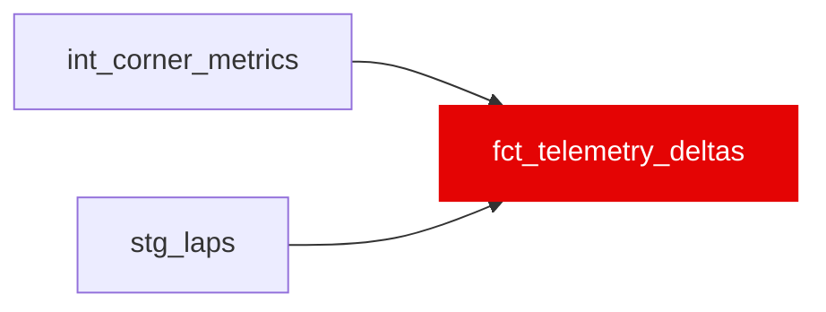

{/* _AUTOGENERATED   do not hand-edit. Run `python scripts/gen_dbt_reference.py` to regenerate. */}

<Note>Part of the [Marts](/transform/families/marts) family.</Note>

Driver-vs-teammate corner-metric deltas. Grain: one row per (race_id, driver_a, driver_b, corner_name, lap_number) for each teammate pair (driver_a &lt; driver_b) within a race, the per-corner difference in braking point, minimum corner speed, and throttle-application point. Built by joining int_corner_metrics to itself across same-car teammates. Exported to the app's data bundle but has no current app feature consumer.

## Lineage

## Overview

| Property | Value |
|---|---|
| Layer | `marts` |
| Family | [Marts](/transform/families/marts) |
| Contract enforced | No |
| Upstream | [`int_corner_metrics`](../int/int_corner_metrics), [`stg_laps`](../stg/stg_laps) |

**9 tests** [guard](/transform/ci/overview) this model  -  9 generic, 0 singular.

## Columns

| Column | Type | Nullable | Tests | Description |
|---|---|---|---|---|
| `race_id` |   | Yes | [`not_null`](/transform/ci/structural) | Race identifier. |
| `driver_a` |   | Yes | [`not_null`](/transform/ci/structural) | First driver of the teammate pair (lexicographically smaller id). |
| `driver_b` |   | Yes | [`not_null`](/transform/ci/structural) | Second driver of the teammate pair. |
| `corner_name` |   | Yes | [`not_null`](/transform/ci/structural) | Named track corner the delta is measured at. |
| `track_id` |   | Yes | [`not_null`](/transform/ci/structural) | Track identifier for the corner. |
| `lap_number` |   | Yes | [`not_null`](/transform/ci/structural) | Lap number within the race. |
| `braking_point_delta_m` |   | Yes | [`not_null`](/transform/ci/structural) | driver_a − driver_b braking point (metres). Positive = driver_a brakes later. |
| `v_min_delta_kph` |   | Yes | [`not_null`](/transform/ci/structural) | driver_a − driver_b minimum corner speed (kph). Positive = driver_a carries more speed. |
| `throttle_point_delta_m` |   | Yes | [`not_null`](/transform/ci/structural) | driver_a − driver_b throttle-application point (metres). Positive = driver_a gets on power later. |
