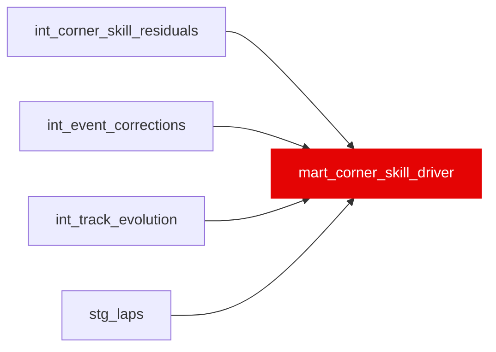

{/* _AUTOGENERATED   do not hand-edit. Run `python scripts/gen_dbt_reference.py` to regenerate. */}

<Note>Part of the [Marts](/transform/families/marts) family.</Note>

Driver corner skill vs a LORO (leave-one-race-out) same-car baseline. Grain: (race_year, driver_id). For each push-lap corner cell, subtracts the mean residual of the driver's OTHER same-car teammates that race, so a driver's edge over a teammate isn't split in half by including themselves in their own car average. Each (driver, race, corner) cell is winsorized to +/-1.0s before the season mean so one thin/outlier cell can't dominate a season. Each phase is z-scored within season so all three contribute equally to corner_skill_index. SC / VSC / pit / inaccurate / non-push (corrected or rain-affected) laps are excluded before car averages are formed. Negative values = faster. corner_skill_index = sum of three z-scores; lower = faster.

## Lineage

## Overview

| Property | Value |
|---|---|
| Layer | `marts` |
| Family | [Marts](/transform/families/marts) |
| Contract enforced | No |
| Tags | `mart` |
| Upstream | [`stg_laps`](../stg/stg_laps), [`int_event_corrections`](../int/int_event_corrections), [`int_track_evolution`](../int/int_track_evolution), [`int_corner_skill_residuals`](../int/int_corner_skill_residuals) |
| Model-level tests | `unique_combination_of_columns` |

**24 tests** [guard](/transform/ci/overview) this model  -  22 generic, 2 singular.

## Columns

| Column | Type | Nullable | Tests | Description |
|---|---|---|---|---|
| `race_year` |   | Yes | [`not_null`](/transform/ci/structural) | Season year |
| `driver_id` |   | Yes | [`not_null`](/transform/ci/structural) | FastF1 three-letter driver code (e.g. VER, HAM) |
| `constructor_id` |   | Yes | [`not_null`](/transform/ci/structural) | Driver's team for the season (ANY_VALUE may vary for mid-season changes) |
| `braking_skill_s` |   | Yes | [`not_null`](/transform/ci/structural), [`expect_column_values_to_be_between`](/transform/ci/range-and-domain) | Mean winsorized LORO-adjusted braking-phase residual (seconds). Negative = faster than the equal-car benchmark. Bounded to [-1, 1] by the cell winsorization (convexity of the mean). |
| `mid_corner_skill_s` |   | Yes | [`not_null`](/transform/ci/structural), [`expect_column_values_to_be_between`](/transform/ci/range-and-domain) | Mean winsorized LORO-adjusted mid-corner residual (seconds). Negative = faster. |
| `exit_skill_s` |   | Yes | [`not_null`](/transform/ci/structural), [`expect_column_values_to_be_between`](/transform/ci/range-and-domain) | Mean winsorized LORO-adjusted exit-phase residual (seconds). Negative = faster. |
| `braking_skill_se_s` |   | Yes | [`not_null`](/transform/ci/structural) | Standard error of braking_skill_s (STDDEV of winsorized cells / SQRT(braking_cells_n)). |
| `mid_corner_skill_se_s` |   | Yes | [`not_null`](/transform/ci/structural) | Standard error of mid_corner_skill_s. |
| `exit_skill_se_s` |   | Yes | [`not_null`](/transform/ci/structural) | Standard error of exit_skill_s. |
| `braking_skill_z` |   | Yes | [`not_null`](/transform/ci/structural) | braking_skill_s standardised within season (zero mean, unit variance). NULL below PHASE_MIN_CELLS=30 braking_cells_n -- the mean is still published, only the standardized score is withheld as unreliable. |
| `mid_corner_skill_z` |   | Yes | [`not_null`](/transform/ci/structural) | mid_corner_skill_s standardised within season. NULL below 30 mid_cells_n. |
| `exit_skill_z` |   | Yes | [`not_null`](/transform/ci/structural) | exit_skill_s standardised within season. NULL below 30 exit_cells_n. |
| `corner_skill_index` |   | Yes | [`not_null`](/transform/ci/structural), [`expect_column_values_to_be_between`](/transform/ci/range-and-domain) | Sum of the three z-scores. Lower = faster driver in corner skill. NULL if any one phase is withheld by its cell floor (see braking_skill_z). Mid-season replacements with few races can reach ±9 because the car baseline is dominated by the full-season driver; this is expected behaviour. |
| `braking_cells_n` |   | Yes | [`not_null`](/transform/ci/structural) | Count of (race, corner) cells behind braking_skill_s this season. |
| `mid_cells_n` |   | Yes | [`not_null`](/transform/ci/structural) | Count of (race, corner) cells behind mid_corner_skill_s this season. Equal to mapped_corners: every mapped corner has a mid-apex, the most complete of the three phases. |
| `exit_cells_n` |   | Yes | [`not_null`](/transform/ci/structural) | Count of (race, corner) cells behind exit_skill_s this season. Can be much lower than mapped_corners -- not every corner has a clean exit-measurement point before the next braking zone. |
| `mapped_corners` |   | Yes | [`not_null`](/transform/ci/structural) | Number of corner observations used in the season aggregate (≥ 100). |
