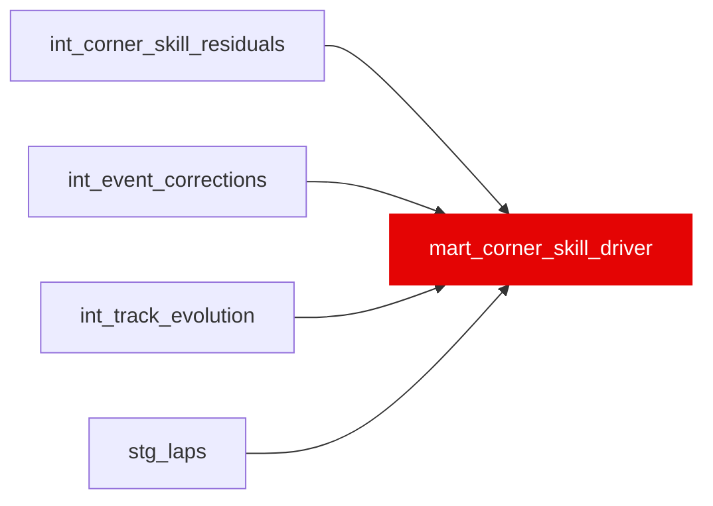

{/* _AUTOGENERATED   do not hand-edit. Run `python scripts/gen_dbt_reference.py` to regenerate. */}

<Note>Part of the [Marts](/transform/families/marts) family.</Note>

Ghost-car-style driver corner skill ranking. Grain: (race_year, driver_id). Estimates driver skill as their deviation from their car's average corner geometry (braking point, apex speed, throttle point), converts to seconds, and z-scores each phase across the field so all three contribute equally to corner_skill_index. SC / VSC / pit / inaccurate laps are excluded before car averages are formed. Negative values = faster. corner_skill_index = sum of three z-scores; lower = faster.

## Lineage

## Overview

| Property | Value |
|---|---|
| Layer | `marts` |
| Family | [Marts](/transform/families/marts) |
| Contract enforced | No |
| Tags | `mart` |
| Upstream | [`stg_laps`](../stg/stg_laps), [`int_event_corrections`](../int/int_event_corrections), [`int_track_evolution`](../int/int_track_evolution), [`int_corner_skill_residuals`](../int/int_corner_skill_residuals) |
| Model-level tests | `unique_combination_of_columns` |

**13 tests** [guard](/transform/ci/overview) this model  -  13 generic, 0 singular.

## Columns

| Column | Type | Nullable | Tests | Description |
|---|---|---|---|---|
| `race_year` |   | Yes | [`not_null`](/transform/ci/structural) | Season year |
| `driver_id` |   | Yes | [`not_null`](/transform/ci/structural) | FastF1 three-letter driver code (e.g. VER, HAM) |
| `constructor_id` |   | Yes | [`not_null`](/transform/ci/structural) | Driver's team for the season (ANY_VALUE may vary for mid-season changes) |
| `braking_skill_s` |   | Yes | [`not_null`](/transform/ci/structural) | Mean braking deviation from car average (seconds). Negative = earlier brake = faster. |
| `mid_corner_skill_s` |   | Yes | [`not_null`](/transform/ci/structural) | Mean apex speed deviation from car average (seconds). Negative = higher apex speed = faster. |
| `exit_skill_s` |   | Yes | [`not_null`](/transform/ci/structural) | Mean throttle-point deviation from car average (seconds). Negative = earlier throttle = faster. |
| `braking_skill_z` |   | Yes | [`not_null`](/transform/ci/structural) | braking_skill_s standardised within season (zero mean, unit variance). |
| `mid_corner_skill_z` |   | Yes | [`not_null`](/transform/ci/structural) | mid_corner_skill_s standardised within season. |
| `exit_skill_z` |   | Yes | [`not_null`](/transform/ci/structural) | exit_skill_s standardised within season. |
| `corner_skill_index` |   | Yes | [`not_null`](/transform/ci/structural), [`expect_column_values_to_be_between`](/transform/ci/range-and-domain) | Sum of the three z-scores. Lower = faster driver in corner skill. Mid-season replacements with few races can reach ±9 because the car baseline is dominated by the full-season driver; this is expected behaviour. |
| `mapped_corners` |   | Yes | [`not_null`](/transform/ci/structural) | Number of corner observations used in the season aggregate (≥ 100). |
