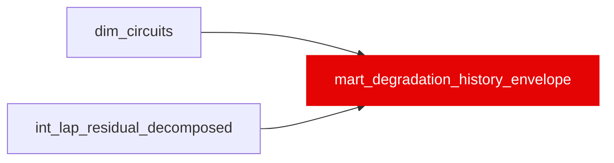

{/* _AUTOGENERATED   do not hand-edit. Run `python scripts/gen_dbt_reference.py` to regenerate. */}

<Note>Part of the [Marts](/transform/families/marts) family.</Note>

Pre-aggregated historical stint envelope for the Degradation Simulator. Grain: (circuit_id, era, compound, lap_in_stint). For each physical circuit × regulation era × compound, captures at every lap-in-stint the observed fuel-removed pace distribution (p10/p50/p90 of weight_corrected_lap_time) and the corresponding tyre-degradation-from-fresh band (the same minus the fresh-tyre anchor ref_green_pace_s). A compound='_all' rollup is emitted for fallback. Clean laps only (correction_weight = 1, not SC/VSC, not major outlier); cells with &lt; 3 observations dropped.

## Lineage

## Overview

| Property | Value |
|---|---|
| Layer | `marts` |
| Family | [Marts](/transform/families/marts) |
| Contract enforced | No |
| Upstream | [`int_lap_residual_decomposed`](../int/int_lap_residual_decomposed), [`dim_circuits`](../dim/dim_circuits) |
| Model-level tests | `unique_combination_of_columns`, `expect_table_row_count_to_be_between`, `expect_column_pair_values_A_to_be_greater_than_B`, `expect_column_pair_values_A_to_be_greater_than_B`, `expect_column_pair_values_A_to_be_greater_than_B` |

**22 tests** [guard](/transform/ci/overview) this model  -  22 generic, 0 singular.

## Columns

| Column | Type | Nullable | Tests | Description |
|---|---|---|---|---|
| `circuit_id` |   | Yes | [`not_null`](/transform/ci/structural) | Physical circuit identifier (slug of circuit_name). |
| `circuit_name` |   | Yes | [`not_null`](/transform/ci/structural) | Canonical display name for the circuit. |
| `era` |   | Yes | [`not_null`](/transform/ci/structural), [`accepted_values`](/transform/ci/range-and-domain) | Regulation era 'pre2022' (2018–2021) or 'post2022' (2022–2024). |
| `compound` |   | Yes | [`not_null`](/transform/ci/structural) | Tyre compound code, or '_all' for the cross-compound rollup. |
| `lap_in_stint` |   | Yes | [`not_null`](/transform/ci/structural), [`expect_column_values_to_be_between`](/transform/ci/range-and-domain) | Lap number within the stint (1-based). |
| `n_observations` |   | Yes | [`not_null`](/transform/ci/structural), [`expect_column_values_to_be_between`](/transform/ci/range-and-domain) | Clean-lap count behind this cell (≥ 3). |
| `ref_green_pace_s` |   | Yes | [`not_null`](/transform/ci/structural), [`expect_column_values_to_be_between`](/transform/ci/range-and-domain) | Fuel-removed fresh-tyre anchor (median weight_corrected_lap_time, age ≤ 2 laps). |
| `obs_fuel_removed_pace_p10_s` |   | Yes | [`not_null`](/transform/ci/structural) | 10th percentile of fuel-removed lap time at this lap-in-stint. |
| `obs_fuel_removed_pace_p50_s` |   | Yes | [`not_null`](/transform/ci/structural) | Median fuel-removed lap time at this lap-in-stint. |
| `obs_fuel_removed_pace_p90_s` |   | Yes | [`not_null`](/transform/ci/structural) | 90th percentile of fuel-removed lap time at this lap-in-stint. |
| `obs_deg_from_fresh_p10_s` |   | Yes | [`not_null`](/transform/ci/structural) | p10 tyre-degradation-from-fresh (obs_fuel_removed_pace_p10_s − ref_green_pace_s). |
| `obs_deg_from_fresh_p50_s` |   | Yes | [`not_null`](/transform/ci/structural) | p50 tyre-degradation-from-fresh. |
| `obs_deg_from_fresh_p90_s` |   | Yes | [`not_null`](/transform/ci/structural) | p90 tyre-degradation-from-fresh. |
