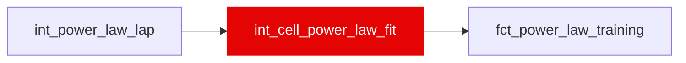

{/* _AUTOGENERATED   do not hand-edit. Run `python scripts/gen_dbt_reference.py` to regenerate. */}

<Note>Part of the [Physics](/transform/families/physics) family.</Note>

WI-17: the pooled fit and training target, one per race x compound hardness rank. Each stint keeps its own intercept; within-stint demeaning removes it, beta is profiled on the grid and alpha is OLS through the origin. curve_incr_&#123;5,10,15,20&#125;_s is the curve over the fresh-tyre pace at tyre age 2 (the simulator's anchor), the quantity Step 0 found identified (reliability ceiling 0.58-0.76) where alpha is not (0.07). fit_eligible: &gt;= 3 qualifying stints (&gt;= 5 laps over &gt;= 2 ages) and &gt;= 40 laps. No 2025 cells (no rank).

## Lineage

## Overview

| Property | Value |
|---|---|
| Layer | `intermediate` |
| Family | [Physics](/transform/families/physics) |
| Contract enforced | No |
| Upstream | [`int_power_law_lap`](./int_power_law_lap) |
| Model-level tests | `unique_combination_of_columns` |

**10 tests** [guard](/transform/ci/overview) this model  -  8 generic, 2 singular.

## Columns

| Column | Type | Nullable | Tests | Description |
|---|---|---|---|---|
| `cell_id` |   | Yes | [`not_null`](/transform/ci/structural), [`unique`](/transform/ci/structural) |  |
| `compound_hardness_rank` |   | Yes | [`not_null`](/transform/ci/structural) |  |
| `n_compound_labels` |   | Yes | [`accepted_values`](/transform/ci/range-and-domain) | Distinct compound names in the cell; 1 by construction (one C-code per label per race). |
| `beta` |   | Yes | [`not_null`](/transform/ci/structural) |  |
| `r2_within` |   | Yes | [`not_null`](/transform/ci/structural) |  |
| `fit_eligible` |   | Yes | [`not_null`](/transform/ci/structural) |  |
