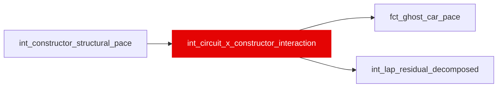

{/* _AUTOGENERATED   do not hand-edit. Run `python scripts/gen_dbt_reference.py` to regenerate. */}

<Note>Part of the [Pace Baselines](/transform/families/pace-baselines) family.</Note>

One row per (race_year, race_id, constructor_id). Circuit-specific car advantage beyond season-average. E.g., Red Bull faster at high-downforce tracks. The shrinkage pool is keyed on the physical-circuit id, so a renamed event or double-header (e.g. mexican_grand_prix / mexico_city_grand_prix) shares one pool rather than splitting into two thinner cells. Shrunk toward 0 (Bayesian prior). Positive = slower at this circuit than season average.

## Lineage

## Overview

| Property | Value |
|---|---|
| Layer | `intermediate` |
| Family | [Pace Baselines](/transform/families/pace-baselines) |
| Contract enforced | No |
| Tags | `simulation`, `ghost_car` |
| Upstream | [`int_constructor_structural_pace`](./int_constructor_structural_pace) |

**3 tests** [guard](/transform/ci/overview) this model  -  3 generic, 0 singular.

## Columns

| Column | Type | Nullable | Tests | Description |
|---|---|---|---|---|
| `constructor_race_id` |   | Yes | [`not_null`](/transform/ci/structural), [`unique`](/transform/ci/structural) | Surrogate PK |
| `circuit_constructor_interaction_s` |   | Yes | [`not_null`](/transform/ci/structural) | Seconds adjustment for this constructor at this circuit. Positive = slower. |
