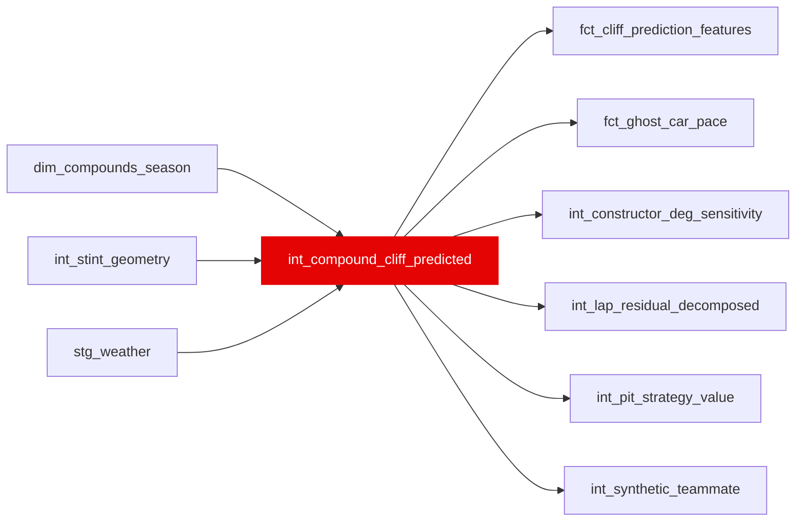

{/* _AUTOGENERATED   do not hand-edit. Run `python scripts/gen_dbt_reference.py` to regenerate. */}

<Note>Part of the [Pace Baselines](/transform/families/pace-baselines) family.</Note>

> For the conceptual foundation, read [Int Compound Cliff Predicted](/decomposition/methodology).

Tyre compound degradation prediction using fitted survival-analysis parameters. One row per lap. Predicts degradation rate and cliff onset based on fitted compound parameters and current thermal conditions.

## Lineage

## Overview

| Property | Value |
|---|---|
| Layer | `intermediate` |
| Family | [Pace Baselines](/transform/families/pace-baselines) |
| Contract enforced | No |
| Upstream | [`int_stint_geometry`](./int_stint_geometry), [`dim_compounds_season`](../dim/dim_compounds_season), [`stg_weather`](../stg/stg_weather) |

**3 tests** [guard](/transform/ci/overview) this model  -  2 generic, 1 singular.

## Columns

| Column | Type | Nullable | Tests | Description |
|---|---|---|---|---|
| `lap_id` |   | Yes | [`not_null`](/transform/ci/structural), [`unique`](/transform/ci/structural) | Foreign key to stg_laps |
