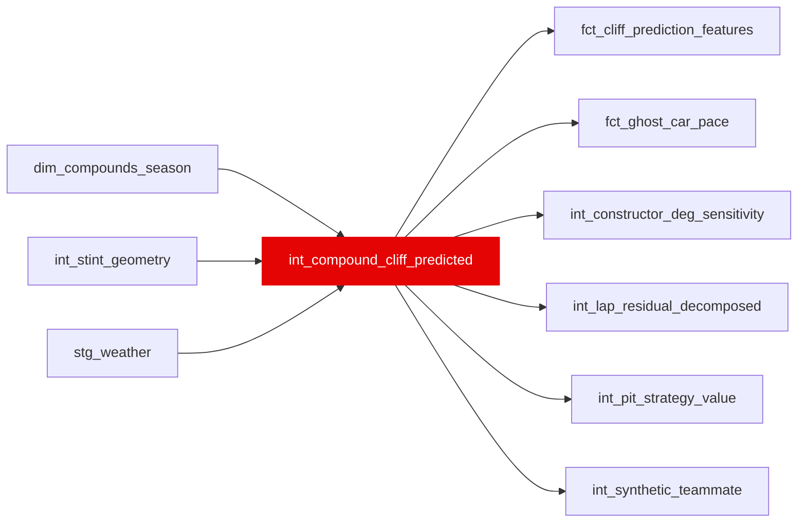

{/* _AUTOGENERATED   do not hand-edit. Run `python scripts/gen_dbt_reference.py` to regenerate. */}

<Note>Part of the [Pace Baselines](/transform/families/pace-baselines) family.</Note>

> For the conceptual foundation, read [Int Compound Cliff Predicted](/decomposition/methodology).

Tyre compound degradation prediction using fitted survival-analysis parameters. One row per lap. Predicts degradation rate and cliff onset based on fitted compound parameters and current thermal conditions.

## Lineage

## Overview

| Property | Value |
|---|---|
| Layer | `intermediate` |
| Family | [Pace Baselines](/transform/families/pace-baselines) |
| Contract enforced | No |
| Upstream | [`int_stint_geometry`](./int_stint_geometry), [`dim_compounds_season`](../dim/dim_compounds_season), [`stg_weather`](../stg/stg_weather) |

**7 tests** [guard](/transform/ci/overview) this model  -  5 generic, 2 singular.

## Columns

| Column | Type | Nullable | Tests | Description |
|---|---|---|---|---|
| `lap_id` |   | Yes | [`not_null`](/transform/ci/structural), [`unique`](/transform/ci/structural) | Foreign key to stg_laps |
| `compound_wear_s` |   | Yes | [`not_null`](/transform/ci/structural) | The age-dependent portion of the hockey-stick curve, bounded at var('compound_wear_max_s_per_lap'). Exposed as its own column so the bound is assertable directly -- see assert_compound_wear_bounded.sql. expected_compound_pace_s is this plus grip_peak plus the temperature offset, so the pace total legitimately exceeds the bound while this column may not. As of 08m (2026-09-16) the formula is wear_gradient*age + cliff_ramp, where cliff_ramp is the de-double-counted, moment-matched saturating post-onset term defined once in macros/compound_cliff_wear.sql. It was previously wear_gradient*age + 0.002*age^2 + severity*laps_past_cliff. Both of the removed terms were unfounded: compound_cliff_severity is FITTED as a level shift in seconds over a ~5.5-lap window and was being charged once per lap (laps_past_cliff reaches 48), and the 0.002 quadratic was a literal constant identical across all 438 seed cells that was never fitted against anything. 08l measured them at 60.4% and 18.9% of the seed's contribution to the ML target respectively. |
| `compound_wear_gradient` |   | Yes | [`not_null`](/transform/ci/structural) | The fitted linear wear slope (s/lap) for this lap's circuit x compound x season cell, passed through from dim_compounds_season. Exposed by 08m alongside compound_cliff_severity because any consumer needing a post-onset RATE needs both: severity is a level shift, and de-double-counting it against this gradient is what turns it into a rate. Use the cliff_ramp_slope_s_per_lap() macro. |
| `expected_compound_pace_s` |   | Yes | [`not_null`](/transform/ci/structural) | Expected pace loss vs compound baseline, in seconds. Bounded as of Phase 8 (2026-08-25): the wear portion is capped, having previously reached 93.5 s/lap on laps that were actually run. This column is subtracted into driver_skill_residual_s, so the unbounded tail was depressing the residual on 12,575 post-onset laps and, through it, corrupting both ML targets -- it hid 6,825 cliff-label crossings (99.5% of them into 'none_in_stint') and moved the degradation target on 9.05% of rows. 08m (2026-09-16) changed what this column MEANS, not just its precision: the severity and quadratic terms it carried were removed (see compound_wear_s). Any number in the tree measured against next_5_lap_cumulative_jump_s before that date is on the old quantity and is not comparable to one measured after it. |
