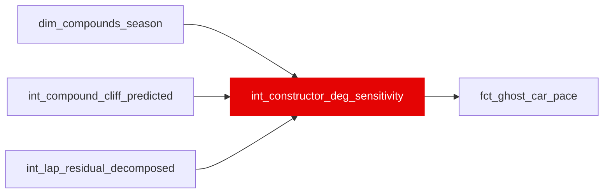

{/* _AUTOGENERATED   do not hand-edit. Run `python scripts/gen_dbt_reference.py` to regenerate. */}

<Note>Part of the [Strategy](/transform/families/strategy) family.</Note>

One row per (race_year, constructor_id, compound). Constructor-specific tyre degradation sensitivity: within-stint fixed-effects slope of the post-decomposition residual on tyre age, field-centred per (compound, season) and empirical-Bayes shrunk toward 0 (DerSimonian-Laird). Positive = degrades faster than the field-average compound curve. Feeds the ghost-car recombination interaction term (host slope minus ego slope) x age_in_stint, which is what lets host identity reorder drivers. slope_se and n_laps are carried for downstream SE propagation. cliff_onset_shift_laps is a per-constructor break-point offset (laps) for the field tyre-cliff onset, estimated as a bivariate within-stint hinge coefficient (extra post-onset degradation), field-centred and EB-shrunk like the linear slope, then mapped to an onset shift via the field severity and typical post-onset depth. Positive = cliff arrives later (gentler). Feeds the ghost-car cliff interaction term.

## Lineage

## Overview

| Property | Value |
|---|---|
| Layer | `intermediate` |
| Family | [Strategy](/transform/families/strategy) |
| Contract enforced | No |
| Tags | `causal_decomposition`, `constructor`, `degradation` |
| Upstream | [`int_lap_residual_decomposed`](./int_lap_residual_decomposed), [`int_compound_cliff_predicted`](./int_compound_cliff_predicted), [`dim_compounds_season`](../dim/dim_compounds_season) |

**27 tests** [guard](/transform/ci/overview) this model  -  25 generic, 2 singular.

## Columns

| Column | Type | Nullable | Tests | Description |
|---|---|---|---|---|
| `deg_sensitivity_id` |   | Yes | [`not_null`](/transform/ci/structural), [`unique`](/transform/ci/structural) | Surrogate PK = race_year \|\| constructor_id \|\| compound |
| `race_year` |   | Yes | [`not_null`](/transform/ci/structural) | Season year (cells are season-scoped; no cross-season pooling) |
| `constructor_id` |   | Yes | [`not_null`](/transform/ci/structural) | Constructor identifier |
| `compound` |   | Yes | [`not_null`](/transform/ci/structural), [`accepted_values`](/transform/ci/range-and-domain) | Dry tyre compound the slope is estimated for |
| `deg_slope_s_per_lap` |   | Yes | [`not_null`](/transform/ci/structural), [`expect_column_values_to_be_between`](/transform/ci/range-and-domain) | Production value: EB-shrunk deviation from the field-mean within-stint slope, in s/lap per lap of tyre age. Positive = degrades faster than field. 0.0 for low-sample cells. 2024 reference range: ~±0.025 s/lap on HARD, ~±0.08 on SOFT. |
| `deg_slope_raw_s_per_lap` |   | Yes | [`expect_column_values_to_be_between`](/transform/ci/range-and-domain) | Uncentred within-stint FE slope (diagnostic). Uniformly negative (~ -0.08 s/lap in 2024) because a common residual fuel under-correction survives the decomposition; the common part cancels in field-centring and in the (host - ego) recombination difference. |
| `field_mean_slope_s_per_lap` |   | Yes |   | Precision-weighted mean raw slope per (race_year, compound); the centring constant. |
| `deg_slope_se_s_per_lap` |   | Yes | [`expect_column_values_to_be_between`](/transform/ci/range-and-domain) | FE-regression standard error of the raw slope (dof = n_laps - n_stints - 1), floored at 1e-4. NULL for low-sample cells. Carried for downstream SE propagation. |
| `deg_slope_posterior_sd_s_per_lap` |   | Yes | [`not_null`](/transform/ci/structural) | EB posterior sd of the shrunk slope; equals tau (prior sd) for low-sample cells and 0 when tau^2 = 0 (no between-constructor signal). |
| `shrink_factor` |   | Yes | [`not_null`](/transform/ci/structural), [`expect_column_values_to_be_between`](/transform/ci/range-and-domain) | tau^2 / (tau^2 + se^2) in [0,1]; 0 for low-sample cells. |
| `tau_s_per_lap` |   | Yes | [`not_null`](/transform/ci/structural) | DerSimonian-Laird between-constructor sd per (race_year, compound). |
| `n_laps` |   | Yes | [`not_null`](/transform/ci/structural) | Clean dry pre-cliff laps in the cell (cell-count; qualifying rule &gt;= 30). |
| `n_stints` |   | Yes | [`not_null`](/transform/ci/structural) | Distinct stints in the cell (qualifying rule &gt;= 5). |
| `is_low_sample` |   | Yes | [`not_null`](/transform/ci/structural) | TRUE when the cell fails minimum-cell rules; slope forced to 0, excluded from pooling. |
| `cliff_onset_shift_laps` |   | Yes | [`not_null`](/transform/ci/structural), [`expect_column_values_to_be_between`](/transform/ci/range-and-domain) | Per-constructor tyre-cliff onset shift in laps relative to the field onset. Positive = cliff arrives LATER (gentler), negative = EARLIER (harsher). 0.0 for cells without enough post-onset depth. Clipped to +/-3 laps. |
| `cliff_onset_shift_se_laps` |   | Yes | [`expect_column_values_to_be_between`](/transform/ci/range-and-domain) | SE of the onset shift (hinge SE mapped through ref_depth / severity). NULL for low-sample cells. Carried for downstream SE propagation. |
| `cliff_hinge_coef_s_per_lap` |   | Yes |   | Diagnostic: raw bivariate within-stint hinge coefficient (extra s/lap of degradation after the field onset). Uniformly negative like the linear slope; common part cancels in field-centring. |
| `cliff_hinge_field_mean_s_per_lap` |   | Yes |   | Precision-weighted mean hinge coefficient per (race_year, compound); the centring constant. |
| `cliff_severity_used_s_per_lap` |   | Yes |   | Median field post-onset severity (s/lap) per (compound, season), floored at 0.30, used in the shift mapping. |
| `cliff_ref_depth_laps` |   | Yes |   | Mean laps past the field onset over post-onset clean laps per (compound, season); the depth at which the hinge deviation is converted to an onset shift. |
| `cliff_hinge_tau_s_per_lap` |   | Yes |   | DerSimonian-Laird between-constructor sd of the hinge coefficient per (race_year, compound). |
| `n_post_cliff_laps` |   | Yes | [`not_null`](/transform/ci/structural) | Post-onset clean laps in the cell (qualifying rule &gt;= 30). |
| `n_deep_cliff_laps` |   | Yes | [`not_null`](/transform/ci/structural) | Post-onset laps at least 2 laps past onset (depth rule &gt;= 15); guards against shallow-crossing noise. |
| `n_stints_cliff` |   | Yes | [`not_null`](/transform/ci/structural) | Distinct stints contributing post-onset laps (qualifying rule &gt;= 5). |
| `is_low_sample_cliff` |   | Yes | [`not_null`](/transform/ci/structural) | TRUE when the cell fails cliff minimum-cell rules; cliff_onset_shift_laps forced to 0. |
| `fit_timestamp` |   | Yes | [`not_null`](/transform/ci/structural) | UTC timestamp when the slopes were fitted (ISO 8601) |
