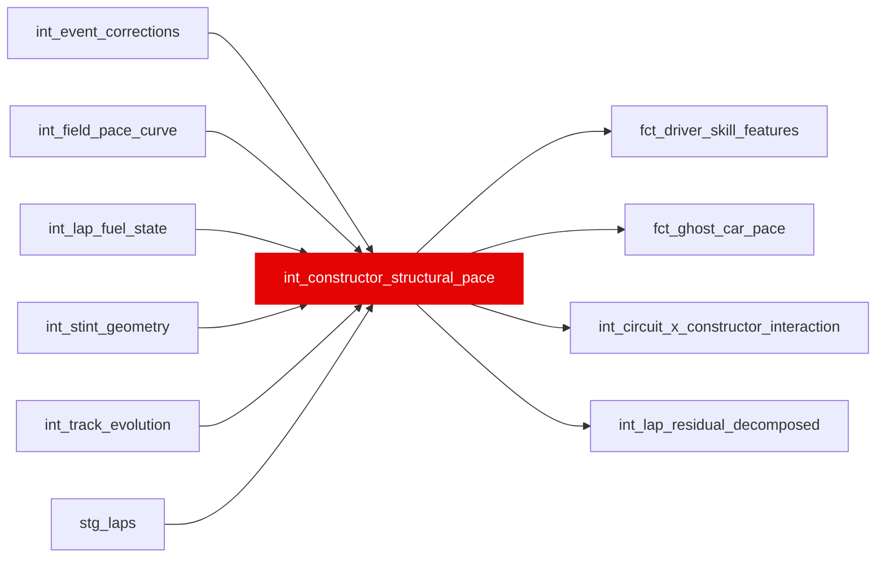

{/* _AUTOGENERATED   do not hand-edit. Run `python scripts/gen_dbt_reference.py` to regenerate. */}

<Note>Part of the [Pace Baselines](/transform/families/pace-baselines) family.</Note>

One row per (race_year, race_id, constructor_id). Car-inherent pace advantage/penalty estimated from a re-centred median pace delta across same-constructor teammates in the same race, isolating car pace from driver skill via within-constructor, between-driver variation. A placeholder for the full panel regression (pyfixest HDFE fit) named in the model's own header; that fixed-effects estimate exists separately, as int_constructor_car_fe. Positive = slower car. Includes a normal- approximation 95% CI and clean pair sample counts for confidence.

## Lineage

## Overview

| Property | Value |
|---|---|
| Layer | `intermediate` |
| Family | [Pace Baselines](/transform/families/pace-baselines) |
| Contract enforced | No |
| Tags | `causal_decomposition`, `constructor` |
| Upstream | [`int_lap_fuel_state`](./int_lap_fuel_state), [`int_field_pace_curve`](./int_field_pace_curve), [`int_stint_geometry`](./int_stint_geometry), [`stg_laps`](../stg/stg_laps), [`int_event_corrections`](./int_event_corrections), [`int_track_evolution`](./int_track_evolution) |
| Model-level tests | `expect_column_pair_values_A_to_be_greater_than_B` |

**16 tests** [guard](/transform/ci/overview) this model  -  15 generic, 1 singular.

## Columns

| Column | Type | Nullable | Tests | Description |
|---|---|---|---|---|
| `constructor_race_id` |   | Yes | [`not_null`](/transform/ci/structural), [`unique`](/transform/ci/structural) | Surrogate PK = hash(race_year, race_id, constructor_id) |
| `race_year` |   | Yes | [`not_null`](/transform/ci/structural) | Season year |
| `race_id` |   | Yes | [`not_null`](/transform/ci/structural) | Race identifier |
| `constructor_id` |   | Yes | [`not_null`](/transform/ci/structural) | Constructor identifier (FK to dim_constructors) |
| `constructor_structural_pace_s` |   | Yes | [`not_null`](/transform/ci/structural) | Re-centred median pace-delta coefficient in seconds (not yet a fitted fixed effect see the model description). Positive = slower than field. Identified via within-constructor, between-driver variation from teammate pairs. |
| `constructor_structural_pace_se_s` |   | Yes | [`not_null`](/transform/ci/structural), [`expect_column_values_to_be_between`](/transform/ci/range-and-domain) | Standard error of the median pace delta (stddev / √n), not yet a clustered (CRV1) regression SE. Positive, ≥0. Captures uncertainty in the coefficient estimate. |
| `constructor_structural_pace_ci_low_s` |   | Yes | [`not_null`](/transform/ci/structural) | 95% confidence interval lower bound |
| `constructor_structural_pace_ci_high_s` |   | Yes | [`not_null`](/transform/ci/structural) | 95% confidence interval upper bound |
| `panel_observations_n` |   | Yes | [`not_null`](/transform/ci/structural) | Sample size of clean laps used in the aggregate estimate |
| `clean_teammate_pair_laps_n` |   | Yes | [`not_null`](/transform/ci/structural) | Count of clean laps where both teammates in a constructor ran (used to assess pair quality). Flags constructor-seasons where this is &lt;100 laps. |
| `r_squared_within` |   | Yes | [`expect_column_values_to_be_between`](/transform/ci/range-and-domain) | Within fixed-effect R² (sanity check; low is expected, high is good). NULL until the pyfixest model is in place   a misleading 0.0 is worse than NULL. |
| `fit_timestamp` |   | Yes | [`not_null`](/transform/ci/structural) | UTC timestamp when this coefficient was fitted (ISO 8601) |
