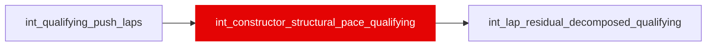

{/* _AUTOGENERATED   do not hand-edit. Run `python scripts/gen_dbt_reference.py` to regenerate. */}

<Note>Part of the [Pace Baselines](/transform/families/pace-baselines) family.</Note>

One row per (race_year, race_id, constructor_id). Car pace advantage in qualifying (one-lap trim) via same panel regression as race version. Different coefficient expected vs race due to fuel load and strategy differences. Single-lap setup may favor different cars.

## Lineage

## Overview

| Property | Value |
|---|---|
| Layer | `intermediate` |
| Family | [Pace Baselines](/transform/families/pace-baselines) |
| Contract enforced | No |
| Tags | `simulation`, `qualifying` |
| Upstream | [`int_qualifying_push_laps`](./int_qualifying_push_laps) |

**3 tests** [guard](/transform/ci/overview) this model  -  3 generic, 0 singular.

## Columns

| Column | Type | Nullable | Tests | Description |
|---|---|---|---|---|
| `constructor_race_id` |   | Yes | [`not_null`](/transform/ci/structural), [`unique`](/transform/ci/structural) | Surrogate PK = concat(race_year, race_id, constructor_id, '_Q') |
| `constructor_structural_pace_s` |   | Yes | [`not_null`](/transform/ci/structural) | Constructor qualifying-mode coefficient. Fit on each driver's best push lap per Q1/Q2/Q3 segment, measured against that segment's median push lap and re-centred within the segment before pooling. Positive = slower. |
