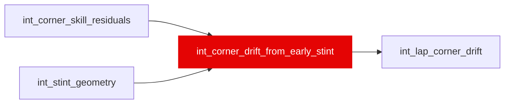

{/* _AUTOGENERATED   do not hand-edit. Run `python scripts/gen_dbt_reference.py` to regenerate. */}

<Note>Part of the [Residual](/transform/families/residual) family.</Note>

Item 02h. int_corner_skill_residuals residualized a SECOND time: for each (stint_id, corner_name), the mean of the three phase residuals over the stint's own first 6 valid laps (valid_lap_in_stint 1-6) is taken as a BASELINE, and every later lap's residual minus that baseline is DRIFT. Grain: (lap_id, corner_name), same as int_corner_skill_residuals.
WHY. 02c's residuals do not persist lap-to-lap (measured lag-1 within-stint autocorrelation 0.032-0.176) because (field trailing-5 median - own) is a relative-PACE construct, and the columns that survive ablation elsewhere in the contract all sit at .27-.42 (proximity .421, thermal's push_residual .343, dirty_air .266). A driver who is steadily 0.05s worse than the field all race has zero drift and is captured by pace already three times over; a driver who opens that gap from 0.05s to 0.35s across the stint has +0.30s of drift, which is the tyre-degradation signal a pace residual cannot distinguish from a driver who is simply slow-but-stable.
LEAKAGE. The baseline window is FIXED at valid_lap_in_stint 1-6, not trailing relative to the query lap. Every row with a non-NULL drift value has valid_lap_in_stint &gt;= 7, strictly after the baseline window, so the baseline never draws on the lap it is subtracted from or any lap after it. Rows with valid_lap_in_stint &lt;= 6 -- the baseline-defining window -- get drift = NULL by construction (verified: zero exceptions). Stints with fewer than 7 valid laps get NULL throughout (no lap to report a drift value for). A (stint, corner, phase) baseline additionally requires &gt;= 3 non-NULL observations inside the 6-lap window.

## Lineage

## Overview

| Property | Value |
|---|---|
| Layer | `intermediate` |
| Family | [Residual](/transform/families/residual) |
| Contract enforced | No |
| Tags | `feature_engineering` |
| Upstream | [`int_corner_skill_residuals`](./int_corner_skill_residuals), [`int_stint_geometry`](./int_stint_geometry) |

**7 tests** [guard](/transform/ci/overview) this model  -  7 generic, 0 singular.

## Columns

| Column | Type | Nullable | Tests | Description |
|---|---|---|---|---|
| `corner_id` |   | Yes | [`not_null`](/transform/ci/structural), [`unique`](/transform/ci/structural) | PK = lap_id \|\| '_C_' \|\| corner_name |
| `lap_id` |   | Yes | [`not_null`](/transform/ci/structural) | FK to stg_laps |
| `stint_id` |   | Yes | [`not_null`](/transform/ci/structural) | FK to int_stint_geometry |
| `corner_name` |   | Yes | [`not_null`](/transform/ci/structural) | Named corner from dim_corners |
| `valid_lap_in_stint` |   | Yes | [`not_null`](/transform/ci/structural) | Ordinal among valid laps only within this stint (from int_stint_geometry). Drift is NULL for values 1-6, the baseline-defining window. |
| `drift_in_baseline_window` |   | Yes | [`not_null`](/transform/ci/structural) | TRUE when this row sits inside the baseline window (valid_lap_in_stint &lt;= 6) or the stint never reached 7 valid laps -- i.e. TRUE whenever all three drift columns are necessarily NULL for a reason other than a missing corner residual. Diagnostic, not a feature. |
| `braking_drift_s` |   | Yes |   | braking_loss_s minus the stint's own early-stint (valid_lap_in_stint 1-6) mean braking_loss_s for this corner. NULL inside the baseline window, on stints shorter than 7 valid laps, on a baseline with fewer than 3 usable observations, or where this lap's own braking_loss_s is NULL. |
| `mid_drift_s` |   | Yes |   | mid_corner_residual_s minus the stint's own early-stint mean mid_corner_residual_s for this corner. Same NULL policy as braking_drift_s. |
| `exit_drift_s` |   | Yes |   | exit_residual_s minus the stint's own early-stint mean exit_residual_s for this corner. Same NULL policy as braking_drift_s. |
