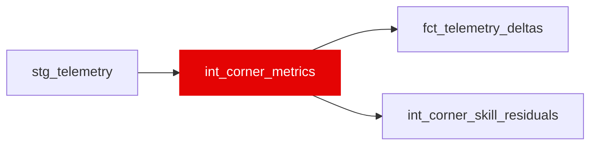

{/* _AUTOGENERATED   do not hand-edit. Run `python scripts/gen_dbt_reference.py` to regenerate. */}

<Note>Part of the [Physics](/transform/families/physics) family.</Note>

Corner-level g-force and speed metrics. Grain is (driver_id, lap_number, race_id, corner_name). Multiple rows per lap, one per named corner. Used for lateral-g features and track-signature analysis.

## Lineage

## Overview

| Property | Value |
|---|---|
| Layer | `intermediate` |
| Family | [Physics](/transform/families/physics) |
| Contract enforced | No |
| Upstream | [`stg_telemetry`](../stg/stg_telemetry) |

**4 tests** [guard](/transform/ci/overview) this model  -  4 generic, 0 singular.

## Columns

| Column | Type | Nullable | Tests | Description |
|---|---|---|---|---|
| `driver_id` |   | Yes | [`not_null`](/transform/ci/structural) | Driver identifier |
| `lap_number` |   | Yes | [`not_null`](/transform/ci/structural) | Lap number within race |
| `race_id` |   | Yes | [`not_null`](/transform/ci/structural) | Race identifier |
| `corner_name` |   | Yes | [`not_null`](/transform/ci/structural) | Named track corner |
