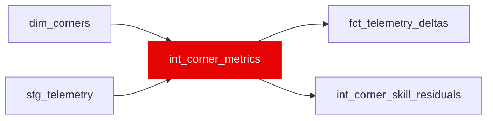

{/* _AUTOGENERATED   do not hand-edit. Run `python scripts/gen_dbt_reference.py` to regenerate. */}

<Note>Part of the [Physics](/transform/families/physics) family.</Note>

Per-corner telemetry metrics. Grain is (race_year, race_id, driver_id, lap_number, corner_name)   one row per corner the driver's telemetry reaches on that lap. Windows come from dim_corners, keyed per race, so each session is measured against its own corner geometry. Feeds int_corner_skill_residuals and fct_telemetry_deltas.

## Lineage

## Overview

| Property | Value |
|---|---|
| Layer | `intermediate` |
| Family | [Physics](/transform/families/physics) |
| Contract enforced | No |
| Upstream | [`stg_telemetry`](../stg/stg_telemetry), [`dim_corners`](../dim/dim_corners) |

**7 tests** [guard](/transform/ci/overview) this model  -  7 generic, 0 singular.

## Columns

| Column | Type | Nullable | Tests | Description |
|---|---|---|---|---|
| `driver_id` |   | Yes | [`not_null`](/transform/ci/structural) | FastF1 three-letter driver code. |
| `lap_number` |   | Yes | [`not_null`](/transform/ci/structural) | Lap number within the race. |
| `race_id` |   | Yes | [`not_null`](/transform/ci/structural) | Numeric FastF1 event id. |
| `race_year` |   | Yes | [`not_null`](/transform/ci/structural) | Season year. |
| `corner_name` |   | Yes | [`not_null`](/transform/ci/structural) | Turn label from dim_corners (Turn_7, Turn_7A). |
| `track_id` |   | Yes | [`not_null`](/transform/ci/structural) | Event slug the corner belongs to, carried from dim_corners as a label. |
| `braking_point_m` |   | Yes |   | Distance of the first sample on the brakes inside the corner window. NULL where the corner is taken flat   a real answer for a fast corner, not missing data. |
| `v_min_kph` |   | Yes | [`not_null`](/transform/ci/structural) | Minimum speed recorded inside the corner window (the apex speed). |
| `throttle_point_m` |   | Yes |   | Distance of the first full-throttle sample at or after the apex: where the driver gets back on power. NULL where the driver never reaches 100% throttle before the window ends at the next apex. |
