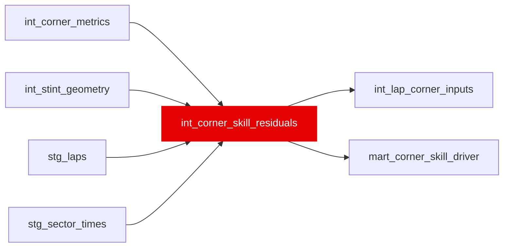

{/* _AUTOGENERATED   do not hand-edit. Run `python scripts/gen_dbt_reference.py` to regenerate. */}

<Note>Part of the [Residual](/transform/families/residual) family.</Note>

One row per lap per named corner. Decomposes corner skill into braking, mid-corner, and exit phases relative to field median (backward-only trailing-5 window, rebuilt 02g). Grain: (lap_id, corner_name). Null when field sample &lt; 5 drivers. Enables high-res corner-by-corner skill profiling.
WINDOW CHANGE (rebuilt 02g): field medians now use RANGE BETWEEN 5 PRECEDING AND 1 PRECEDING (trailing-5, all drivers at each lap level, excluding the focal lap). Previous construction used FLOOR(lap/5)*5 block buckets which reached forward 1.877 laps on average (38.45% of the median drawn from future, up to 76% at block position 0), placing future label signals in the baseline. Rebuild eliminated reach; contamination signal was weak (corr +0.0344 vs +0.0083 control, marginal; sd 0.116 vs 0.043 block, noise-shaped).
COVERAGE: Lap-2 coverage loss (21.4pp on laps ≤ 6) is deterministic and non-leaking—lap 2 has no predecessor, so trailing window returns NULL. This loss sits on lap_number (already in contract via age_in_stint) and is declarable, not a hazard. No expanding window rescue attempted: lap 1 never reaches any lap to base a median on. An expanding window would pool early and late race track states (2026-09-08, measured trailing-5 vs expanding, identical formula, identical coverage loss on lap 2 in both cases). Trailing-5 kept for consistency with its width replacing the old block.
SIGN CONVENTION (00d, 2026-09-20): all three phases are POSITIVE = SECONDS LOST vs the field median, negative = seconds gained, and corner_residual_total_s is their straight sum and therefore a real "seconds lost at this corner". The direction of the underlying measure decides the subtraction: braking_point_m and v_min_kph are higher-is-faster so their residuals are (field - own); throttle_point_m is higher-is-slower (on power later) so its residual is (own - field). Before 00d, braking_loss_s alone was built as (own - field), so positive meant braking LATER = faster, while mart_corner_skill_driver summed all three z-scores into corner_skill_index and ordered ASC with no negation in between -- one of three terms entered a shipped public leaderboard inverted, and corner_residual_total_s summed a gain with two losses. Fixed at the source rather than negated in the mart (the ruling and the full consumer trace are in _improvements/work/00-corrections.md, 00d). The direction is now pinned against the raw geometry by transform/tests/assert_corner_skill_sign_convention.sql, which no sign-agnostic closure or count test could catch -- that is how the defect survived both the 02g and 02c rebuilds of this model.

## Lineage

## Overview

| Property | Value |
|---|---|
| Layer | `intermediate` |
| Family | [Residual](/transform/families/residual) |
| Contract enforced | No |
| Tags | `feature_engineering` |
| Upstream | [`int_corner_metrics`](./int_corner_metrics), [`int_stint_geometry`](./int_stint_geometry), [`stg_laps`](../stg/stg_laps), [`stg_sector_times`](../stg/stg_sector_times) |

**10 tests** [guard](/transform/ci/overview) this model  -  6 generic, 4 singular.

## Columns

| Column | Type | Nullable | Tests | Description |
|---|---|---|---|---|
| `corner_id` |   | Yes | [`not_null`](/transform/ci/structural), [`unique`](/transform/ci/structural) | PK = lap_id \|\| '_C_' \|\| corner_name |
| `lap_id` |   | Yes | [`not_null`](/transform/ci/structural) | FK to stg_laps |
| `corner_name` |   | Yes | [`not_null`](/transform/ci/structural) | Named corner from dim_corners |
| `braking_loss_s` |   | Yes |   | Seconds lost on corner entry vs the backward-only trailing-5 field median, as (field median - own braking_point_m) * dt_per_dm at the sector-2 trap speed. POSITIVE = braked EARLIER than the field = time LOST. Negative = braked later = time gained. NULL when field_corner_sample_n &lt; 5 or the corner is taken flat (no braking_point_m), both real answers rather than missing data. The (field - own) orientation is the fix 00d made and matches the house convention already in the feature contract (int_lap_telemetry_aggregates' braking_point_drift_m is base - lap). |
| `mid_corner_residual_s` |   | Yes |   | Seconds lost at the apex vs the trailing-5 field median, as (field v_min - own v_min) converted at the field apex speed. POSITIVE = carried LESS speed than the field = time LOST. Highest-coverage of the three phases: every corner has an apex. |
| `exit_residual_s` |   | Yes |   | Seconds lost on exit vs the trailing-5 field median, as (own throttle_point_m - field median) * dt_per_dm. POSITIVE = regained full throttle LATER than the field = time LOST. Note the subtraction runs the other way round from the other two phases because throttle_point_m is higher-is-slower while braking_point_m and v_min_kph are higher-is-faster; all three still read positive = loss. |
| `corner_residual_total_s` |   | Yes |   | braking_loss_s + mid_corner_residual_s + exit_residual_s: total seconds lost at this corner vs the field median. Non-NULL only where all three phases are measurable (the intersection, 38.59% of corner rows), which is why int_lap_corner_inputs aggregates each phase over its own measurable corners instead of using this column. Only a meaningful total since 00d gave the three phases one sign convention -- before that it summed a gain with two losses, which is why 06b moved its headline off it. Closure pinned by transform/tests/assert_corner_closure.sql. |
| `field_corner_sample_n` |   | Yes | [`not_null`](/transform/ci/structural) | Number of field observations behind this corner/lap's median. Trailing-5 window (laps t-5 to t-1, RANGE frame): counts valid, non-NULL braking_point_m rows across ALL drivers in that lap interval. Reported UNFLOORED and never NULL, which is the trailing_observation_count contract: the count is what the &gt;= 5 floor is applied to, so flooring it here would make "no prior lap at all" and "four prior laps" indistinguishable and leave the residual NULLs unexplainable. 0 on lap 2, which has no predecessor. The residuals themselves NULL out through trailing_median's own min_observations=5, and corner_unmapped_flag carries the gate. |
| `corner_unmapped_flag` |   | Yes | [`not_null`](/transform/ci/structural) | TRUE when field_corner_sample_n &lt; 5 (residuals are NULL) |
