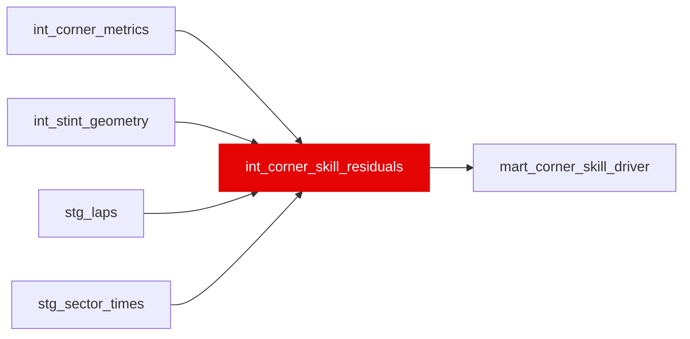

{/* _AUTOGENERATED   do not hand-edit. Run `python scripts/gen_dbt_reference.py` to regenerate. */}

<Note>Part of the [Residual](/transform/families/residual) family.</Note>

One row per lap per named corner. Decomposes corner skill into braking, mid-corner, and exit phases relative to field median (5-lap rolling window). Grain: (lap_id, corner_name). Null when field sample &lt; 5 drivers. Enables high-res corner-by-corner skill profiling.

## Lineage

## Overview

| Property | Value |
|---|---|
| Layer | `intermediate` |
| Family | [Residual](/transform/families/residual) |
| Contract enforced | No |
| Tags | `feature_engineering` |
| Upstream | [`int_corner_metrics`](./int_corner_metrics), [`int_stint_geometry`](./int_stint_geometry), [`stg_laps`](../stg/stg_laps), [`stg_sector_times`](../stg/stg_sector_times) |

**7 tests** [guard](/transform/ci/overview) this model  -  6 generic, 1 singular.

## Columns

| Column | Type | Nullable | Tests | Description |
|---|---|---|---|---|
| `corner_id` |   | Yes | [`not_null`](/transform/ci/structural), [`unique`](/transform/ci/structural) | PK = lap_id \|\| '_C_' \|\| corner_name |
| `lap_id` |   | Yes | [`not_null`](/transform/ci/structural) | FK to stg_laps |
| `corner_name` |   | Yes | [`not_null`](/transform/ci/structural) | Named corner from dim_corners |
| `field_corner_sample_n` |   | Yes | [`not_null`](/transform/ci/structural) | Number of drivers in the field median for this corner/lap_window |
| `corner_unmapped_flag` |   | Yes | [`not_null`](/transform/ci/structural) | TRUE when field_corner_sample_n &lt; 5 (residuals are NULL) |
