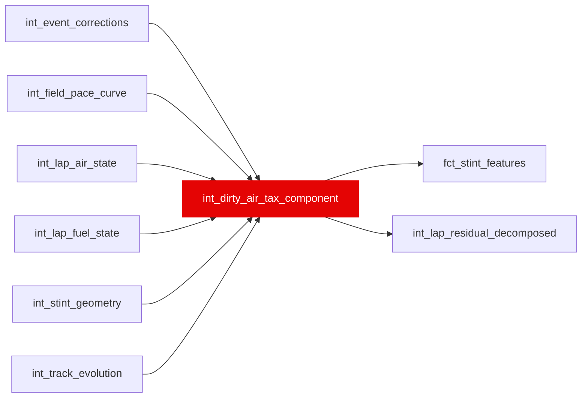

{/* _AUTOGENERATED   do not hand-edit. Run `python scripts/gen_dbt_reference.py` to regenerate. */}

<Note>Part of the [Physics](/transform/families/physics) family.</Note>

> For the conceptual foundation, read [Int Dirty Air Tax Component](/decomposition/methodology).

One row per lap. Cost of driving in dirty air (turbulent wake) following another car. Uses prior-lap dirty-air intensity to establish causality: current lap slowdown → prior lap's position. Avoids reverse causality. Seconds lost = θ_air × dirty_air_intensity_lag1, capped [0, 5.0] seconds.

## Lineage

## Overview

| Property | Value |
|---|---|
| Layer | `intermediate` |
| Family | [Physics](/transform/families/physics) |
| Contract enforced | No |
| Tags | `causal_decomposition`, `dirty_air` |
| Upstream | [`int_lap_fuel_state`](./int_lap_fuel_state), [`int_field_pace_curve`](./int_field_pace_curve), [`int_stint_geometry`](./int_stint_geometry), [`int_lap_air_state`](./int_lap_air_state), [`int_event_corrections`](./int_event_corrections), [`int_track_evolution`](./int_track_evolution) |

**11 tests** [guard](/transform/ci/overview) this model  -  10 generic, 1 singular.

## Columns

| Column | Type | Nullable | Tests | Description |
|---|---|---|---|---|
| `lap_id` |   | Yes | [`not_null`](/transform/ci/structural), [`unique`](/transform/ci/structural) | PK, FK to stg_laps |
| `dirty_air_intensity_lag1` |   | Yes | [`not_null`](/transform/ci/structural) | One-lap-lagged dirty-air intensity from int_lap_air_state |
| `dirty_air_tax_s` |   | Yes | [`not_null`](/transform/ci/structural), [`expect_column_values_to_be_between`](/transform/ci/range-and-domain) | Per-lap dirty-air slowdown in seconds. θ_air × dirty_air_intensity_lag1. Positive (slower cost). Bounded [0, 5.0]. |
| `dirty_air_tax_se_s` |   | Yes | [`not_null`](/transform/ci/structural) | Standard error of the tax estimate via propagation |
| `tax_calibration_confidence` |   | Yes | [`not_null`](/transform/ci/structural), [`expect_column_values_to_be_between`](/transform/ci/range-and-domain) | Confidence in the tax [0, 1]. Degrades when calibration sample &lt;1000 or intensity is extreme (&gt;2.5). |
| `cumulative_dirty_air_tax_race_s` |   | Yes | [`not_null`](/transform/ci/structural) | Running race-cumulative sum of per-lap dirty-air tax for each driver |
| `dirtiest_air_lap_in_race_flag` |   | Yes | [`not_null`](/transform/ci/structural) | TRUE on the lap where this driver's per-lap tax is at its maximum in the race |
