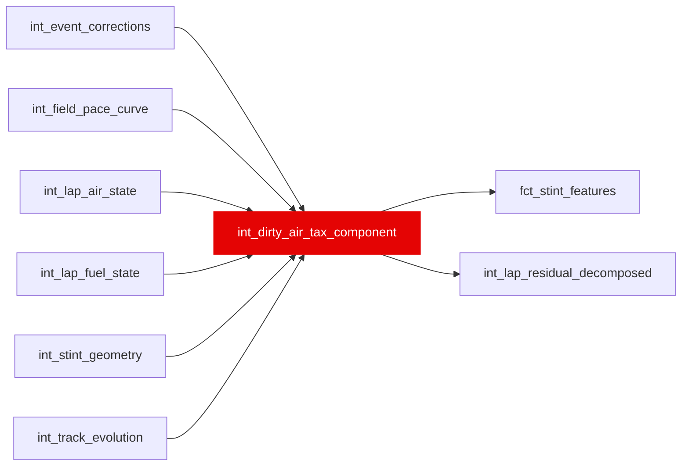

{/* _AUTOGENERATED   do not hand-edit. Run `python scripts/gen_dbt_reference.py` to regenerate. */}

<Note>Part of the [Physics](/transform/families/physics) family.</Note>

> For the conceptual foundation, read [Int Dirty Air Tax Component](/decomposition/methodology).

One row per lap. Cost of driving in dirty air (turbulent wake) following another car. Uses prior-lap dirty-air intensity to establish causality: current lap slowdown → prior lap's position. Avoids reverse causality. Seconds lost = θ_air × dirty_air_intensity_lag1, capped [0, 5.0] seconds. θ_air IS FITTED FROM THE DATA, not configured: it is the OLS slope of partial residual on the lagged dirty-air bit over the full two-arm calibration panel (treated and untreated laps). Before 08q (2026-09-21) the panel was filtered to `dirty_air_share_lag1 > 0`, which left the binary regressor constant and unidentified, so θ_air silently fell through a COALESCE to the literal 0.5 s/lap on every build and dirty_air_tax_s was 0.5 on every dirty-air lap and 0.0 otherwise. Measured on the v12 substrate the fitted value is +0.1310 s/lap [95% CI +0.1144, +0.1476] over 123,993 laps — the shipped 0.5 was 3.8x too high. The COALESCE literal is now that measured estimate and serves only as a degenerate-panel guard. A global pooled θ is used deliberately; per-season θ runs +0.418 (2018) to -0.011 (2024) and is not distinguishable from zero on 2021 and 2024, which is an open ruling for any fan-facing surface that reports per-driver seconds (see work/08-foundations-repair.md section 08q).

## Lineage

## Overview

| Property | Value |
|---|---|
| Layer | `intermediate` |
| Family | [Physics](/transform/families/physics) |
| Contract enforced | No |
| Tags | `causal_decomposition`, `dirty_air` |
| Upstream | [`int_lap_fuel_state`](./int_lap_fuel_state), [`int_field_pace_curve`](./int_field_pace_curve), [`int_stint_geometry`](./int_stint_geometry), [`int_lap_air_state`](./int_lap_air_state), [`int_event_corrections`](./int_event_corrections), [`int_track_evolution`](./int_track_evolution) |

**11 tests** [guard](/transform/ci/overview) this model  -  10 generic, 1 singular.

## Columns

| Column | Type | Nullable | Tests | Description |
|---|---|---|---|---|
| `lap_id` |   | Yes | [`not_null`](/transform/ci/structural), [`unique`](/transform/ci/structural) | PK, FK to stg_laps |
| `dirty_air_intensity_lag1` |   | Yes | [`not_null`](/transform/ci/structural) | One-lap-lagged dirty-air intensity from int_lap_air_state |
| `dirty_air_tax_s` |   | Yes | [`not_null`](/transform/ci/structural), [`expect_column_values_to_be_between`](/transform/ci/range-and-domain) | Per-lap dirty-air slowdown in seconds. θ_air × dirty_air_intensity_lag1. Positive (slower cost). Bounded [0, 5.0]. θ_air is estimated from the two-arm calibration panel, not defaulted (08q). Because dirty_air_intensity_lag1 is one bit per lap, this column still takes two values per build — 0.0 on a clean-air lap and θ_air on a dirty-air lap — but θ_air is now the fitted +0.1310 s/lap rather than the unfitted 0.5 literal it was through v12. A dose-response on the measured gap (int_lap_air_state.min_gap_s / stg_telemetry_position.distance_to_ahead_m) is the standing follow-up; removing the treated-arm filter is the identification fix, not the measurement fix. |
| `dirty_air_tax_se_s` |   | Yes | [`not_null`](/transform/ci/structural) | Standard error of the tax estimate via propagation |
| `tax_calibration_confidence` |   | Yes | [`not_null`](/transform/ci/structural), [`expect_column_values_to_be_between`](/transform/ci/range-and-domain) | Confidence in the tax [0, 1], as n / (n + 500) over the calibration sample n. Since 08q restored both arms to that panel, n is the full 123,993-lap panel rather than the 28,523 treated laps it was through v12, so this reads ~0.996 rather than ~0.983. It measures calibration SAMPLE SIZE ONLY and is not a statement about whether θ_air is distinguishable from zero in a given season — it is near 1.0 on every season including 2021 and 2024, where the per-season estimate straddles zero. |
| `cumulative_dirty_air_tax_race_s` |   | Yes | [`not_null`](/transform/ci/structural) | Running race-cumulative sum of per-lap dirty-air tax for each driver |
| `dirtiest_air_lap_in_race_flag` |   | Yes | [`not_null`](/transform/ci/structural) | TRUE on the lap where this driver's per-lap tax is at its maximum in the race |
