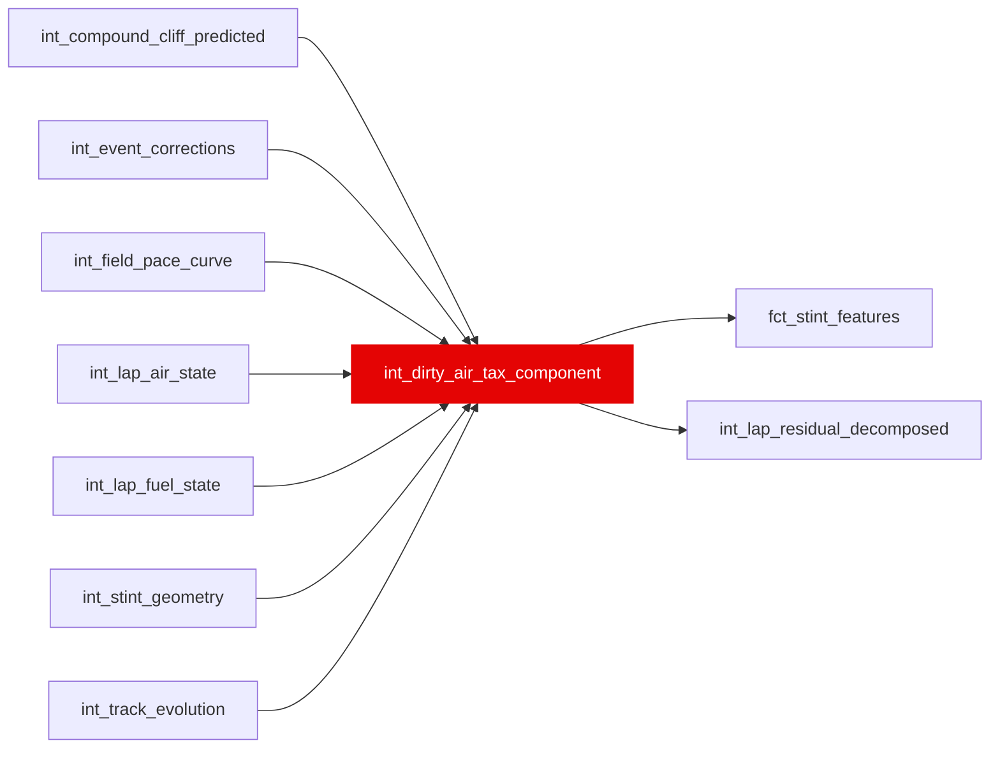

{/* _AUTOGENERATED   do not hand-edit. Run `python scripts/gen_dbt_reference.py` to regenerate. */}

<Note>Part of the [Physics](/transform/families/physics) family.</Note>

> For the conceptual foundation, read [Int Dirty Air Tax Component](/decomposition/methodology).

One row per lap. Cost of driving in dirty air (turbulent wake) following another car. Uses prior-lap dirty-air intensity to establish causality: current lap slowdown → prior lap's position. Avoids reverse causality. Seconds lost = θ_air × dirty_air_intensity_lag1, capped [0, 5.0] seconds. θ_air is the DECLARED var theta_air_label_value (0.331 s/lap since W40, 2026-09-27), applied as-is. It is fitted from the data, but outside dbt: 06b's pre-registered F2 estimator (partial residual on the lagged dirty-air bit, stint fixed effects plus six tyre-age bins) on this model's two-arm calibration panel, 2018-2025, gives 0.3313 [0.293, 0.370] (_roadmap/_fixes/wi/WI-12-06b-remeasure.md). The pooled OLS slope this model used to fit in SQL (0.5033 on the same panel, WI-01's interim value) billed some car pace as dirty air, because slower cars follow more often. History: an unfitted 0.5 literal through v12 (the panel was filtered to the treated arm, so the slope was unidentified, 08q), 0.1310 (08q, v12 substrate), 0.5033 (WI-01, interim), 0.331 (W40). One θ for every season; per-season fits are published in the 06b post, not carried into the label.

## Lineage

```mermaid
flowchart LR
  int_compound_cliff_predicted --> int_dirty_air_tax_component
  int_event_corrections --> int_dirty_air_tax_component
  int_field_pace_curve --> int_dirty_air_tax_component
  int_lap_air_state --> int_dirty_air_tax_component
  int_lap_fuel_state --> int_dirty_air_tax_component
  int_stint_geometry --> int_dirty_air_tax_component
  int_track_evolution --> int_dirty_air_tax_component
  int_dirty_air_tax_component --> fct_stint_features
  int_dirty_air_tax_component --> int_lap_residual_decomposed
  style int_dirty_air_tax_component fill:#e40404,stroke:#e40404,color:#fff
```

## Overview

| Property | Value |
|---|---|
| Layer | `intermediate` |
| Family | [Physics](/transform/families/physics) |
| Contract enforced | No |
| Tags | `causal_decomposition`, `dirty_air` |
| Upstream | [`int_lap_fuel_state`](./int_lap_fuel_state), [`int_field_pace_curve`](./int_field_pace_curve), [`int_compound_cliff_predicted`](./int_compound_cliff_predicted), [`int_stint_geometry`](./int_stint_geometry), [`int_lap_air_state`](./int_lap_air_state), [`int_event_corrections`](./int_event_corrections), [`int_track_evolution`](./int_track_evolution) |

**14 tests** [guard](/transform/ci/overview) this model  -  10 generic, 4 singular.

## Columns

| Column | Type | Nullable | Tests | Description |
|---|---|---|---|---|
| `lap_id` |   | Yes | [`not_null`](/transform/ci/structural), [`unique`](/transform/ci/structural) | PK, FK to stg_laps |
| `dirty_air_intensity_lag1` |   | Yes | [`not_null`](/transform/ci/structural) | One-lap-lagged dirty-air intensity from int_lap_air_state |
| `dirty_air_tax_s` |   | Yes | [`not_null`](/transform/ci/structural), [`expect_column_values_to_be_between`](/transform/ci/range-and-domain) | Per-lap dirty-air slowdown in seconds. θ_air × dirty_air_intensity_lag1. Positive (slower cost). Bounded [0, 5.0]. θ_air is the declared theta_air_label_value (0.331 s/lap, W40), fitted outside dbt on the two-arm calibration panel (see the model description). Because dirty_air_intensity_lag1 is one bit per lap, this column takes two values per build — 0.0 on a clean-air lap and θ_air on a dirty-air lap. A dose-response on the measured gap (int_lap_air_state.min_gap_s / stg_telemetry_position.distance_to_ahead_m) is the standing follow-up; removing the treated-arm filter is the identification fix, not the measurement fix. |
| `dirty_air_tax_se_s` |   | Yes | [`not_null`](/transform/ci/structural) | Standard error of the tax estimate via propagation |
| `tax_calibration_confidence` |   | Yes | [`not_null`](/transform/ci/structural), [`expect_column_values_to_be_between`](/transform/ci/range-and-domain) | Confidence in the tax [0, 1], as n / (n + 500) over the calibration sample n. Since 08q restored both arms to that panel, n is the full two-arm panel (138,970 laps on the WI-01 label) rather than the 28,523 treated laps it was through v12, so this reads ~0.996 rather than ~0.983. It measures calibration SAMPLE SIZE ONLY and is not a statement about whether θ_air is distinguishable from zero in a given season — it is near 1.0 on every season including 2021 and 2024, where the per-season estimate straddles zero. |
| `cumulative_dirty_air_tax_race_s` |   | Yes | [`not_null`](/transform/ci/structural) | Running race-cumulative sum of per-lap dirty-air tax for each driver |
| `dirtiest_air_lap_in_race_flag` |   | Yes | [`not_null`](/transform/ci/structural) | TRUE on the lap where this driver's per-lap tax is at its maximum in the race |
