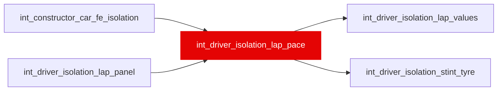

{/* _AUTOGENERATED   do not hand-edit. Run `python scripts/gen_dbt_reference.py` to regenerate. */}

<Note>Part of the [Skill](/transform/families/skill) family.</Note>

Driver isolation with the car removed: pace_isolated_gain_s = -(y_s - car_iso_s) per Ω lap, positive = faster than the field on an equal car, tyre state, traffic and fuel. Exists so the stint and lap models subtract the car the same way. NULL without a car term, never a car term of 0. Leakage: a function of the residual trajectory; no ML- contract mart may depend on it (T48, ml/tests/test_manifest_contract.py). WI-16a, _roadmap/_fixes/wi/WI-16-cumulative-driver-isolation.md.

## Lineage

## Overview

| Property | Value |
|---|---|
| Layer | `intermediate` |
| Family | [Skill](/transform/families/skill) |
| Contract enforced | No |
| Tags | `driver_isolation` |
| Upstream | [`int_driver_isolation_lap_panel`](./int_driver_isolation_lap_panel), [`int_constructor_car_fe_isolation`](./int_constructor_car_fe_isolation) |

**15 tests** [guard](/transform/ci/overview) this model  -  15 generic, 0 singular.

## Columns

| Column | Type | Nullable | Tests | Description |
|---|---|---|---|---|
| `lap_id` |   | Yes | [`not_null`](/transform/ci/structural), [`unique`](/transform/ci/structural) | Lap identifier (int_lap_residual_decomposed.lap_id). |
| `stint_id` |   | Yes | [`not_null`](/transform/ci/structural) | Stint identifier (int_stint_geometry.stint_id). |
| `race_year` |   | Yes | [`not_null`](/transform/ci/structural) | Season. |
| `race_id` |   | Yes | [`not_null`](/transform/ci/structural) | FastF1 event id, e.g. 2021_8. |
| `driver_id` |   | Yes | [`not_null`](/transform/ci/structural) | Driver (three-letter code). In the pair mart, the focal driver whose gains the row reports. |
| `constructor_id` |   | Yes | [`not_null`](/transform/ci/structural) | Constructor (stg_laps.constructor_id). |
| `stint_number` |   | Yes |   | Stint ordinal within the driver's race (int_stint_geometry). |
| `lap_number` |   | Yes | [`not_null`](/transform/ci/structural) | Race lap number. Tiers 1 and 3 match cars on it, which is why 2020_1 is excluded (W18). |
| `compound` |   | Yes | [`not_null`](/transform/ci/structural) | Dry compound of the stint (INTERMEDIATE and WET laps are not in Ω). |
| `age_in_stint` |   | Yes | [`not_null`](/transform/ci/structural) | Tyre age in laps (int_stint_geometry). |
| `lap_in_stint` |   | Yes |   | Lap ordinal within the stint, counting every lap. |
| `valid_lap_in_stint` |   | Yes |   | Ordinal among the stint's valid laps; early vs mid phase splits at 5/6. |
| `laps_past_cliff` |   | Yes |   | Laps beyond the compound seed's cliff onset (0 before it); drives tyre_phase = cliff. Never NULL in Ω. |
| `fuel_mass_kg` |   | Yes |   | Scheduled-distance fuel load, kg. The same for every car on a lap, so it cancels from every rating (carried for WI-16b's V4 physics check). |
| `era` |   | Yes |   | Regulation era: pre&lt;era_boundary&gt; or post&lt;era_boundary&gt; (var era_boundary, 2022). |
| `anomaly_class` |   | Yes |   | int_lap_anomaly_flags.anomaly_class; normal or clean_cliff in Ω. |
| `air_state_dominant` |   | Yes |   | int_lap_air_state.air_state_dominant (context; dirty_air drives the recovery overlay). |
| `is_dirty_air_lap` |   | Yes |   | TRUE when air_state_dominant = 'dirty_air'. |
| `field_n` |   | Yes |   | Ω laps on this (race, lap); &gt;= var('isolation_min_field_n') by construction (T40). |
| `lap_time_s` |   | Yes |   | Raw lap time, s. |
| `compound_component_s` |   | Yes |   | C: the compound seed's expected cost of this tyre state, s, positive = slower (int_lap_residual_decomposed). Never COALESCEd: an unknown tyre is not in Ω. |
| `dirty_air_tax_s` |   | Yes |   | D: dirty-air tax, s, positive = slower (int_lap_residual_decomposed). |
| `x_s` |   | Yes |   | lap_time_s - compound_component_s - dirty_air_tax_s, s. |
| `y_s` |   | Yes | [`not_null`](/transform/ci/structural) | x_s minus the lap's Ω field median of x_s, s. POSITIVE = SLOWER than the field- typical car and driver on the lap. Invariant to the field base, fuel, rubber and ambient terms, which depend on (race, lap) only (T41). |
| `tyre_offset_vs_field_s` |   | Yes |   | compound_component_s minus the lap's Ω field median of it, s; positive = this tyre state costs more than the field's. The strategy position on the lap: team-dominated context, not a rating. |
| `tyre_phase` |   | Yes | [`accepted_values`](/transform/ci/range-and-domain) | early (laps_past_cliff = 0, valid_lap_in_stint &lt;= 5), mid (laps_past_cliff = 0, &gt;= 6) or cliff (laps_past_cliff &gt; 0), from the seed's onset, so never selected on the residual. |
| `is_recovery` |   | Yes |   | TRUE on the first var('isolation_recovery_laps') valid laps of a non-dirty-air run directly after &gt;= var('isolation_recovery_min_dirty_run') consecutive dirty-air valid laps in the stint. Backward-looking only. |
| `stint_phase` |   | Yes | [`accepted_values`](/transform/ci/range-and-domain) | 'recovery' when is_recovery, else tyre_phase (T45). |
| `car_iso_s` |   | Yes |   | Isolation car term, s, NEGATIVE = FASTER than the race's lap-weighted car (int_constructor_car_fe_isolation). NULL when not identified. |
| `car_term_source` |   | Yes | [`not_null`](/transform/ci/structural), [`accepted_values`](/transform/ci/range-and-domain) | Where car_iso_s came from: driver_id (fitted per-era), unidentified (multiple components in race), not_estimated (pyfixest singleton), or no_fit_row (no row in the fit). |
| `pace_isolated_gain_s` |   | Yes |   | p = -(y_s - car_iso_s), s/lap. POSITIVE = FASTER than the field on an equal car, tyre state, traffic and fuel: the driver plus noise, everything modelled removed. NULL without a car term (never a car term of 0). |
