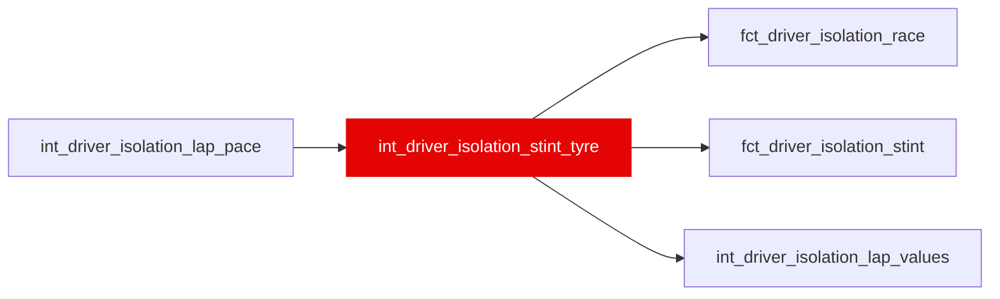

{/* _AUTOGENERATED   do not hand-edit. Run `python scripts/gen_dbt_reference.py` to regenerate. */}

<Note>Part of the [Skill](/transform/families/skill) family.</Note>

Driver isolation, tier 2's stint layer: each stint's pace line (slope of p on tyre age over its clean early/mid, non-recovery laps; NULL below var('isolation_min_stint_laps') or with Sxx = 0, never NaN), the leave-driver-out peer slope (same race and compound, else the season pool), the car's degradation character (int_constructor_deg_sensitivity), the tactical slope m_s and its SE, the cliff reference kappa_ref, and the per-season noise (sigma_w, rho1, f) every downstream SE uses. Leakage: a function of the residual trajectory; no ML-contract mart may depend on it (T48, ml/tests/test_manifest_contract.py). WI-16a, _roadmap/_fixes/wi/WI-16-cumulative-driver-isolation.md.

## Lineage

## Overview

| Property | Value |
|---|---|
| Layer | `intermediate` |
| Family | [Skill](/transform/families/skill) |
| Contract enforced | No |
| Tags | `driver_isolation` |
| Upstream | [`int_driver_isolation_lap_pace`](./int_driver_isolation_lap_pace) |

**11 tests** [guard](/transform/ci/overview) this model  -  11 generic, 0 singular.

## Columns

| Column | Type | Nullable | Tests | Description |
|---|---|---|---|---|
| `stint_id` |   | Yes | [`not_null`](/transform/ci/structural), [`unique`](/transform/ci/structural) | Stint identifier (int_stint_geometry.stint_id). |
| `race_year` |   | Yes | [`not_null`](/transform/ci/structural) | Season. |
| `race_id` |   | Yes | [`not_null`](/transform/ci/structural) | FastF1 event id, e.g. 2021_8. |
| `driver_id` |   | Yes | [`not_null`](/transform/ci/structural) | Driver (three-letter code). In the pair mart, the focal driver whose gains the row reports. |
| `constructor_id` |   | Yes | [`not_null`](/transform/ci/structural) | Constructor (stg_laps.constructor_id). |
| `stint_number` |   | Yes |   | Stint ordinal within the driver's race (int_stint_geometry). |
| `compound` |   | Yes | [`not_null`](/transform/ci/structural) | Dry compound of the stint (INTERMEDIATE and WET laps are not in Ω). |
| `era` |   | Yes |   | Regulation era: pre&lt;era_boundary&gt; or post&lt;era_boundary&gt; (var era_boundary, 2022). |
| `n_omega_laps` |   | Yes | [`not_null`](/transform/ci/structural) | Ω laps in the stint. |
| `n_pace_laps` |   | Yes | [`not_null`](/transform/ci/structural) | Ω laps with p (a car term). |
| `n_cliff_laps` |   | Yes | [`not_null`](/transform/ci/structural) | Ω laps on a cliff tyre. |
| `n_line_laps` |   | Yes | [`not_null`](/transform/ci/structural) | Line laps the stint's slope was fitted on (early/mid, not recovery, with p). Below var('isolation_min_stint_laps') the slope and every tactical value are NULL. |
| `line_mean_pace_gain_s` |   | Yes |   | p_bar: mean p over the line laps, s/lap. |
| `line_mean_age_laps` |   | Yes |   | Mean tyre age over the line laps, laps. |
| `line_ref_age_laps` |   | Yes |   | age_ref: the tyre age of the stint's first line lap, laps. Tactical accumulates from here (a declared attribution rule). |
| `line_age_sxx` |   | Yes |   | Sxx of tyre age over the line laps (REGR_SXX), laps^2. |
| `line_slope_s_per_lap2` |   | Yes |   | beta_s: REGR_SLOPE(p, age) over the stint's line laps, s/lap per lap of age; &gt; 0 = his isolated pace rises through the stint. NULL below the line floor or with Sxx = 0 (never NaN). |
| `line_slope_se_s_per_lap2` |   | Yes |   | OLS SE of the line slope, sigma_w / sqrt(Sxx f), s/lap^2. |
| `season_sigma_w_s` |   | Yes |   | Pooled within-stint SD of p around its stint line for the season, s. |
| `season_rho1` |   | Yes |   | Pooled lag-1 autocorrelation of those line residuals for the season (adjacent laps only). |
| `season_neff_factor` |   | Yes |   | f = (1 - rho+)/(1 + rho+), rho+ = GREATEST(season_rho1, 0): the effective-sample factor every SE uses. NULL if rho cannot be measured. |
