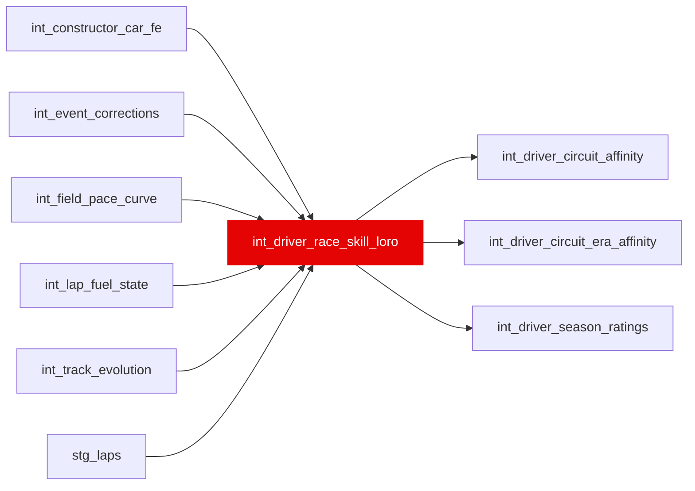

{/* _AUTOGENERATED   do not hand-edit. Run `python scripts/gen_dbt_reference.py` to regenerate. */}

<Note>Part of the [Skill](/transform/families/skill) family.</Note>

De-confounded absolute equal-car skill, race grain (race_year, race_id, driver_id). driver_skill_loro_s = P20 ceiling minus the LORO teammate baseline (used by the rating chain). driver_skill_field_s = median pace delta minus the de-biased constructor×race FE (int_constructor_car_fe.car_fe_s, car pace net of driver skill); used only by int_driver_circuit_era_affinity / Ghost Car Standings leaderboard, fixing the weak-teammate inflation confound. Negative = faster than field (both signals).

## Lineage

## Overview

| Property | Value |
|---|---|
| Layer | `intermediate` |
| Family | [Skill](/transform/families/skill) |
| Contract enforced | No |
| Tags | `driver_rating`, `causal_decomposition` |
| Upstream | [`int_lap_fuel_state`](./int_lap_fuel_state), [`int_field_pace_curve`](./int_field_pace_curve), [`stg_laps`](../stg/stg_laps), [`int_event_corrections`](./int_event_corrections), [`int_track_evolution`](./int_track_evolution), [`int_constructor_car_fe`](./int_constructor_car_fe) |

**6 tests** [guard](/transform/ci/overview) this model  -  6 generic, 0 singular.

## Columns

| Column | Type | Nullable | Tests | Description |
|---|---|---|---|---|
| `driver_race_skill_id` |   | Yes | [`not_null`](/transform/ci/structural), [`unique`](/transform/ci/structural) | Surrogate PK = hash(race_year, race_id, driver_id) |
| `driver_id` |   | Yes | [`not_null`](/transform/ci/structural) | Driver identifier |
| `race_year` |   | Yes | [`not_null`](/transform/ci/structural) | Race year (integer) |
| `race_id` |   | Yes | [`not_null`](/transform/ci/structural) | Race identifier (numeric) |
| `driver_skill_loro_s` |   | Yes |   | De-confounded equal-car skill, seconds. P20 of focal deltas minus LORO car baseline. Negative = faster. NULL when the driver is the only one with clean laps in his car that race (no equal-car reference). Used by the rating chain. |
| `driver_skill_field_s` |   | Yes |   | Field-anchored equal-car skill, seconds. Median pace delta minus the de-biased car term (int_constructor_car_fe.car_fe_s the constructor×race FE, car pace net of driver skill). The FE's global driver anchor fixes the weak-teammate inflation confound that the old constructor-median term still leaked (that median absorbed the team's driver skill, so subtracting it handed a weak driver's slowness back as skill). NULL when the constructor×race FE is unidentified for this race. Used only by int_driver_circuit_era_affinity (Ghost Car Standings leaderboard). |
| `clean_lap_count` |   | Yes | [`not_null`](/transform/ci/structural) | Clean laps contributing to this driver-race estimate. |
