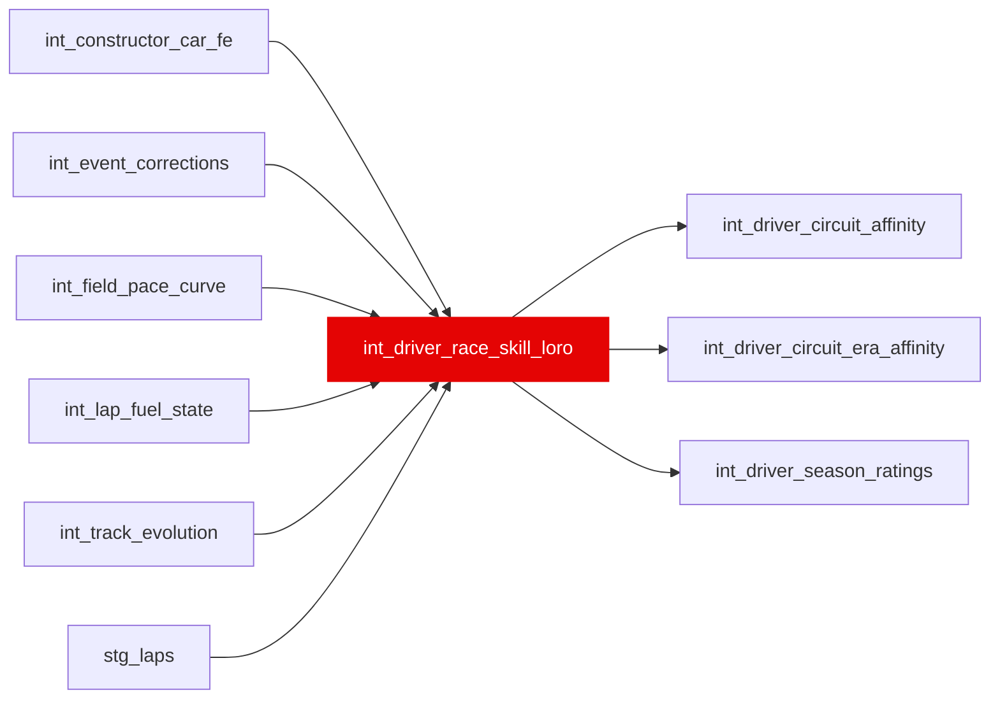

{/* _AUTOGENERATED   do not hand-edit. Run `python scripts/gen_dbt_reference.py` to regenerate. */}

<Note>Part of the [Skill](/transform/families/skill) family.</Note>

Equal-car driver skill, race grain (race_year, race_id, driver_id). driver_skill_loro_s = MEDIAN(own lap time - teammate lap time) over the clean laps both drivers ran, paired on lap_number (WI-14b, F40, FD5 option C); negative = faster than the teammate; used by the rating chain. It replaced P20(own) minus the teammate's median, which rated lap-time scatter as speed (mean pair sum -1.83 s). driver_skill_field_s = median pace delta minus the de-biased constructor×race FE (int_constructor_car_fe.car_fe_s, car pace net of driver skill); used only by int_driver_circuit_era_affinity / Ghost Car Standings leaderboard, fixing the weak-teammate inflation confound; negative = faster than the car term.

## Lineage

```mermaid
flowchart LR
  int_constructor_car_fe --> int_driver_race_skill_loro
  int_event_corrections --> int_driver_race_skill_loro
  int_field_pace_curve --> int_driver_race_skill_loro
  int_lap_fuel_state --> int_driver_race_skill_loro
  int_track_evolution --> int_driver_race_skill_loro
  stg_laps --> int_driver_race_skill_loro
  int_driver_race_skill_loro --> int_driver_circuit_affinity
  int_driver_race_skill_loro --> int_driver_circuit_era_affinity
  int_driver_race_skill_loro --> int_driver_season_ratings
  style int_driver_race_skill_loro fill:#e40404,stroke:#e40404,color:#fff
```

## Overview

| Property | Value |
|---|---|
| Layer | `intermediate` |
| Family | [Skill](/transform/families/skill) |
| Contract enforced | No |
| Tags | `driver_rating`, `causal_decomposition` |
| Upstream | [`int_lap_fuel_state`](./int_lap_fuel_state), [`int_field_pace_curve`](./int_field_pace_curve), [`stg_laps`](../stg/stg_laps), [`int_event_corrections`](./int_event_corrections), [`int_track_evolution`](./int_track_evolution), [`int_constructor_car_fe`](./int_constructor_car_fe) |

**8 tests** [guard](/transform/ci/overview) this model  -  7 generic, 1 singular.

## Columns

| Column | Type | Nullable | Tests | Description |
|---|---|---|---|---|
| `driver_race_skill_id` |   | Yes | [`not_null`](/transform/ci/structural), [`unique`](/transform/ci/structural) | Surrogate PK = hash(race_year, race_id, driver_id) |
| `driver_id` |   | Yes | [`not_null`](/transform/ci/structural) | Driver identifier |
| `race_year` |   | Yes | [`not_null`](/transform/ci/structural) | Race year (integer) |
| `race_id` |   | Yes | [`not_null`](/transform/ci/structural) | Race identifier (numeric) |
| `driver_skill_loro_s` |   | Yes |   | Equal-car rating, seconds: the median lap-by-lap gap to the teammate, MEDIAN(own lap_time_s - teammate lap_time_s) over laps both ran clean (same lap number, correction_weight 1, dry). Negative = faster than the teammate. Antisymmetric: a two-driver car's two values sum to 0 (T30). NULL when no teammate has a clean lap on any lap number the driver ran clean (no equal-car reference). Used by the rating chain. |
| `driver_skill_field_s` |   | Yes |   | Field-anchored equal-car skill, seconds. Median pace delta minus the de-biased car term (int_constructor_car_fe.car_fe_s the constructor×race FE, car pace net of driver skill). The FE's global driver anchor fixes the weak-teammate inflation confound that the old constructor-median term still leaked (that median absorbed the team's driver skill, so subtracting it handed a weak driver's slowness back as skill). NULL when the constructor×race FE is unidentified for this race. Used only by int_driver_circuit_era_affinity (Ghost Car Standings leaderboard). |
| `clean_lap_count` |   | Yes | [`not_null`](/transform/ci/structural) | The driver's own clean laps in this race (correction_weight 1, dry). |
| `paired_lap_count` |   | Yes | [`not_null`](/transform/ci/structural) | Clean laps paired with a teammate's clean lap on the same lap number: the sample behind driver_skill_loro_s. 0 exactly when driver_skill_loro_s is NULL. |
